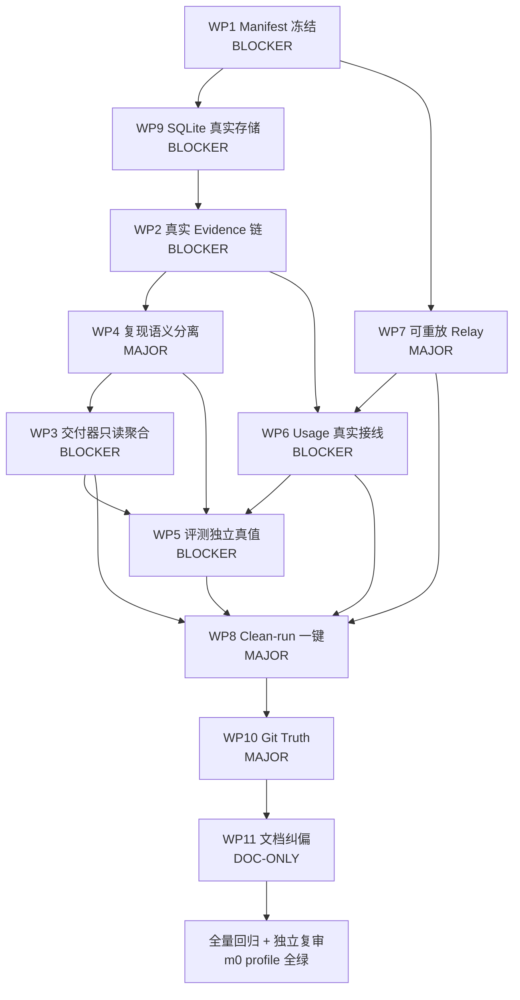

# M12-R1 — Production Truth Closure Remediation Plan

> 事实优先级：production code > Contracts > 可重复执行 > Git history > deterministic tests > audit evidence > 文档。M12 按 FAIL/MVP NO-GO 处理，保留原 FAIL 审查记录，不改写历史。

## 现场真相（基于当前代码的核验结论）

**已真实成立（不重写）**

- NCBI E-utilities 真实 `literature_search` + 契约套件（`adapters/research_tools/ncbi.py` 真实 esearch 754 hits）
- `DockerExecutionBackend` + `FileWorkspaceBackend` + `SqliteArtifactStore` 真实容器执行双分支 `m12_reference_classification.py`
- M9 lifecycle（SUCCEEDED / NEGATIVE_RESULT / FAILED / TIMED_OUT）与 `ReproducibilityAudit` 封存
- M10 `EvidenceLedger` gate（`register_experiment_evidence` / `promote_claim_to_verified` / `contradiction`）与 `MemoryGateDeps` 5 阶段
- M11 `Eval Harness` 确定性 scorer / `GateConfig` / `EvalDataset` freeze digest

**尚未成立（13 Finding 已定位根因）**

- `tools/m12_generate_deliverable.py` 全量 Fake 合成是唯一交付路径，与真实容器执行物理分叉；`_EXPERIMENT_RESULT` 常量直接派生 digest / metric / verdict / budget
- `ToolResult` 止于 `ToolResultRecord` spill 未入 `Source→Evidence`；`EvidenceRelation VERIFIED` 来源合成
- `RunManifest` 冻结后未被执行链消费；fallback 未显式冻结；`model_runtime_fingerprints` 空
- `feature_time_s` wall-clock 进 `metrics_digest` 污染复现语义；raw/semantic digest 未分离
- `examples/eval/datasets/m12_research_v1.yaml:result_correctness_001` 的 `0.745` 与 `tests/evals/test_m12_evaluation.py:_REAL_EXPERIMENT` 同源自证，无独立 ground truth；对抗样例缺失
- `ModelUsage(1200+800)` 等四源用量手工注入，`UsageLedger` → `Budget closure` 与真实 `ModelGateway` / `ExecutionRun` / `EvalRun` 断开
- `tools/m12_relay_smoke.py` 一次性打印 digest，不持久化、不入账、无 NOT VERIFIED 结构化占位
- 无 `run_id` 驱动的 clean-run harness；无法从空状态重建同一真相
- `SqliteEvidenceLedger` / `SqliteMemoryStore` 缺失，生产误用 `Fake*` 暴露重启丢证据风险
- `docs/roadmap/M12_COMPLETION_RECORD.md` 将 synthetic / Fake / OFFLINE_FAKE 描述为真实闭环

## 架构约束（本轮硬边界）

- 不建第二套 Workflow / Evidence / Budget / Domain；不绕过 `ToolResolver` / `ExecutionBackend` / `Evidence/Memory gate` / `Evaluation Plane`
- 不把 `Report` 当 `Canonical State`，不把 `EvalResult` 当科学真相
- 本地持久化继续 SQLite（M14 前不引入 PostgreSQL / Temporal / Console / Distributed / GPU）
- 不引入 DeepSeek harness 迁移；不引入未 pin 依赖/Skill/MCP

## WP1 — Single Production Run Composition — `BLOCKER`

- **Finding ID:** #1, #2 部分, #12
- **Root Cause:** `CompiledRunPlan` → `PreflightReport` → `RunManifest` 仅在 `examples/protocols/m12_reference_research_v1.yaml` 编译阶段产生 digest（`sha256:65c762...`），未被 `packages/application/run_orchestration/service.py` 执行链消费；`tools/m12_generate_deliverable.py` 另起独立 Fake 链。`RunManifest` 未冻结 `endpoint_config_digest` / `probe_suite_digest` / `fallback` / `ToolPack digest` / `image_digest` / `policy_version` / `evaluation config`。
- **Affected path:** `ProtocolDefinition → compiler → preflight → freeze → execute` 断于 freeze 之后
- **Concrete files:**
  - `packages/domain/manifest.py`（`RunManifest` / `semantic_digest`）
  - `packages/application/protocol_compile/compiler.py`, `packages/application/preflight/*`, `packages/application/run_orchestration/service.py` / `freeze_manifest.py`
  - `examples/protocols/m12_reference_research_v1.yaml`, `examples/config/llm_endpoints.yaml`, `examples/config/models.yaml`, `examples/contracts/toolpack_ncbi_eutils.yaml`, `UPSTREAM_COMPONENTS.yaml`
  - `packages/application/model_relay/fallback.py`, `packages/application/model_relay/fingerprint.py`, `adapters/relay/gateway.py`
- **Proposed change:**
  - 明确 M12 Reference Workflow composition root：单一入口 `tools/m12_reference_workflow.py`（或 `packages/application/run_orchestration/m12_reference.py`）按 AGENTS.md §3 顺序编排 `compile → preflight → freeze_manifest → execute`，`freeze_manifest.digest/semantic_digest` 作为后续所有写入的 `manifest_digest` 外键
  - `RunManifest` 补/显式冻结字段：`resolved_models` + `endpoint_config_digest` + `model_runtime_fingerprints`（含 `NOT_VERIFIED` 占位，见 WP7）+ `effective_tools` + `tool_pack_digests` + `skill_version/digest` + `policy_version` + `execution_backend` + `environment` / `image_digest` + `protocol_digest` + `compiled_plan_digest` + `budget_reservation_ref` + `evaluation_dataset_digest`；无 fallback 时显式 `fallback: none`，有则记录 `requested → selected + trigger`
  - 执行前强制 `preflight.ok == True` 否则拒绝 `RUNNING`；manifest `with_manifest` 时 `frozen_at` 不入 `semantic_digest`（已满足 `manifest.py:61`），但需落盘持久化供审计
- **Frozen Contract impact:** `RunManifest` 增字段属兼容扩展（新增 optional）；`schemas/run-manifest*.schema.json` 若存在需同步；新增 `digests` 为审计字段不改变已有 digest 算法（已排除 `frozen_at`）。若需打破兼容，补 ADR-`M12-R1-01 Manifest Freeze Completeness` + migration 说明
- **Tests:** `tests/domain/test_manifest_semantic_digest.py`（新增字段不回归旧 digest 除 `frozen_at`）、`tests/application/test_m12_manifest_freeze.py`（freeze 含全部 M12 维度、no-fallback 显式、`preflight` 不通过拒绝）、`tests/e2e/test_m12_manifest_drives_execution.py`（同一 manifest 驱动真实 relay/tool/experiment 三分支）
- **Fault validation:** 篡改 manifest 任一冻结维度后 `resume` 拒绝（digest mismatch）；注入 `preflight` 失败后 `execute` 被门禁拦截
- **Completion evidence:** 新 harness 输出 `run_id` / `manifest_digest` / `semantic_digest` / `frozen_at` / `fallback_audit` JSON，`git show` 可追溯；`validate_bundle.py` PASS
- **Depends:** 首项，无前置；为 WP2/WP3/WP6/WP7/WP8 前置

## WP2 — Real Research Truth Chain — `BLOCKER`

- **Finding ID:** #3, #5, #6, #7
- **Root Cause:** 双轨制。真实容器 `DockerExecutionBackend → SqliteArtifactStore` 产出 `experiment_result.json`，但 `tools/m12_generate_deliverable.py:50-72` 以 `_EXPERIMENT_RESULT` 常量 + `FakeArtifactStore` / `FakeEvidenceLedger` 另行构造 `Source(GENERATED) → Evidence → Claim VERIFIED` 与 `REFUTES repro-2` 合成矛盾源，真实 `ExecutionRun` 从未调用 `packages/application/experiments/evidence_admission.py:register_experiment_evidence`。`NcbiEutilsProvider → ToolResult` 止于 `ToolResultRecord` spill 未入 `MemoryGateDeps.provenance`。
- **Affected path:** `DockerExecutionBackend → ArtifactStore → EvidenceAdmission → EvidenceLedger → Claim → Memory` 与 `ToolResolver → NcbiEutilsProvider → ToolResult → SourceRecord → Evidence`
- **Concrete files:**
  - `tools/m12_generate_deliverable.py:50-116,132,160`（合成源）
  - `packages/application/evidence/m12_chain.py:65-118`（Fake 宿主的重放链）
  - `packages/application/experiments/evidence_admission.py:40-72`, `packages/application/experiments/execute.py`, `adapters/sqlite/artifact_store.py`
  - `adapters/research_tools/ncbi.py:1-277`, `packages/application/tool_plane/*`, `adapters/research_tools/spill.py`
  - `tests/application/experiments/test_m12_reference_e2e.py`（仅验证容器产出，未验证 admission）
- **Proposed change:**
  - 删除 production path 中 `_EXPERIMENT_RESULT` 硬编码、伪 `image_digest="sha256:ab*32"` / `workspace_snapshot_before="sha256:cd*32"` 快照、合成 `repro-2` digest；改为 `ExperimentExecutor.execute → outcome.run.result.artifact_refs → SqliteArtifactStore.get/verify → register_experiment_evidence(ledger, run, artifacts, provenance={run_id, manifest_digest, image_digest, snapshots, metrics_digest})`
  - `ToolResult != Evidence` 强制路径：`NcbiEutilsProvider` 文献检索结果经 `spill_large_result → ArtifactStore.put → SourceRecord(origin=tool:ncbi:pmid:..., content_digest=artifact_digest, trust=GENERATED, access_time, parser_version)` 入账，再经 `register_evidence_with_contradiction_check` / `propose_and_commit_memory` 的 provenance 白名单校验；至少1个 `SUPPORTS` 来自 Experiment Evidence，至少1个 citation/qualification 来自 Tool Source Evidence
  - `register_contradicting_evidence` 的 `REFUTES` 源必须来自真实重跑产物或真实文献补检，非 `digest_of({"repro":2})`
- **Frozen Contract impact:** `adapters/sqlite/evidence_ledger` 新增不改 Domain `Evidence` 结构；`evidence_admission` 已有，属 wiring 修复。若 `Evidence.metric_refs` 需扩展，采用兼容新增
- **Tests:** `tests/application/experiments/test_evidence_admission_e2e.py`（真实容器 + SQLite 产物 admission 成功，篡改 artifact 拒绝）、`tests/application/evidence/test_tool_result_not_evidence.py`（直升 Evidence 拒绝）、`tests/application/evidence/test_m12_real_chain.py`（同一 run_id 下 Claim 真实消费 Experiment+Tool 双 Evidence）
- **Fault validation:** 篡改 `experiment_result.json` 内容后 `EvidenceAdmission` 拒绝；缺失 `SourceRecord` 的 REFUTES 拒绝；`agent:` 自证 `verify_claim` 拒绝
- **Completion evidence:** 从 `SqliteEvidenceLedger` 读出的 `Evidence.artifact_id / run_id / experiment_run_id / image_digest / claim_status` 与 `SqliteArtifactStore` blob digest 一致；`m12_chain` 仅保留对真实 Port 的薄封装，`_EXPERIMENT_RESULT` 彻底移除（grep 0 命中 production）
- **Depends:** 依赖 WP1（manifest 绑定）+ WP9（真实 EvidenceLedger）；为 WP3/WP5 前置

## WP3 — Deliverable from Persisted State — `BLOCKER`

- **Finding ID:** #4, #11
- **Root Cause:** `tools/m12_generate_deliverable.py:_build_report` 从代码内字典派生全部报告事实（numbers / digests / source ids / verdict / reproduction / budget），未接受 `run_id` 读正式状态。生产使用 `FakeArtifactStore/Ledger/Memory/Budget`。
- **Affected path:** `Run → ExperimentRun/Metric/Artifact/Source/Evidence/Claim/Eval/Memory/UsageLedger → Deliverable`
- **Concrete files:**
  - `tools/m12_generate_deliverable.py:89-280`（`_build_report` / `_render_markdown`）
  - `docs/research/M12_REFERENCE_RESEARCH_REPORT.{json,md}`
  - `packages/domain/budget.py`, `adapters/fakes/budget_ledger.py`, `packages/application/experiments/budget_closure.py`
  - `packages/application/evaluation/runner.py`, `packages/domain/eval_result.py`
- **Proposed change:**
  - 重构交付器为只读聚合器：`build_deliverable(run_id: str, *, artifacts: ArtifactStore, ledger: EvidenceLedger, memory: MemoryStore, budget: BudgetLedger, eval_report: EvalReport, manifest: RunManifest) → Report`，全部字段 `SELECT` 自持久状态；`ReportBuilder` 仅 render
  - 报告必需字段改为外键引用：`experiment.artifact_digest` = `ArtifactStore.get(artifact_id).digest`（verify 通过）、`evidence_chain.evidence_ids` 来自 `ledger.relations_for_claim`、`claim_status` 来自 `ledger.get_claim`、`budget` 来自 `BudgetLedger.snapshot/entries`、`evaluation.verdict/dataset_digest` 来自 `EvalReport.frozen_conditions`、`reproduction` 来自 `ReproducibilityAudit`（区分 raw/semantic，见 WP4）
  - 禁止在交付器内构造 `Artifact` / `Evidence` / `Claim`；禁止硬编码 `dataset_digest` / `verdict`
- **Frozen Contract impact:** 报告 JSON schema 若已冻结（`schemas/research-report*.json`）保持字段兼容，仅修正值来源
- **Tests:** `tests/application/test_m12_deliverable_from_state.py`（给定空 DB 拒绝；篡改 ledger 后报告 digest 变化；基于同一 run_id 重建报告逐字节一致）、契约测试 `report.input_digests == ledger/manifest/artifact digests`
- **Fault validation:** 手工篡改 `ExperimentResult` 后交付器拒绝或报告 `FAIL`；缺证据 Claim 的报告被 WP5 scorer 标 `FAIL`
- **Completion evidence:** `docs/research/M12_REFERENCE_RESEARCH_REPORT.json` 的每个 digest 可由 `SqliteArtifactStore` / `SqliteEvidenceLedger` / `EvalReport` 重新计算验证；`tools/m12_generate_deliverable.py` 保留为 CLI thin wrapper，核心逻辑在 `packages/application/deliverable/`*
- **Depends:** 依赖 WP2 + WP9 + WP4 + WP6

## WP4 — Reproducibility Truth — `MAJOR`（接近 BLOCKER）

- **Finding ID:** #9
- **Root Cause:** `examples/experiments/m12_reference_classification.py:185,199,218` 将 `time.monotonic() → feature_time_s` 写入 `metrics`，进而进 `digest_of(metrics)` → `ReproducibilityAudit.metrics_digest`（经 `packages/application/experiments/repro_audit.py:_metrics_digest` 与 `packages/domain/reproducibility.py:binding_payload`），导致同配置重跑 raw artifact digest 必然漂移却被描述为 deterministic。`tests/application/experiments/test_m12_reference_e2e.py:159` 局部豁免不比较 `feature_time_s`，未在契约层隔离。
- **Affected path:** `ExperimentRunResult.metrics → metrics_digest → audit_digest → ReproducibilityAudit.verify`
- **Concrete files:**
  - `examples/experiments/m12_reference_classification.py:185-218`
  - `packages/application/experiments/repro_audit.py`, `packages/domain/reproducibility.py:61-85`, `packages/application/experiments/metric_extraction.py:98`, `packages/domain/manifest.py:61`（semantic_digest 已正确排除 `frozen_at`，参照）
- **Proposed change:**
  - 最小兼容修复：实验输出拆 `metrics.scientific`（`baseline_accuracy` / `candidate_accuracy` / `n_train/n_test` / `seed`）与 `metrics.observational`（`baseline_feature_time_s` / `candidate_feature_time_s` / `wall_clock` / `duration`）；`metrics_digest` / `semantic_result_digest` 仅覆盖 scientific 子集（canonical `digest_of`）；`raw_artifact_digest` 保留完整 blob digest（含 observational）供审计，允许重跑不等
  - `ReproducibilityAudit` 增加 `observational_digest` 或明确文档化 `metrics_digest = digest_of(scientific_projection)`，不为 M12 新增重复领域概念；若必须改 Domain，先判定为 Contract bug，补 ADR-`M12-R1-02 Reproducibility Semantic Digest` 并保持 `binding_payload` 向后兼容（旧 audit 仍可 verify）
  - 交付器与 scorer 诚实表述：`semantic_result_consistent: bool` / `raw_artifact_consistent: bool` / `variance_fields: ["feature_time_s"]` + 实测 variance 值
- **Frozen Contract impact:** `ReproducibilityAudit` / `ExperimentRunResult.metrics` 语义修正属 bugfix，需 ADR + migration 说明；M9 已冻结但承认 wall-clock 分类缺口，属最小兼容修复
- **Tests:** `tests/application/experiments/test_reproducibility_semantic.py`（同 input 连续两次 scientific digest 相同、raw digest 可不同；`feature_time_s` 变异不导致 `FAIL`）、`tests/contracts/test_repro_audit_contract.py` 补充 observational 豁免回归
- **Fault validation:** 注入 `feature_time_s` 漂移后 `semantic PASS, raw FAIL` 诚实报告；篡改 scientific metric 后 `semantic FAIL`
- **Completion evidence:** 真实容器重跑两次的 `audit_digest` / `metrics_digest` 绑定记录与 `raw_artifact_digest` 对比表入交付物
- **Depends:** 依赖 WP2（真实产物）；为 WP5 reproducibility scorer 与 WP3 交付物前置

## WP5 — Evaluation with Independent Ground Truth — `BLOCKER` 最高优先级

- **Finding ID:** #8
- **Root Cause:** `examples/eval/datasets/m12_research_v1.yaml:result_correctness_001` 的 `expected: {value:'0.745'}` 与 `tests/evals/test_m12_evaluation.py:_INPUTS["input://m12/result_correctness"]="0.745"` 来自同一常量（`_EXPERIMENT_RESULT` / `_REAL_EXPERIMENT`），`packages/application/evaluation/scorers.py:_numeric_tolerance` 仅比对调用方自述字符串，未读 `ArtifactStore` blob、未校验 `provenance` / `metrics_digest` / `direction`。`m12_research_v1.yaml` 10 cases 全预期 PASS，无 adversarial 必 FAIL 样例；`scorers_evidence.py:evidence_provenance_scorer` / `experiment_reproducibility_scorer` 未被 dataset 引用。
- **Affected path:** `Experiment Artifact → Evaluation Input → Scorer → Gate Verdict` 自证闭环断开独立性
- **Concrete files:**
  - `examples/eval/datasets/m12_research_v1.yaml`, `packages/application/evaluation/scorers.py:169-196`, `packages/application/evaluation/scorers_evidence.py`, `packages/application/evaluation/runner.py:RunRequest`
  - `tests/evals/test_m12_evaluation.py`, `tools/m12_eval_discrimination_probe.py`（已写探针但未入 CI）
  - `packages/application/experiments/metric_extraction.py`
- **Proposed change:**
  - 消除同源：`RunRequest.inputs["input://m12/result_correctness"]` 不再由测试手工喂 `"0.745"`，改为由交付前 scorer 从 `ArtifactStore.get("run:experiment_result.json")` 解 JSON → 重算/校验 `baseline_accuracy` / `candidate_accuracy`（`performance` 字段不参与），与 `Evidence.metric_refs` / `Artifact digest` 交叉核对
  - 新增判别力 scorers（deterministic）并接入 `m12_research_v1`：
    - `metric_correctness`：独立解析 artifact 重算 metric，拒绝自报值
    - `direction_improvement`：按 `Claim` 语义校验 `baseline vs candidate` 方向；`reversed candidate 0.75>0.20` 必 FAIL
    - `provenance`：报告中的 metric/claim 必须追溯到 `Evidence.artifact_id` + `SourceRecord.content_digest`
    - `reproducibility`：基于 `ReproducibilityAudit` semantic digest（WP4）判定
    - `citation_source`：引用 `source/evidence` 必须属于当前 `run_id`
    - `unsupported_claim`：无 `SUPPORTS` 的 Claim 必 FAIL
  - `m12_research_v1.yaml` 重冻结 digest，新增 8 个 adversarial regression cases（`direction_reversed` / `metric_exaggerated_0.999` / `wrong_artifact_digest` / `missing_evidence` / `unsupported_claim` / `contradictory_evidence` / `fake_reproduction` / `wrong_source_id`）全部期望对应 scorer FAIL；禁止“修改 expected 跟随 candidate”
- **Frozen Contract impact:** `schemas/eval-dataset.schema.json` / `schemas/eval-score.schema.json` 不改；`domain/eval_spec.py` 版本化 scorer 标识新增属兼容；dataset digest 变更需记录 freeze version 升级
- **Tests:** `tests/evals/test_m12_evaluation_adversarial.py`（8 cases 逐项 FAIL，`OFFLINE_FAKE` 仍拦截），`tests/evals/test_m12_metric_correctness.py`（artifact 重算 vs 自述值分歧拒绝），`tools/m12_eval_discrimination_probe.py` 转为 `tests` 常驻回归，不再是手动脚本
- **Fault validation:** 上述 8 类伪造输入在 gate 均为 `FAIL` / `INFRA_ERROR`（设施失败不转 PASS）；篡改 `expected` 跟随 candidate 的尝试在 `validate_bundle` 被 dataset digest 校验拦截
- **Completion evidence:** 新 dataset `sha256:…` + `EvalReport` 全量 `scorer_findings` 入交付物；`m12_reference_workflow` 的 `evaluation` 阶段以该 dataset 跑真实产物输入
- **Depends:** 依赖 WP2 + WP3 + WP4（需真实 artifact / semantic digest）；为 clean-run 最终 gate

## WP6 — Real Usage / Budget Wiring — `BLOCKER`

- **Finding ID:** #10
- **Root Cause:** `tools/m12_generate_deliverable.py:169-188` 手工 `ModelUsage(1200+800, calls=3)` / `ToolUsage(requests=2)` / `ExperimentUsage(elapsed_seconds=45)` / `EvaluationUsage(cases=10)` 直接 `close_budget`，未从 `adapters/relay/gateway.py:207 usage_reported` / `ExecutionRun.duration` / `ToolCall` records / `EvalRun.scorer_calls` 采集。`packages/application/experiments/budget_closure.py` 的 `reservation_actual_consistent` 因未传 `reservation_ref` 恒 `false`。
- **Affected path:** `actual execution events → UsageLedger → Budget closure → Budget report`
- **Concrete files:**
  - `packages/application/experiments/budget_closure.py:34-224`, `packages/domain/budget.py`, `adapters/fakes/budget_ledger.py`, `adapters/sqlite/*`（需补真实 ledger 或复用现有 sqlite）
  - `adapters/relay/gateway.py:227`, `packages/application/model_relay/probe.py`, `adapters/research_tools/ncbi.py:ToolCall`, `packages/application/experiments/execute.py`, `packages/application/evaluation/runner.py`
  - `tests/application/experiments/test_budget_closure.py`
- **Proposed change:**
  - 最小正式接线：`ModelUsage` 从 `ProbeResult` / `chat.completions` 响应 `usage` 字段提取 `prompt_tokens` / `completion_tokens` / `calls` / `model/endpoint identity`，缺字段记 `UNKNOWN` 不伪造；`ToolUsage` 从 `ToolCall` / `ToolResult` 执行记录计数；`ExperimentUsage` 从 `ExperimentRunResult.elapsed_seconds` / `resource_observation` 真实值；`EvaluationUsage` 从 `EvalReport` 实际 `cases/scorer_calls`；如仅 deterministic scorer 则不虚构 LLM evaluation usage
  - `close_budget` 幂等 `entry_id=f"usage:{run_id}:{source}:{id}"` 去重，retry/failure/re-eval 不漏账不 double-count；`BudgetPolicy` 预占 `reserve → usage → release` 对账仅在显式 `reservation_ref` 时生效，否则交付物如实 `reservation_actual_consistent: false` 但需在报告注明原因而非伪造
  - 报告 `budget` 段只读 `BudgetLedger.snapshot`，禁止在交付器内硬编码 token
- **Frozen Contract impact:** `domain/budget.py:UsageLedgerEntry` 不改；新增采集点属 application wiring
- **Tests:** `tests/application/experiments/test_budget_real_wiring.py`（retry 不 double-count、缺 `usage_reported` 时 `UNKNOWN`、re-eval 追加入账）、`tests/contracts/test_budget_ledger_contract.py` 补充幂等回归
- **Fault validation:** 注入 retry 重放后 `ledger.count(entry_id)` 仍 1；provider 无 token 字段时报告显式 `UNKNOWN` 而非 1200
- **Completion evidence:** 真实 `m12_reference_workflow` 一次运行的 `BudgetLedger` 明细（5+ entries）与 `ModelGateway` / `ExperimentRun` / `EvalRun` 原始事件可追溯对齐
- **Depends:** 依赖 WP1（reservation）+ WP2（tool/experiment 事件）+ WP7（relay usage）

## WP7 — Replayable Real Relay — `MAJOR`

- **Finding ID:** #2, #10 部分, #13 部分
- **Root Cause:** `tools/m12_relay_smoke.py:35-92` 仅打印 `endpoint_config_digest` / `probe_suite_digest` / `returned_model_name` / `system_fingerprint`，未持久化 `ModelRuntimeFingerprint`，无凭据时 `exit 3` 非结构化 `NOT VERIFIED`，`gateway.usage_reported` 未入 `BudgetLedger`，fallback 语义与 `RunManifest` 无法对账
- **Affected path:** `LLMEndpoint / CredentialResolver / ModelDefinition → ModelGateway → ProbeResult → Fingerprint → RunManifest → UsageLedger`
- **Concrete files:**
  - `tools/m12_relay_smoke.py`, `adapters/relay/gateway.py`, `adapters/relay/credential_resolver.py:EnvCredentialResolver`, `packages/application/model_relay/probe.py:109,205`, `packages/application/model_relay/fingerprint.py:61`, `packages/domain/models.py:EndpointProbeSnapshot`
  - `packages/application/model_relay/fallback.py:66`, `packages/domain/manifest.py:model_runtime_fingerprints`
- **Proposed change:**
  - 将 smoke 提升为正式 `live` integration path：`run_probe(credential_resolver, endpoint, model, suite) → ModelProbeResult` 经 `build_fingerprint` 生成 `ModelRuntimeFingerprint`（含 `endpoint_config_digest` / `probe_suite_digest` / `returned_model_name` / `system_fingerprint` / 白名单 `response_headers`）持久化到 `RunManifest.model_runtime_fingerprints[model_id]`；无凭据时落 `NOT VERIFIED` 结构化占位（`ok=false, error_category=configuration_failure`），非 Fake PASS
  - 秘密纪律：`SecretValue` 全程密封，`gateway` 不落盘，输出仅 digest/status；`probe` 失败不阻断 deterministic suite（CI 核心不依赖付费网络），但 `M12 DoD live evidence` 可由 `uv run --frozen --no-sync python tools/m12_relay_smoke.py`（或新 harness 子命令 `--live-relay`) 重放
  - `usage_reported` 若 provider 返回则转 `ModelUsage` 入 `BudgetLedger`（WP6）；`fallback/no-fallback` 与 `RunManifest.fallback_audit` 一致（无 fallback 显式 `none`）
- **Frozen Contract impact:** `domain/models.py` 指纹结构不变；`RunManifest` 持久化指纹属审计扩展
- **Tests:** `tests/application/model_relay/test_live_probe_not_verified.py`（无凭据落 NOT VERIFIED 占位）、`tests/integration/test_relay_live_opt_in.py`（`@pytest.mark.requires_live_llm` opt-in，缺凭据 skip 非 PASS）、`test_secret_redaction` 保持
- **Fault validation:** 无凭据时 manifest 含 NOT VERIFIED 且交付物不宣称 probe ok；有凭据时 `returned_model_name` 与 `requested_model_id` 一致性可审计，`system_fingerprint=None` 如实标“可重复配置”
- **Completion evidence:** 一次 opt-in live 运行的 sanitized fingerprint JSON + `ProbeResult.observed_capabilities` + `BudgetLedger` usage（如返回）可由审查员重放验证
- **Depends:** 依赖 WP1（manifest 位）+ WP6（usage 入账）

## WP8 — Clean-run Harness — `MAJOR`

- **Finding ID:** #12
- **Root Cause:** 无正式 `preflight → manifest freeze → real relay → real tool → real experiment → evidence → evaluation → memory → budget → deliverable` 一键入口；依赖开发者手工 populated DB / 临时文件 / 先前报告
- **Affected path:** 全 `Research Objective → Deliverable` 主链
- **Concrete files:**
  - 新 `tools/m12_reference_workflow.py`（或 `packages/application/run_orchestration/m12_reference_workflow.py` + `tools/` thin wrapper）
  - 复用 `examples/protocols/m12_reference_research_v1.yaml`, `examples/experiments/m12_reference_classification.py`, `adapters/execution/DockerExecutionBackend`, `adapters/research_tools/ncbi.py`, `packages/application/evidence/*`, `packages/application/evaluation/*`, `packages/application/experiments/budget_closure.py`
- **Proposed change:**
  - 单一 entrypoint：`python tools/m12_reference_workflow.py [--clean] [--live-relay]` 从空 SQLite 状态重建 `run_id` / `manifest_digest` / `experiment_ids` / `artifact_ids/digests` / `evidence/claim ids` / `eval_run_id` / `budget summary` / `deliverable digest`，输出不泄漏凭据
  - 干净状态语义：`--clean` 时建临时 `SqliteWorkflowEngine(:memory:)` + `SqliteArtifactStore(blob_dir=tmp)` + `SqliteEvidenceLedger/MemoryStore` 全新实例；不读开发者临时文件或先前 `docs/research/*.json`
  - 每步幂等 `idempotency_key = f"m12:{run_id}:{phase}:{digest}"`，支持 `recover_expired_leases` 自愈（M14 前单进程懒触发已足够）
- **Frozen Contract impact:** 新增 entrypoint，不改 Domain
- **Tests:** `tests/e2e/test_m12_clean_run.py`（`@pytest.mark.requires_docker` gated，空 DB → 全链 `SUCCEEDED` → 报告可重算）、`tests/e2e/test_m12_clean_run_no_live.py`（无凭据时 relay 段 NOT VERIFIED 但其余链仍闭合）
- **Fault validation:** 二次执行同 `run_id` 被幂等去重拒绝；`--clean` 两次产出 `semantic digest` 一致而 `raw artifact digest` 允许漂移（WP4）
- **Completion evidence:** 一次 clean-run 的 stdout / `M12_REFERENCE_RESEARCH_REPORT.json` / 各 `digest` 均可由 `sqlite` 文件重放验证；CI deterministic job 不依赖该 harness，live evidence 由显式命令重执行
- **Depends:** 依赖 WP1-WP7 全部闭合

## WP9 — Persistence Boundary — `BLOCKER`

- **Finding ID:** #4, #9 关联, #13 部分
- **Root Cause:** `adapters/sqlite/__init__.py:1-16` 仅导出 `SqliteArtifactStore / SqliteWorkflowEngine / SqliteOutboxEventPublisher`，`Grep SqliteEvidenceLedger|SqliteMemoryStore` 0 命中；`docs/roadmap/M12_COMPLETION_RECORD.md:§12.5` 自认 `EvidenceLedger/MemoryStore 持久化仍为 Fake（P1→M14）`，但 M12 production 误用 Fake 导致重启丢证据、claim 可伪造重放
- **Affected path:** `EvidenceLedger` / `MemoryStore` / `BudgetLedger` 生产持久化
- **Concrete files:**
  - `adapters/sqlite/__init__.py`, `adapters/sqlite/artifact_store.py`（参照）
  - 新 `adapters/sqlite/evidence_ledger.py`, `adapters/sqlite/memory_store.py`, `adapters/sqlite/budget_ledger.py`（如需）
  - `packages/application/ports/evidence_ledger.py`, `memory_store.py`, `budget_ledger.py`, `tests/contracts/registry.py`
  - `BACKLOG.md:EvidenceLedger 持久化 P1→M14`（本轮为 M12 真实闭环的例外提前，需 ADR 说明不提前进入 M14 分布式语义）
- **Proposed change:**
  - 为 M12 闭环补最小 SQLite 适配：表 `sources(content_digest, trust_label)` / `evidences(artifact_id, run_id, experiment_run_id, content_digest)` / `claims(status)` / `relations(claim_id, evidence_id, type, strength)` / `memory_records`，复用 `digest_of` 校验；事务与 `ExperimentRun` 共用 `SqliteAdapterBase` 连接；不引入 PostgreSQL 迁移
  - `tools/m12_generate_deliverable.py` 与 `m12_chain` 的 production 路径切换为 `Sqlite*`；`Fake*` 仅保留 `tests/` fixture
  - `UPSTREAM_COMPONENTS.yaml` 中 `EvidenceLedger` 状态仍 `PLANNED → ADOPTED(sqlite)` 需显式记录，本次不宣称 M14 完成
- **Frozen Contract impact:** Port 契约不变，仅新增 adapter 实现；`schemas/` 新增 sqlite 迁移脚本若有需 versioned
- **Tests:** `tests/contracts/test_evidence_ledger_contract.py` / `test_ports_persistence.py` 在 `SqliteEvidenceLedger` 上复跑通过；`tests/adapters/sqlite/test_evidence_ledger.py`（跨进程重启后仍可 `get_claim`）
- **Fault validation:** 进程重启后 claim 仍 `VERIFIED` 且 `relations` 保留；`Fake` 与 `Sqlite` 双实现通过同一 contract suite
- **Completion evidence:** `sqlite` 文件（`tmp/m12.sqlite` 或 `:memory:` dump）可作为审计证据提交；`git ls-files | grep adapters/sqlite` 含新文件
- **Depends:** 需在 WP2 之前完成；与 WP1 可并行

## WP10 — Git / Repository Truth — `MAJOR`

- **Finding ID:** #13
- **Root Cause:** M12 intended assets 存在未跟踪（`git status --short` 需实测分类），`M12_REFERENCE_RESEARCH_REPORT.json` 由 Fake 生成却被 track，`tools/m12_*.py` 探针与 `examples/eval/datasets/m12_research_v1.yaml` freeze 状态与代码不同步
- **Affected path:** 仓库事实与审计证据一致性
- **Concrete files:**
  - `git status --short`, `git ls-files --others --exclude-standard`, `.gitignore`
  - `docs/research/M12_REFERENCE_RESEARCH_REPORT.*`, `examples/protocols/m12_reference_research_v1.yaml`, `examples/eval/datasets/m12_research_v1.yaml`, `docs/references/upstream/M12_NCBI_EUTILS_QUALIFICATION.md`, `examples/contracts/toolpack_ncbi_eutils.yaml`
  - 任何 `tools/m12_*` 新入口与 `docs/roadmap/M12_R1_*.md` 证据文档
- **Proposed change:**
  - 分类处置：(1) 源码/测试/config/docs 正式 `git add` track；(2) runtime/generated evidence（`blobs/` / `*.sqlite` / `probe` 原始响应）按 `ARTIFACT_STORE.md` / `.gitignore` 忽略或归档到 `evidence/` 受控位置；(3) secrets/local runtime state 禁止提交；(4) 无关用户文件不删除
  - 最终 `M12-R1` 完成时所有应持久保留的 `implementation / tests / configs / protocol assets / audit docs` 进入 Git truth，剩余 untracked 在报告列明理由
  - 禁止 `git add -A` / `git push` / 改写历史（未获明确授权）
- **Frozen Contract impact:** 无
- **Tests:** `validate_bundle.py` 与 `governance-check/validate.py` 通过；新增 `tests/tooling/test_no_untracked_m12_assets.py`（可选，校验关键 M12 产物已 track）
- **Fault validation:** `git status` clean（除白名单忽略）
- **Completion evidence:** `git status --short` / `git log --oneline -5` 截图与 untracked 分类表入 `M12_R1_COMPLETION_RECORD.md`
- **Depends:** 随各 WP 产出增量执行，最终收口

## WP11 — Documentation Truth Repair — `DOC-ONLY`

- **Finding ID:** #11 部分, 全部 Finding 的文档误述
- **Root Cause:** `docs/roadmap/M12_COMPLETION_RECORD.md` 将 synthetic digest 描述为 real artifact、full raw digest 描述为 deterministic、手工 usage 描述为 budget closure、`OFFLINE_FAKE` 自报通过描述为 independent evaluation、Fake chain 描述为 production、clean-run 未验证却 PASS、MVP 判定 GO
- **Affected path:** 审计与独立复审可信度
- **Concrete files:**
  - `docs/roadmap/M12_COMPLETION_RECORD.md`, `docs/roadmap/COMPLETION_MATRIX_M0_M11.md`（如需增行）, `docs/INDEX.md`, `BACKLOG.md`, `docs/research/M12_REFERENCE_RESEARCH_REPORT.md`
  - 新 `docs/roadmap/M12_R1_REMEDIATION_PLAN.md`（本计划落盘）、`docs/roadmap/M12_R1_COMPLETION_RECORD.md`、`docs/roadmap/M12_REVIEW_RECORD.md`（追加 FAIL 保留）
- **Proposed change:**
  - 不删除/改写历史 FAIL 审查；新增 `M12-R1` 证据链：`Finding → Root Cause → Fix → Regression → Revalidation` 逐项对照
  - 修正措辞：`artifact digest` 标 `raw vs semantic`、`budget` 标 `ledger entries` 来源、`evaluation` 标 `independent ground truth scorer / OFFLINE_FAKE` 边界、`reproduction` 标 `semantic PASS, raw may drift`、`system_fingerprint=None` 如实“可重复配置”
  - `MILESTONES.md` 的 `M12` 状态保持 `PLANNED` 直到 R1 重新独立复审 PASS
- **Frozen Contract impact:** 文档级，无
- **Tests:** `docs-check` / `validate_bundle` 对 `M12_R1` 文档索引与链接校验
- **Fault validation:** 独立复审可仅凭 `git show` + `sqlite` + `EvalReport` 重算全部报告断言
- **Completion evidence:** `M12_R1_COMPLETION_RECORD.md` + 更新后的 `M12_COMPLETION_RECORD.md`（追加 `R1` 章节，非覆盖）
- **Depends:** 依赖 WP1-WP10 证据齐备

## 执行顺序与依赖

**顺序理由：** WP1 是唯一真相根，必须最先冻结；WP9 是 WP2 的持久化前提故提前于原建议的 WP3/WP4；WP4 需在 WP3/WP5 前确定 scientific/observational 切分；WP6 依赖 WP2+WP7 的真实事件；WP5 是最高优先级 BLOCKER 但需真实 artifact/semantic/budget 齐备故后置；WP8 聚合全链；WP10/WP11 收口。

## Frozen Contract 影响汇总

- **兼容扩展：** `RunManifest` 增审计字段、`ReproducibilityAudit` 增 `observational_digest`、`m12_research_v1` dataset 版本升级
- **需 ADR：** `ADR-M12-R1-01 Manifest Freeze Completeness`、`ADR-M12-R1-02 Semantic Digest`（wall-clock 隔离）、`ADR-M12-R1-03 SqliteEvidenceLedger for M12 Closure`（提前于 M14 的例外说明，不宣称分布式语义）
- **不改：** `schemas/eval-score` / `domain/budget` 结构保持；`M9` 容器执行语义保持

## 测试与对抗验证总纲

- **Contract suites：** `SqliteEvidenceLedger` / `SqliteMemoryStore` 复跑 `tests/contracts/test_evidence_ledger_contract.py` / `test_ports_persistence.py`；`DockerExecutionBackend` 容器 E2E 保持
- **Adversarial 8 项：** `direction_reversed` / `metric 0.999` / `wrong artifact digest` / `missing evidence` / `unsupported claim` / `contradictory evidence` / `fake reproduction` / `wrong source id` 全部在新 `m12_research_v1` 中必 FAIL
- **Fault injection：** artifact 篡改拒绝、Source 未登记 REFUTES 拒绝、`agent:` 自证拒绝、retry 不 double-count、raw/semantic 分离诚实、live 缺凭据 NOT VERIFIED
- **Validators：** 每 WP 完成后 `python -B .cursor/skills/system-spec-check/scripts/validate_bundle.py` 与 `.cursor/skills/governance-check/scripts/validate.py`；最终 `m0` profile `pytest` 全绿（`requires_docker` / `requires_live_llm` gated jobs 单独标注）

## 完成证据清单（DoD 重审入口）

- `tools/m12_reference_workflow.py --clean` 一次 clean-run 的 `run_id` / `manifest_digest` / `experiment_ids` / `artifact digests` / `evidence/claim ids` / `eval_run_id` / `budget summary` / `deliverable digest` 输出
- `SqliteArtifactStore` blob 与 `SqliteEvidenceLedger` / `MemoryStore` / `BudgetLedger` 快照可重算报告全部字段
- 新 `m12_research_v1.yaml` digest + `EvalReport` 全量 `scorer_findings`（含 8 adversarial FAIL）
- `feature_time_s` 漂移对比表（semantic PASS, raw may differ）
- `ModelRuntimeFingerprint` sanitized JSON + `NOT VERIFIED` 占位样例
- `git status --short` 分类表与 `M12_R1_COMPLETION_RECORD.md: Finding→Fix→Revalidation`
- 独立复审员凭上述证据可一键重放 `uv run --frozen --no-sync python tools/m12_reference_workflow.py --clean --live-relay`（有凭据）完成 MVP GO/NO-GO 二次判定
