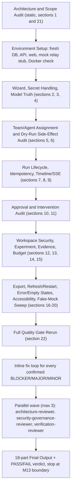

# M13 Research Console — Independent Adversarial Re-Audit

## Why this is a real re-audit, not a rubric check

M13 already went through one independent review cycle: FAIL on 2026-08-26 (3 BLOCKER + 7 MAJOR + 4 missing declared UI scope + 6 MINOR), remediated in `.cursor/plans/m13_console_remediation_405f5840.plan.md`, and self-certified PASS in [docs/roadmap/M13_R1_COMPLETION_RECORD.md](../../docs/roadmap/M13_R1_COMPLETION_RECORD.md) (current HEAD `b3f60a7`, m0 profile 18/19 checks green, 2047 passed/2 skipped). Per the task, that PASS is a claim to falsify, not a fact.

Pre-execution spot check already falsified one specific claim in that record: both the record and the remediation plan state a UI disclosure was added — "Agent 研究执行体为受控 Fake Runtime（非真实 LLM 推理）" — next to `DryRunPanel`/`ModelsPage`. A full-text search of `apps/web/src/**` for "Fake", "受控", "simulated", "non-real" returns **zero matches**. Only a backend code comment claims it (`services/api/composition.py:63`: "受控 Fake agent loop；UI 如实披露执行体性质"). This confirms the record contains at least one unverified/false claim and justifies redoing the full audit from primary evidence.

Other pre-existing context worth carrying into the audit (not yet judged, just noted):

- `docs/INDEX.md` still marks M12 (M13's hard entry dependency) as "M12 待重新独立复审" after its own FAIL → M12-R1 fix cycle, and the M12 engineering-memory entry (`MEM-20260822-016`) is dated before M12-R1 and still cites the original, later-invalidated recheck as evidence with no superseding note. M12 itself is **out of scope** for this audit (it's a fixed input per the task), but this caveat will be carried into the final report's readiness section.
- No committed automated browser E2E harness exists anywhere in the repo (`apps/web/tests/unit/` has 4 mocked-API-level test files only; no Playwright/Puppeteer config). Every prior "browser E2E" claim was necessarily a manual, non-reproducible agent-driven session. This audit will re-drive the browser live itself rather than trust that history.

## Method

- Evidence priority: running code + live HTTP/browser/DB observation this session > deterministic tests re-run this session > git history > the M12/M13 completion-record documents.
- Full stack will be booted fresh (`services/api` via uvicorn, `apps/web` via vite dev) against an **empty** SQLite DB to genuinely exercise "first run," not a pre-seeded fixture DB.
- For constructed LLM-relay fault modes (discovery unavailable, model unavailable, transient error, missing credential, chat_completions vs. responses-style, arbitrary endpoint), a small local mock OpenAI-compatible HTTP stub will be run under my control so every mode is reproducible on demand — this avoids hard-coding proof to any one real vendor (opencode/DeepSeek), matching the constraint directly. A real relay is only used as a bonus pass if the user supplies credentials live through the browser during the session; I will not read `.env`/secrets myself (already hard-blocked by the repo's `secret_guard` hook, which is itself a good sign).
- Every PASS claim in the final report must cite a command, HTTP response, DB row, or DOM/network capture obtained in this session.
- No git commit/push — default per repo Git Hard Boundaries; fixes stay in the working tree unless the user later asks for a commit.

## Execution flow

## Phase detail

**Architecture + Scope (sections 1, 21) — static, before boot**
Re-verify with fresh grep/read (not trusting prior claims): any `apps/web` import reaching into domain/application/backend types; any `services/api` router/module bypassing a Port to call SQLite/Docker/OpenHands directly; any business-logic duplication between API layer and `packages/application`; the `ApiDeps.run_registry` dict-vs-`SqliteRunStore` dual-write named as a specific Canonical-State-duplication suspect to resolve with a live concurrent-write/restart test, not just static reading. Confirm no PostgreSQL/Temporal/distributed/GPU/multi-tenant-RBAC/OPA/central-Secret-Manager/DeepSeek-harness coupling via `.importlinter*` and `dependency-cruiser.config.mjs`.

**Environment setup**
Boot `services/api` (uvicorn) against a throwaway empty SQLite DB, boot `apps/web` (vite dev), confirm Docker reachable for the `container-quality` suite, stand up the local mock-relay stub.

**Wizard / Secrets / Model truth (sections 2, 3, 4)**
Drive Relay → Credential → Endpoint Test → Discovery/Manual Add → Probe → Defaults live in the browser against the mock stub, forcing: chat_completions success, responses-style success, arbitrary endpoint, manual Model ID, discovery-unavailable, model-unavailable, transient error, missing credential. In parallel, plant a distinctive marker string as the test API key and grep for it across HTML/DOM/localStorage/sessionStorage/URL/console/network/API responses/backend logs/export output; reload the endpoint after saving to confirm it never redisplays. Force `system_fingerprint: null` and confirm the UI never upgrades to "fully reproducible" wording (static read of `DoneStep.tsx`/`ModelsPage.tsx` already looks correct — this reconfirms live).

**Team/Agent + Dry Run (sections 5, 6)**
Create same-Role/multiple-Agent, different-model-per-Agent, and one deliberately incompatible assignment; confirm Preflight rejects it with a real backend finding code and no client-side bypass. Snapshot the DB before/after a Dry Run and confirm zero ToolProvider/ExecutionBackend/MemoryStore/Run-creation/Experiment/publish side effects.

**Lifecycle, Idempotency, Timeline/SSE (sections 7, 8, 9)**
Drive start/pause/resume/cancel/fork; attempt illegal transitions directly via API. Double-fire start/approve/deny/cancel/retry with duplicate Idempotency-Keys and stale `If-Match`. Test SSE initial load, disconnect, reconnect, duplicate/out-of-order events, and full refresh — timeline must be rebuildable from backend state every time.

**Approval / Intervention (sections 10, 11)**
Approve/deny via UI, then bypass the UI and call the decide/intervention endpoints directly to confirm backend — not a hidden button — is the real boundary. Attempt agent/model/tool-set/budget changes on a RUNNING run; each must produce a real Manifest Revision/Fork or be rejected, never silently mutate the run.

**Workspace / Experiment / Evidence / Budget (sections 12, 13, 14, 15)**
Probe workspace/artifact viewing with `../`, absolute paths, symlinks, cross-workspace IDs, oversized/binary files, hostile HTML/script payloads. Cross-check the Experiment view and Claim map against direct DB/ArtifactStore queries, re-inject a fresh cross-run claim leak attempt against the live server. Reconstruct usage from the ledger tables directly and diff against the UI, forcing unknown/zero/retry/duplicate/exhausted scenarios — "unknown" must never render as "0".

**Export / Refresh / Error states / Accessibility / Fake-mock sweep (sections 16-20)**
Diff a real `/runs/{id}/export` against persisted state field-by-field and grep it for the planted secret marker. Refresh mid-run, restart the web dev server, restart the API process — confirm recovery from backend truth. Force each distinct error/empty/degraded state (API down, SSE down, no projects/runs, unhealthy endpoint, tool unavailable, experiment failed, negative scientific result, eval infra error vs. eval quality fail, budget exhausted, approval pending) and confirm the UI never collapses a scientific negative result into a generic failure look. Keyboard-only pass over the main flows. Repo-wide grep sweep of production paths (excluding tests/fixtures) for mock/hardcoded-metric/fake-timeline/fixture-claim/placeholder/static-PASS patterns — the already-found missing Fake-Runtime disclosure is the first confirmed catch here.

**Full Quality Gate (section 22)**
Fresh run of `run_all_checks.py --profile m0` (19 checks), the Docker `container-quality` suite, `pnpm run check`, and full `pytest` — new logs, not reused from before this session. Anything that cannot actually be executed here is reported `NOT VERIFIED`, never `PASS`.

## Fix loop (applied inline per finding)

Reproduce → root cause → minimal fix → new deterministic regression test → live browser/API re-run of that exact scenario → carried into the final full-regression pass. Explicitly forbidden as a "fix": hidden buttons, frontend hardcoding, mock-backend substitution, skipping E2E, relaxing typecheck, loosening backend authorization, deleting a failing test.

## Final independent cross-check (one parallel wave, ≤3 subagents)

After fixes land, dispatch the repo's own read-only reviewer subagents in parallel (each already outputs `hard_gate: PASS|FAIL` per their `.cursor/agents/*.md` definition):

- `architecture-reviewer` — dependency direction, Canonical State duplication, boundary claims.
- `security-governance-reviewer` — secret handling, authorization boundary, workspace/artifact safety.
- `verification-reviewer` — every PASS claim across all phases has re-runnable command/test/DB evidence, not narrative only.
Any subagent `hard_gate: FAIL` sends that item back through the fix loop before the final verdict.

## Final deliverables

The 18-part Final Output the task specifies: DoD Revalidation Matrix; API/DTO architecture audit; first-run/model audit; dry-run side-effect audit; timeline/SSE audit; approval/intervention audit; workspace/security audit; experiment/evidence audit; budget/usage audit; audit/export audit; secret/redaction evidence; UI truth/state assessment; tests/E2E/full regression; newly found/fixed findings; remaining debt; M13 Final PASS/FAIL; M14 readiness; M18 readiness. Execution stops at the M13 boundary — no automatic start of M14/M18 work.

---

## Execution record (2026-08-27 session)

All 18 todos completed. Evidence log: `.artifacts/m13_audit/FINDINGS.md`; 18-part final report: `.artifacts/m13_audit/FINAL_REPORT.md`.

**Findings found → fixed (reproduce → root cause → minimal fix → regression test → live re-run):**
- FINDING-M13-1 (MAJOR): probe blocked for localhost/private endpoints, no config path → `ApiSettings.allow_localhost_endpoints` (env `RESEARCHOS_ALLOW_LOCALHOST_ENDPOINTS`, default off/fail-closed) threaded via composition → probe/test routers; tests `test_endpoint_policy_api.py`; live verified.
- FINDING-M13-6 (MAJOR): `/runs/{id}/usage` returned global ledger for any run id (cross-run leak), unknown runs not 404 → run-scoped task_id filter + 404; tests `test_inspection_usage_api.py` (3 new); live verified.
- FINDING-M13-5 (MINOR): Add Relay button didn't open wizard → `App.tsx` showWizard; live verified.
- Reviewer round-2 gate failures: App.tsx lint (`void refresh()`) and plan-file broken link → both fixed; final m0 gate 19/19 PASS.

**Verdict: M13 PASS (PASS_WITH_NOTES).** Final m0 gate: 19 deterministic checks PASS, python/tests 2054 passed / 2 skipped, typescript all green, validate_bundle PASS. Independent cross-check wave: architecture PASS, security PASS, verification PASS after fix round.

**Notable corrections to plan pre-checks:** UI Fake-Runtime disclosure exists (`RunPanel.tsx` run-runtime-note) — plan's "zero matches" was a tooling false negative; M13-R1 record claim VERIFIED TRUE.