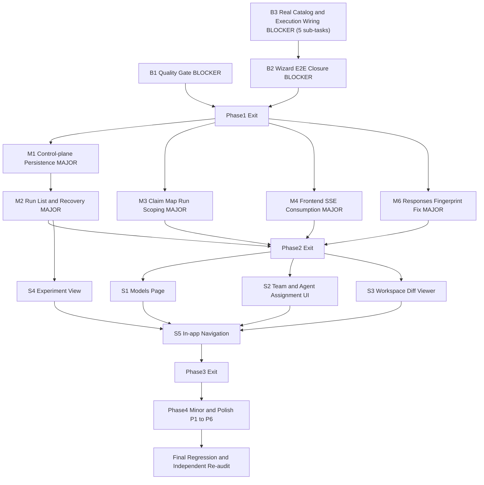

# M13 — Research Console 完整修复计划

> 事实优先级：production code > Contracts > 可重复执行 > Git history > deterministic tests > audit evidence > 文档。保留原 FAIL 独立复审记录不改写；完成后按 M12-R1 先例产出 `M13_R1_COMPLETION_RECORD.md`，不覆盖历史。

## 范围边界（本计划明确排除的项）

- 不做 PostgreSQL / Temporal / distributed scheduling / GPU / multi-tenant RBAC / OPA / 中心化 Secret Manager / DeepSeek harness 迁移（MILESTONES.md M13 Non-goals + 原复审 §21）。
- 不把 `FakeAgentRuntime` 换成真实 OpenHands Agent Loop 接线——这是 M12 自身已接受的架构边界（M12 CLI 参考流程本身也用 Fake agent loop + 真实 Docker 实验执行），非 M13 回归；仅要求 UI 诚实披露当前执行体性质（折入 WP-S1/DryRunPanel 文案）。
- 不做 Role 自定义创建（`POST /roles/custom`）与 TeamTemplate CRUD（`POST /team-templates/custom`）；"custom Team" 用 Agent 组合（在既有模板内增减 Agent 实例、绑定模型）满足，与原审计 §5 测试点一致。
- 不做 Tool Provider 上线 UI（`POST /tool-providers`）；Tool Provider 目录继续 examples/config 来源（除下文移除 `research_mcp` 占位项）。
- 不做 Memory Proposal/Gate UI（不在 MILESTONES.md M13 Scope 一行、也不在原 22 节复审清单内）。

## Phase 1 — BLOCKER 闭环（M13 PASS 最低必要条件）

### WP-B1 — Quality Gate Closure

- **Root cause**：`run_all_checks.py --profile m0` 4 项 FAILED——`python/engineering-lint`（`.cursor/hooks/subagent_guard.py` 未排序 import、`.cursor/hooks/subagent_stop.py` 未用 import）、`python/product-lint`（`tests/contracts/test_dry_run_no_side_effect.py` 未排序/未用 import）、`python/format-check`（16 个文件未格式化，含 M13 新增测试文件与 `packages/application/m12_reference/clean_run_eval.py`）、`framework/validate_cursor_framework`（M13 新增 `scripts/gen_openapi.py` 落在仓库根 `scripts/`，与既有约定冲突——产品脚本一律放 `tools/`，`scripts/` 保留给 Cursor 工程自动化）。
- **Files**：`.cursor/hooks/subagent_guard.py`、`.cursor/hooks/subagent_stop.py`、`tests/contracts/test_dry_run_no_side_effect.py`、`ruff format` 报告的 16 个文件、`scripts/gen_openapi.py` → 迁移为 `tools/gen_openapi.py`（先 grep 全仓 `scripts/gen_openapi` 引用点：`tests/contracts/test_openapi_snapshot.py`、CI workflow、文档，逐一更新路径后删除 `scripts/` 目录）。
- **Change**：`ruff check --fix`（仅限上述未排序/未用 import 违规）；`ruff format`（仅限报告的 16 个文件，不做全仓格式化）；移动 `gen_openapi.py` 并更新引用。
- **Tests**：`uv run --frozen --no-sync python -B .cursor/skills/cursor-framework-check/scripts/run_all_checks.py --profile m0 --keep-going` 全绿。
- **Depends**：无前置，Phase 1 第一项执行。

### WP-B3 — Real Catalog & Execution Wiring（BLOCKER，本计划核心架构修复）

- **Root cause**：`services/api/catalog.py::load_catalog_snapshot()` 每次请求都从 `examples/config/*.yaml` 重新加载完整目录（含硬编码 `opencode.ai` + `deepseek-v4-flash`），与 `deps.endpoint_store`/`deps.model_store`（用户经 wizard 真实配置、SQLite 持久化）完全无关；`team_protocol.py`/`runs.py` 全部调用点消费的都是这份静态目录。导致：preflight 恒定 `ENDPOINT_UNHEALTHY`/`CREDENTIAL_MISSING`/`SUPPLY_CHAIN_UNPINNED`/`POLICY_MISSING`，用户配置永不进入执行链，`RUNNING`/`WAITING_FOR_APPROVAL`/审批/pause/resume/fork/`SUCCEEDED` 全部不可达。

**B3.1 Catalog 合并**（endpoints/models 用户配置覆盖 examples）
- 新增 `services/api/catalog_merge.py::merged_catalog_snapshot(deps: ApiDeps) -> CatalogSnapshot`：以 `load_catalog_snapshot()` 为基底，用 `deps.endpoint_store.list_endpoints()`/`deps.model_store.list_models()` 按 id 覆盖合并（`{**base, **user}`，用户配置优先）。
- 改造调用点：`team_protocol.py`（`list_roles`/`list_team_templates`/`list_agents`/`get_project_settings`/`update_agent`/`validate_protocol`/`compile_and_preflight_endpoint`/`preflight_endpoint`/`dry_run_endpoint`）与 `runs.py::_execution_inputs`，全部从 `load_catalog_snapshot()` 改为 `merged_catalog_snapshot(deps)`。
- Tests：`tests/api/test_catalog_merge.py`（用户创建的 endpoint/model 出现在 dry-run 的 `agent_models` 投影中；example 中未被覆盖的 endpoint 仍存在）。

**B3.2 真实 ToolPack digest 接线 + 移除不可信占位 provider**
- 发现：`examples/contracts/toolpack_ncbi_eutils.yaml` 已有真实 pin（`digest: sha256:947cbb...`），但 `catalog.py` 显式设 `tool_pack_digests={}`，从未读取。`research_mcp`（`tool_providers.yaml`，MCP kind，指向虚构域名 `research-tools.example.com`）无任何真实上游可 pin，永远无法诚实产出 digest，且与 `ncbi_eutils` 声明完全相同的能力（`literature.search/read`、`citation.inspect`）。
- Change：`catalog.py::load_catalog_snapshot()` 增加读取 `examples/contracts/toolpack_*.yaml` 并填充 `tool_pack_digests`（复用 `packages/domain/tools.py::toolpack_content_digest`/现有 M9 loader 逻辑，不新造校验规则）；从 `examples/config/tool_providers.yaml` 移除 `research_mcp` 条目（先 grep 全仓 `research_mcp` 引用：`tests/api/run_fixtures.py::_PROVIDERS`、文档，同步移除/更新）。不为 `research_mcp` 伪造 digest（AGENTS.md §9 禁止未 pin 资产）。
- Tests：`tests/api/test_catalog_merge.py` 补充断言 `tool_pack_digests["ncbi_eutils"]` 非空；`python -B .cursor/skills/system-spec-check/scripts/validate_bundle.py` 通过（examples 变更同步核对）。

**B3.3 Native PolicyEvaluator 接线**
- 发现：`team_protocol.py::_context()`/`runs.py::_execution_inputs` 硬编码 `policy_evaluator=None`，导致 `POLICY_MISSING`/`no policy evaluator is injected` 恒定失败。`packages/application/policy/native.py::NativePolicyEvaluator(policy: PolicyDefinition)` 已存在、构造只需 `catalog.policy`。
- Change：两处 `PreflightContext` 构造改为 `policy_evaluator=NativePolicyEvaluator(policy=catalog.policy) if catalog.policy else None`。
- Tests：`tests/api/test_runs_api.py` 新增用例验证 policy-approval-required 场景经真实 evaluator 产生 `POLICY_APPROVAL_REQUIRED` finding（而非默认放行/默认拒绝）。

**B3.4 实时 Endpoint Health 接线**
- 发现：`PreflightContext.endpoint_health` 默认空字典 → 所有 endpoint 判 `EndpointHealth.UNKNOWN` → `ENDPOINT_UNHEALTHY` 恒定触发，即使用户 endpoint 真实健康。
- Change：新增 `services/api/preflight_support.py::build_endpoint_health(deps, catalog) -> dict[str, EndpointHealth]`：对 catalog 中每个凭据可解析的 endpoint 调用 `deps.gateway.probe_connectivity`（复用 `/llm-endpoints/{id}/health` 已有语义，不新造探测逻辑），单次请求内去重缓存；`team_protocol.py`/`runs.py` 构造 `PreflightContext` 时注入。
- Tests：`tests/api/test_runs_api.py`/`test_team_protocol_api.py` 用真实 mock relay（复用现有 `FakeModelGateway`/httpx mock transport 模式）验证健康 endpoint 不再触发 `ENDPOINT_UNHEALTHY`。
- **Depends**：B3.1（需要合并后的 catalog 提供真实 endpoint 列表）。

**B3.5 AgentStore + ProjectSettingsStore 持久化**（Team/Agent 真实绑定的前提，供 Phase 3 WP-S2 UI 消费）
- 新增 Port：`packages/application/ports/agent_store.py::AgentStore`（`list_agents/get_agent/save_agent/delete_agent`，镜像 `ModelStore` 形态）、`packages/application/ports/project_settings_store.py::ProjectSettingsStore`（`get/save`，单条记录）。
- 新增 adapter：`adapters/sqlite/agent_store.py::SqliteAgentStore`（JSON-blob-per-row，复用 `adapters/sqlite/model_store.py` 的 encode/decode 模式，序列化 `AgentSpec`/`AgentBinding`/`WorkspacePolicy`/`AgentContextConfig`/`BackendKind`）、`adapters/sqlite/project_settings_store.py::SqliteProjectSettingsStore`。
- `services/api/composition.py::ApiDeps` 新增 `agent_store`/`project_settings_store` 字段；`assemble()` 用共享连接装配。
- `catalog_merge.py` 扩展：`agents` 字段同样按 id 合并（SQLite 覆盖 examples）；`load_project_settings` 改为优先读 `ProjectSettingsStore`，为空时回退 `examples/config/project.yaml`。
- 新增端点：`services/api/routers/team_protocol.py::create_agent`（`POST /projects/{id}/agents`，校验 `role` 存在于 catalog.roles、`model_binding.value` 解析于 catalog.models/model_profiles，写入 `SqliteAgentStore`，201）；`update_agent`（`PATCH /agents/{id}`）从现有 501 改为真实持久化（校验 If-Match，写覆盖行）；`PUT /projects/{id}/settings`（新端点，写 `SqliteProjectSettingsStore`）。
- Tests：`tests/api/test_team_protocol_api.py` 新增：create agent 201 + 出现在 dry-run projection；patch 现有 example agent（如 `director`）后 dry-run 反映新绑定；`role` 不存在 → 422；`model_binding` 引用不存在模型 → 422；`PATCH` 缺 If-Match → 428、stale → 412（复用既有 If-Match 模式）。
- **Depends**：B3.1。

### WP-B2 — First-run Wizard E2E Closure（BLOCKER）

- **Root cause**：`ModelsStep.tsx` 无任何 discover/add 控件；`useWizardActions.runProbe` 在无模型时抛内联 `Error`，无恢复路径；probe 返回 `ok:false`（HTTP 200 body 内）时代码无条件 `setStep("done")`，`DoneStep` 未区分失败态；`App.tsx` 的 `#/endpoints`/`#/models` 锚点无路由监听，纯死链接。
- **Change**：
  - 新增/扩展 `apps/web/src/features/setup/steps/ModelsStep.tsx`：Discover 按钮调 `api.discoverModels`（捕获 503 等错误，降级为"discovery unavailable，请手动输入 model id"提示，不抛未捕获异常）→ 复选/选择发现结果 → "Add Selected" 批量 `api.createModel`；并列提供手动 Model ID 输入 + Add（满足审计 §2 "manual Model ID"）。
  - `useWizardActions.runProbe`：`result.ok === false` 时不静默等同成功——仍进入 Done 但由 `DoneStep` 分支渲染失败态（banner + `error_category`/`error_message_redacted`），CTA 变为"Retry Probe"（回到 Models 步）与"Finish Anyway"（不隐藏失败继续保存配置，避免真实中转站瞬时故障时把用户卡死）。
  - `App.tsx`：移除无监听的 hash 锚点，改为最小 `activeView` state 驱动的真实 view-switcher（为 Phase 3 新页面预留挂载点，替代死链接）。
- **Tests**：`apps/web/tests/unit/wizard-flow.test.ts`（新增）：discovery 成功/503/空列表三态；probe 失败态渲染失败 banner 而非成功外观；手动 Model ID 路径可达 Done。浏览器 E2E（复用独立复审已验证的 mock relay 7 模式脚本）：空 DB 全流程可在 UI 内完成，不借助 API 直连兜底。
- **Depends**：B3.2/B3.3/B3.4/B3.5（wizard 完成后紧跟的 dry-run/probe 需基于真实接线才有意义地展示成功路径）。

**Phase 1 Exit Gate**：`run_all_checks.py --profile m0` 全绿；从空 SQLite 库通过浏览器完成向导 → dry-run PASS（非 FAIL）→ 真实 run 可达 `RUNNING`/`SUCCEEDED`（Fake agent loop 快速终态，Docker 实验按既有 M12 边界跳过或标 `requires_docker`）。

## Phase 2 — MAJOR 闭环

### WP-M1 — Control-plane 状态持久化

- **Root cause**：`ApiDeps.run_registry`（dict）、`ApprovalRegistry`（内存）、`InMemoryIdempotencyStore`、`FakeBudgetLedger` 均非持久化；API 重启后 run/approval/idempotency/budget 全部丢失，即使 outbox 事件本身持久（`SqliteOutboxEventPublisher.published` 是实时查表，非缓存——已核实此部分健康）。这不是 M14 PostgreSQL 范畴，而是延续 M13 已有的 SQLite adapter 模式（`SqliteEndpointStore`/`SqliteModelStore`/`SqliteEvidenceLedger` 先例）补齐遗漏面。
- **Files/Change**：新增 `adapters/sqlite/run_store.py::SqliteRunStore`（`ResearchRun` 的 JSON-blob 持久化，同 `SqliteModelStore` 模式）；`adapters/sqlite/approval_store.py::SqliteApprovalStore`（实现 `ApprovalRegistry` 相同接口，替换内存字典）；`adapters/sqlite/idempotency_store.py::SqliteIdempotencyStore`（实现 `services/api/idempotency.py::IdempotencyStore` Protocol）；`adapters/sqlite/budget_ledger.py::SqliteBudgetLedger`（实现 `BudgetLedger` Port：`reserve/release/record_usage/snapshot`，reservations/entries 两张表）。
- `services/api/composition.py::assemble()`：全部替换为上述 Sqlite 实现；`services/api/routers/runs.py`/`approvals.py`/`run_events.py`/`inspection.py` 从 `deps.run_registry[...]` 字典访问改为 `deps.runs_store.get/save(...)`（保持路由层逻辑不变，仅替换存取方式）。
- **Tests**：`tests/contracts/test_run_store_contract.py`/`test_approval_store_contract.py`/`test_idempotency_store_contract.py`/`test_budget_ledger_sqlite_contract.py`（Fake/Sqlite 双实现跑同一 contract suite，复用 M5 Port+Fakes 先例）；`tests/api/test_restart_recovery.py`（新建 TestClient → 写入 run/approval/idempotency-key → 重建 `create_app(assemble(同 db_path))` 模拟重启 → 数据仍可读）。
- **Depends**：Phase 1 Exit（不阻塞但建议在真实 run 链路稳定后接入，避免同时改两处基础设施增加调试面）。

### WP-M2 — Run 列表与刷新恢复

- **Root cause**：无 "list runs" 端点；浏览器刷新丢失 React 内存中的 `run_id`，即使后端数据持久也无法被前端重新发现。
- **Change**：新增 `GET /projects/{id}/runs`（`runs.py`，读 `SqliteRunStore.list_runs()`，按 `created_at` 倒序）；`apps/web/src/features/runs/useRunPanel.ts` 挂载时调用该端点，自动 hydrate 最近一个非终态或最近一个 run（不要求用户记住/粘贴 run id）；`TimelineView` 在 hydrate 后重新拉取 `/events`（JSON replay）。
- **Tests**：`tests/api/test_runs_api.py::test_list_runs_returns_recent_first`；浏览器 E2E：启动 run → 刷新页面 → Run 面板自动恢复状态与 Timeline，不需要手动操作。
- **Depends**：WP-M1（`SqliteRunStore`）。

### WP-M3 — Claim Map Run 级隔离（安全缺陷，已在复审中实测复现跨 run 泄漏）

- **Root cause**：`services/api/routers/inspection.py::run_claim_map` 遍历 `ledger.claims()`（全表）与 `ledger.relations_for_claim(claim.id)`，未按 `run_id` 过滤——任意 run 的 claim map 会返回其他 run 注册的 claim/evidence（已用真实 SQLite 注入复现）。
- **Change**：`_evidence_of_run`已有 run 过滤逻辑（经 evidence.run_id），但 `run_claim_map` 的 claim 遍历完全独立、未复用该逻辑。改为：先取 `_evidence_of_run(ledger, run_id)` 得到该 run 的 evidence id 集合，再只保留 relation 命中该集合的 claim（无命中 evidence 的 claim 视为不属于该 run，不返回）。
- **Tests**：`tests/api/test_inspection_api.py::test_claim_map_does_not_leak_other_run_claims`（两个 run 各自注册 claim/evidence，断言互不可见——直接固化本次复审的实测复现场景为回归测试）。
- **Depends**：无。

### WP-M4 — 前端 SSE 消费

- **Root cause**：后端 SSE（`Last-Event-ID`/`?cursor=`/`poll=1`）已正确实现且经复审实测验证，但 `apps/web` 全仓无 `EventSource`——`TimelineView` 只消费一次性 JSON replay，无 live/reconnect/resume/dedupe。
- **Change**：新增 `apps/web/src/features/runs/useRunEventStream.ts`：`new EventSource('/api/runs/{id}/events')`（浏览器原生按 `id:` 字段自动处理 `Last-Event-ID` 重连，符合后端契约）；`onmessage`/`addEventListener(type, ...)` 按 `event_id` 去重追加到现有 events 数组（避免与初始 JSON replay 重复）；断线时浏览器原生重试，UI 显示"reconnecting"态；组件卸载时 `close()`。`useRunPanel.ts` 初始仍用 JSON replay 做首屏，随后切到该 hook 接管增量。
- **Tests**：`apps/web/tests/unit/run-event-stream.test.ts`（mock EventSource：初始事件、断线、重连后续传不重复、越界/迟到事件按 event_id 排序丢弃早于当前 cursor 的）；浏览器 E2E：运行中开启第二个浏览器 tab 观察 timeline 实时增量。
- **Depends**：无（独立于 Phase1 catalog 修复，可并行）。

### WP-M6 — Responses 风格 Fingerprint 修复

- **Root cause**：`adapters/relay/responses_api.py::responses_result` 硬编码 `system_fingerprint=None`，即使 relay 在 responses payload 中返回了 `system_fingerprint` 字段也被丢弃。
- **Change**：`responses_result` 从 `payload.get("system_fingerprint")` 提取（与 `chat_api.py::chat_result` 的既有提取方式对齐），非法/缺失时保持 `None`（诚实占位，不伪造）。
- **Tests**：`tests/adapters/relay/test_responses_api.py` 新增用例：payload 含 `system_fingerprint` 时结果非 None；缺失时仍为 None。
- **Depends**：无。

**Phase 2 Exit Gate**：全量 pytest（含新 contract suite）通过；浏览器实测 API 重启后 run/timeline 可恢复；跨 run claim 注入测试不再泄漏；SSE 实时更新可观察。

## Phase 3 — 声明范围补齐（MILESTONES.md Scope 对齐）

### WP-S1 — Models / Probe 独立页面

- MILESTONES.md M13 Scope 明确列"models/probe page"，当前只有 wizard 内嵌步骤，无常驻页面。
- Change：新建 `apps/web/src/features/models/ModelsPage.tsx` + `useModelsPage.ts`：列出全部 endpoint 下的 model（`api.listModels()`）、逐项 Probe（复用 `api.probeModel`）、展示 `CompatibilityViewDto`（`api` 需新增 `getCompatibility` 调用既有 `/models/{id}/compatibility`）、probe 历史（复用 events/无需新后端，probe 结果直接来自返回值）。DryRunPanel 旁增加一行文案："Agent 研究执行体为受控 Fake Runtime（非真实 LLM 推理）"，诚实披露（对齐 AGENTS.md §4 精神，不在 UI 夸大真实性）。
- Tests：`apps/web/tests/unit/models-page.test.ts`；浏览器 E2E：从 Models 页对已有模型发起 probe，结果与 wizard 内一致。
- **Depends**：WP-B2（复用其 discover/add 组件）。

### WP-S2 — Team / Agent Assignment UI

- 后端已具备验证能力（`packages/application/preflight/role_checks.py::check_team`：`AGENT_PERMISSION_DENIED`/`HETEROGENEITY_VIOLATION`；`packages/application/preflight/checks.py::_check_record_eligibility`：`MODEL_ELIGIBILITY`）——UI 只需暴露，不需要新造校验规则。
- Change：新建 `apps/web/src/features/team/TeamPage.tsx`：列 Roles（`GET /roles`）+ Team Templates（`GET /team-templates`）+ 当前 Agents（`GET /projects/{id}/agents`，读合并后目录）；每个 Agent 行可编辑 model_binding（下拉选当前可用模型，**仅 UX 提示**用客户端做粗筛，最终裁决始终是 dry-run/preflight 返回的 finding，不在客户端伪造通过）；"Add Agent" 表单（role 下拉 + model 下拉）调 `POST /projects/{id}/agents`；同 Role 可重复添加多个 Agent（满足"same Role, multiple Agents"）；保存后触发一次 dry-run 并在同页展示 findings（`AGENT_PERMISSION_DENIED`/`HETEROGENEITY_VIOLATION`/`MODEL_ELIGIBILITY` 直接来自后端，不做客户端二次判定）。
- Tests：浏览器 E2E 覆盖原审计 §5 四个测试点：同 Role 多 Agent、不同 Agent 不同模型、custom Team（增删 Agent 组合）、无效能力分配 → preflight 拒绝且 UI 如实展示 finding（不用隐藏 option 掩盖）。
- **Depends**：WP-B3.5（AgentStore/端点）。

### WP-S3 — Workspace Diff Viewer

- **已知设计缺口（先做发现，再定最终形态）**：`packages/domain/workspace.py::WorkspaceSnapshot` 目前只有 `workspace_id + digest`（单一树摘要），没有文件级 manifest；仓库内无任何 `diff` 计算函数。实现前必须先读 `adapters/execution/*`（Docker/File Workspace Backend 具体实现）确认是否已在 adapter 层持久化文件级 manifest（path→digest）可供比较。
  - 若已存在：新增只读端点暴露该 manifest + 新增 `packages/application/workspace/diff.py::compute_workspace_diff(before, after) -> WorkspaceDiff`（纯函数，added/removed/modified 列表），前端渲染安全 diff（路径显示、内容懒加载、拒绝 `../`/绝对路径/symlink 穿越，复用已验证的 M9 workspace 安全边界，不新增攻击面）。
  - 若不存在：这是 Runtime 层（M6/M9）遗留缺口，非 M13 应擅自跨层新增的领域概念；本 WP 改为诚实降级——展示 snapshot digest + 已知 artifact（`ArtifactStore` 中与该 run 关联的产物）只读查看器，UI 明确标注"file-level diff unavailable"，并在 Remaining Debt 中记录为需要 M6/M9 补充的前置能力，不伪造 diff。
- Tests：视上述发现结果定；不可信内容（HTML/Markdown/脚本 payload）渲染必须走纯文本/转义展示，不触发脚本执行（复用已验证的 CSP + React 转义边界）。
- **Depends**：需要一次独立的 adapter-layer 探查（建议作为本 WP 第一个子任务，探查结果决定后续设计，避免执行期返工）。

### WP-S4 — Experiment View

- Change：新增只读端点 `GET /runs/{id}/experiments`（`services/api/routers/inspection.py` 或新 `experiments.py` router）：从 `ArtifactStore` + M9 `ExperimentRunResult`/`ReproducibilityAudit`（持久化位置需核对 M9 完成记录，大概率经 Evidence/Artifact 关联可查）聚合 `ExperimentPlan → ExperimentRun → Metrics → Artifacts → Reproduction` 视图 DTO；前端新建 `apps/web/src/features/experiments/ExperimentView.tsx` 只读渲染，含 semantic/raw reproducibility digest 区分（延续 M12-R1 的诚实语义，不合并展示成单一"可复现"标签）。
- Tests：`tests/api/test_experiments_api.py`（给定持久化的 experiment run，端点返回值与 `SqliteArtifactStore`/`ReproducibilityAudit` 可交叉核对）；篡改 frontend 响应不改变后端 truth（既有 DTO-only 架构已保证，补一条契约测试固化）。
- **Depends**：WP-M2（复用 run 列表/选择机制）。

### WP-S5 — 应用内导航收口

- Change：`App.tsx` 的 `activeView` state（WP-B2 已引入）扩展为覆盖 Console / Models / Team / Workspace / Experiments 五个视图的真实切换，移除任何非功能性锚点或占位链接。
- Tests：浏览器 E2E：逐一点击导航项确认渲染对应真实视图（非死链接）。
- **Depends**：WP-S1、WP-S2、WP-S3、WP-S4。

**Phase 3 Exit Gate**：Console IA（`docs/product/CONSOLE_INFORMATION_ARCHITECTURE.md`）声明的 Global 导航项在 UI 中均有对应真实视图或明确标注"未来里程碑"，无死链接、无隐藏假成功。

## Phase 4 — MINOR / 打磨闭环

- **WP-P1**：`services/api/approvals.py::build_approval_event` 内联 `__import__("packages.domain.core", ...)` → 移到模块顶部 `from packages.domain.core import Timestamp`（no-inline-import 规则）。
- **WP-P2**：`routers/approvals.py::intervene` 对 `RUNNING` 状态不分 `payload.kind` 一律 PAUSE——改为显式按 `kind`（`pause`/`resume`/`budget_adjust`/`replace_agent`）分支，`pause`/`resume` 走状态机，语义类保持 501 诚实边界，不再无条件吞掉 payload。
- **WP-P3**：`RunActions.tsx`/`ApprovalListItem` 增加破坏性操作二次确认（Cancel run / Deny approval 前弹确认）；`RunActions` 对终态 run 禁用而非仍可点击后收 409。
- **WP-P4**：`inspection.py::run_claim_map` 对畸形 ledger 行（`evidence_relations` 非 JSON）从未捕获异常导致 422 崩溃，改为跳过该行并在响应中标记 `degraded: true`（不静默丢失问题，但不整体 500/422）。
- **WP-P5**：`tests/api/test_approvals_api.py::test_pause_resume_use_state_machine` 的 `if run["state"] != "FAILED":` 条件分支在当前 fixture 下恒不执行断言——重构为受控注入 RUNNING 状态（同文件其他用例已有该模式）而非依赖偶然的 run 结果。
- **WP-P6**：可访问性基线通过（不要求完整 WCAG 认证，对齐原审计 §19 边界）：wizard/RunPanel/ApprovalsPanel/InspectionPanel 补齐表单 label 关联、`aria-live` 用于错误/状态更新、focus 管理（step 切换后 focus 移至新内容首个可交互元素）、disabled/loading 态的可读文案（非仅样式变化）。

**Depends**：均可在 Phase 1-3 完成后并行执行，无跨 WP 依赖。

## 依赖关系总览

## Frozen Contract 影响汇总

- **新增 Port（兼容新增，非破坏）**：`AgentStore`、`ProjectSettingsStore`（新契约，无既有实现需迁移）。
- **新增 Adapter（延续 M13 既有先例，无需新 ADR）**：`SqliteRunStore`/`SqliteApprovalStore`/`SqliteIdempotencyStore`/`SqliteBudgetLedger`/`SqliteAgentStore`/`SqliteProjectSettingsStore`——均是既有 Port 的新实现或与 `SqliteEndpointStore`/`SqliteModelStore` 同构的新 Port 实现，不改变 Port 契约本身。
- **examples/ 资产变更**：移除 `tool_providers.yaml::research_mcp`（无法诚实 pin 的占位项）——需同步核对 `docs/INDEX.md`、`tests/api/run_fixtures.py`，运行 `validate_bundle.py`。
- **可能需要新 ADR（视 WP-S3 发现结果而定）**：若 Workspace 文件级 manifest 需要在 adapter 层新增持久化能力，需先确认这是否越过 M13/M6 职责边界，必要时另立小 ADR 或明确记为 M6/M9 补充项而非本计划直接实现。
- **不改**：`packages/domain/*` 现有实体结构、`RunManifest`/`ResearchRunState` 状态机、`EvidenceLedger`/`BudgetLedger`/`RunProjection` 既有 Port 方法签名。

## 跨切约束

- 新增/修改文件遵循既有阈值：Python 单文件 ≤300 行/函数 ≤50 行/CCN≤10/参数≤5；TypeScript 同等阈值 + `switch` 穷尽检查；两侧均需通过 mypy strict / ruff / import-linter / ESLint / dependency-cruiser。
- 所有新 Adapter 遵循 `adapter → application → domain` 依赖方向，不引入新的跨层直连。
- 不引入未 pin 依赖/Skill/MCP；不新增付费 LLM CI 依赖。
- 默认不创建 git commit；完成后由用户决定是否经 `semantic-commit` Skill 提交。

## Final Regression & 独立复审重判

1. 全量质量门禁：`run_all_checks.py --profile m0`、`mypy --strict`、`ruff check/format`、`lint-imports`（`.importlinter.api`）、`pnpm run check`（format/lint/typecheck/boundaries/tests）、全量 `pytest`（含新增 contract suite，`requires_docker`/`requires_live_llm` 按环境标注 NOT VERIFIED 而非跳过不提）。
2. 重放原始 22 节独立复审的浏览器/API 实测脚本（空 DB 向导 E2E、7 种 mock relay 探测模式、dry-run 前后 SQLite 快照零副作用比对、run 生命周期含审批可达、SSE 实时/重连/去重、跨 run claim 注入回归、secret 十表面扫描、刷新/重启恢复）。
3. 产出 `docs/roadmap/M13_R1_COMPLETION_RECORD.md`（Finding → Root Cause → Fix → Regression → Revalidation 逐项对照，保留原 FAIL 记录不改写）。
4. 独立复审重判 M13 PASS/FAIL；PASS 后仍停在 M13 边界，不自动进入 M14/M18。