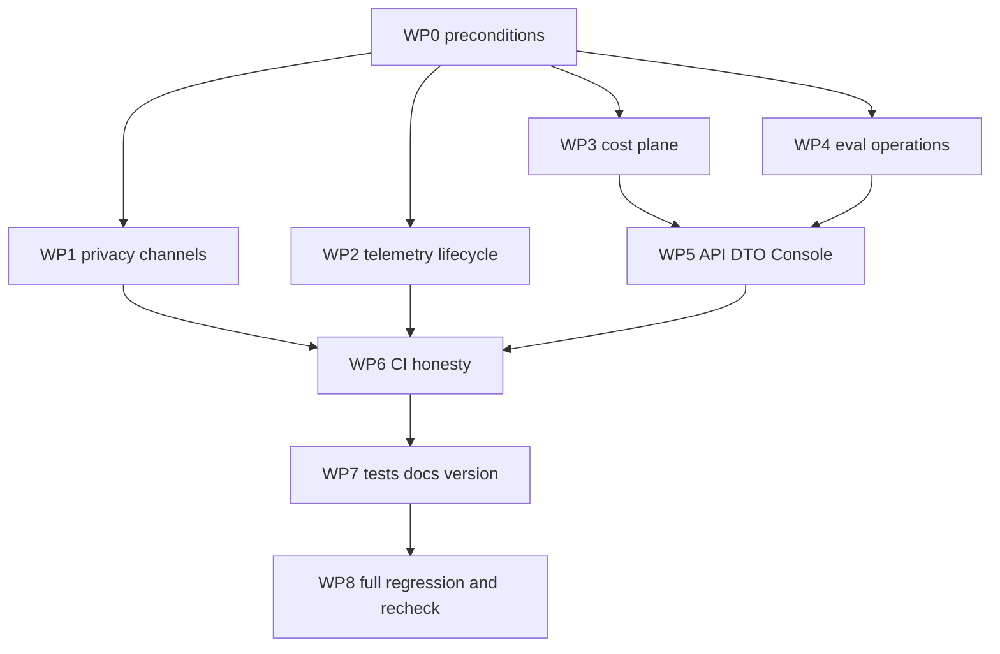

« M15 FAIL Remediation Plan

## 已确认的三项设计决策

- 范围：全部修复（6 BLOCKER + 约 24 MAJOR + 约 25 MINOR）。
- 定价历史稳定性：RunManifest 冻结 pricing 引用 + 版本可寻址 pricing 快照存储；冻结引用落在 **run 行**（`pricing_version` / `pricing_digest`）。
- Exporter 生命周期上界：**watchdog 线程硬超时 + 调小默认 timeout**。

## WP0 先决条件（必须先做，否则后续验证不可复现）

- 从 [.gitignore](../../.gitignore) 删除第 10 行 `.importlinter.sqlite`，把该文件纳入版本控制。这是 BLOCKER-1：`git ls-files` 目前只有 9 个契约文件，而 [tests/architecture/python/test_relay_boundaries.py](../../tests/architecture/python/test_relay_boundaries.py) 的 `test_sqlite_adapters_have_no_vendor_or_fake_dependency` 断言 `returncode == 0`，`lint-imports --config <缺失>` 实测 exit 1，clean clone 必失败。
- 迁移编号协调（为 WP3 的真实 `006` 让路）：真实迁移目录目前到 `005_eval_state.sql`；[tools/probes/probe_migration.py](../../tools/probes/probe_migration.py) 第 71 行 `applied == [1, 2, 3, 4]` **当前已 FAIL**，第 106/130/132 行用 `006_broken.sql` 做临时目录注入。修法：71 行改为实际版本列表；broken 注入改用 `007_broken.sql`，`{1, 2, 3, 4, 5}` 改为含 6。同步更新 `tests/postgres/test_migration_files.py`。

## WP1 隐私与内容通道（BLOCKER-2、BLOCKER-3 + 相关 MAJOR/MINOR）

- 重写 [tests/observability/test_privacy_canary.py](../../tests/observability/test_privacy_canary.py)：`_emit_canary_signals` 必须把 9 类 marker（fake API key、Authorization、prompt、response、tool arg、tool output、source body、artifact body、PG 密码）真实注入到每个可达通道（operation attributes、`failure_category`、operation name、metric labels、correlation ids、resource attributes），再扫描真实 OTLP wire bytes、解码后的 span attributes/events、metric labels、`caplog`/`capsys` 应用输出，以及**真实** `GET /runs/{id}/telemetry` 响应。删除第 102-105 行拿测试内部字面量自比的断言。
- 给 `failure_category` 加界：[packages/application/observability/signals.py](../../packages/application/observability/signals.py) 的 `OperationEnd.failure_category` 收敛为闭集（复用 `packages/domain/enums.py::FailureCategory` 或新建闭集 enum），或在 `__post_init__` 做 allow-list + 长度上限 + redaction。同步 [adapters/otel/span_mapping.py](../../adapters/otel/span_mapping.py) 第 91-92 行与 `_status_for` 的 `description`。
- 修 `sanitize_attributes` 顺序倒置：[packages/application/observability/attributes.py](../../packages/application/observability/attributes.py) 第 75-78 行改为**先 redact 后截断**（与同文件第 61 行 docstring 一致）；把 `_REDACTED_ATTRS`（第 55 行，当前仅 3 键）扩到全部字符串型 `AttributeKey`。
- 给 metric label **值**加界：[packages/application/observability/attributes.py](../../packages/application/observability/attributes.py) 的 `MetricSample.__post_init__` 增加值域校验（长度上限 + redaction + 对 `scope`/`outcome` 强制枚举），[adapters/otel/metric_mapping.py](../../adapters/otel/metric_mapping.py) 第 32 行的 `str(value)` 直通不再是唯一防线。
- operation `name` 与 correlation id 加长度上限；`MeterProvider` 增加 `views=` 做 cardinality 兜底（[adapters/otel/provider.py](../../adapters/otel/provider.py)）。
- 收紧 resource 逃逸：[adapters/otel/resource.py](../../adapters/otel/resource.py) 不用 `Resource.create`（会并入 `OTEL_RESOURCE_ATTRIBUTES`），改显式构造；`_resolve_headers` 在无 credential ref 时显式传空 dict，阻断 `OTEL_EXPORTER_OTLP_HEADERS` 回落。
- 删除 [.env.example](../../.env.example) 第 16-17 行两个无读取者的死键（`OTEL_CAPTURE_GENAI_CONTENT`、`OTEL_EXPORTER_OTLP_ENDPOINT`），或改为真实 `RESEARCHOS_OTEL_*` 键名。
- collector 证据管线只绑 loopback：[docker-compose.m15.yml](../../docker-compose.m15.yml) 端口映射加 `127.0.0.1:` 前缀，与 `UPSTREAM_COMPONENTS.yaml` 声明的 `loopback_only_default_endpoint` 对齐。

## WP2 Telemetry 生命周期、fail-open 与资源（BLOCKER-4 + 相关 MAJOR）

- BLOCKER-4：在 [adapters/otel/sink.py](../../adapters/otel/sink.py) 的 `flush`/`shutdown` 外包 watchdog——把 inner provider 的 `force_flush`/`shutdown` 放进 daemon 线程并 `join(timeout_seconds)`，超时则放弃线程、计 drop、立即返回；同时把 `_DEFAULT_LIFECYCLE_TIMEOUT_SECONDS` 与 `OtelConfig.timeout_seconds` 默认值调小。回归测试断言：blackhole collector 下 `flush(1.0)` 与 `shutdown(1.0)` 的实测墙钟 < 1.5s（当前实测 10.781s / 20.047s）。同步修正 [adapters/otel/provider.py](../../adapters/otel/provider.py)、`sink.py`、[services/api/app.py](../../services/api/app.py) 第 77 行三处"有界"docstring。
- 修控制面 exporter 健康信号：[adapters/otel/failsafe.py](../../adapters/otel/failsafe.py) 的 `drop_count` 只数 inner 抛错，而 `OtelTelemetrySink` 全部自吞 → 结构性恒 0。让 `FailSafeTelemetrySink` 聚合 inner 自有的 `dropped`，或让 [services/api/mappers/operations.py](../../services/api/mappers/operations.py) 第 166 行同时读 inner 计数。相应改掉 [tests/observability/test_telemetry_overhead.py](../../tests/observability/test_telemetry_overhead.py) 第 99 行那条近乎恒真的 `drop_count == 0`。
- 让 telemetry 真正零介入业务时钟：[adapters/sqlite/workflow_ops.py](../../adapters/sqlite/workflow_ops.py) 的 `_note_queue_lag` / `_note_task_duration` 用 `self._now`（注入的业务时钟），且 [services/api/telemetry.py](../../services/api/telemetry.py) 的 `build_api_telemetry` 永不返回 `None` → "telemetry off 零开销"在出厂组装中不成立，实测 14 个持久化事件时间戳偏移。修法：telemetry 计时改用独立单调时钟源，或在 sink 为 Null 组合时短路。
- 补齐 fail-open 对称性：[packages/application/observability/scope.py](../../packages/application/observability/scope.py) 的 `__enter__` 加 try/except（与 `__exit__` 对称）；[services/api/scheduler.py](../../services/api/scheduler.py) 第 72-79 行守护线程内的 `record_metric` 纳入 try；[adapters/postgres/outbox_relay.py](../../adapters/postgres/outbox_relay.py) 第 51-58 行把 backlog metric 移到 drain 之后或加保护。
- 修 `_scopes` 无界：[adapters/otel/sink.py](../../adapters/otel/sink.py) 的 `_scopes` 只在 `end_operation` 弹出，`SpanMapper._evict_overflow` 不触及它（实测 6 万次无配对 begin 后达 60000 而 in-flight 正确停在 4096）。让驱逐同时清理 `_scopes`，并把 `_scopes` 纳入 `_lock`。
- 补 `_scopes` / `SpanMapper.dropped` 的并发写保护；修正 `sink.dropped` docstring（当前把"父引用不可解析"也计入 drop，健康 run 报 3 次幻影 drop）。
- 修 PROJECT span 从不创建导致 `run` span 父引用悬空，以及 `workflow.submit` 在 `trace_id` 存在时脱链（`parent_span_ref` 摘要含 `trace_id`，而 workflow engine 传入的 `CorrelationRef` 不带）。

## WP3 成本平面（BLOCKER-5、BLOCKER-6 + 相关 MAJOR）

### BLOCKER-6 定价冻结（已定方案）

- 新增 Port `packages/application/ports/pricing_snapshot_store.py`：按 `(version, digest)` 可寻址地存取 `PricingTable`；实现 sqlite / postgres / fake 三份，PG 用新迁移 `adapters/postgres/migrations/006_pricing_snapshot.sql`。
- [packages/domain/manifest.py](../../packages/domain/manifest.py) 的 `RunManifest` 增加 optional `pricing_version` / `pricing_digest`（沿用 M12-R1 既有加性字段先例，`digest()` 自动覆盖）；[packages/application/preflight/preflight.py](../../packages/application/preflight/preflight.py) 的 `freeze_manifest` 在冻结时写入，并把当期 `PricingTable` 落进快照存储。
- [packages/domain/run.py](../../packages/domain/run.py) 的 `ResearchRun` 增加 `pricing_version` / `pricing_digest`。**注意该 dataclass 是 `frozen + slots` 且 `transition()`（第 51 行起）与 `with_manifest()`（第 68 行起）逐字段手工复制新实例——两个方法都必须同步加字段，否则任何状态迁移都会静默丢掉冻结引用。** 同步 [adapters/sqlite/run_store.py](../../adapters/sqlite/run_store.py) 与 [adapters/postgres/run_store.py](../../adapters/postgres/run_store.py) 的编解码。
- [packages/application/cost/projection.py](../../packages/application/cost/projection.py) 的 `project_entry_cost` 改为按 run 冻结的 `pricing_version` 从快照存储解析历史价表，而不是用读时传入的当期表再盖当期章。
- 遗留 run（无冻结引用）必须显式表达为"pricing 未冻结"而**不是**静默回落到当期表——那正是本 BLOCKER 的成因。[packages/application/run_orchestration/snapshot_migration.py](../../packages/application/run_orchestration/snapshot_migration.py) 的遗留判定同步扩展。
- 替换名不副实的 `test_price_change_cannot_mutate_historical_projection`（[tests/application/test_cost_projection.py](../../tests/application/test_cost_projection.py) 第 110-136 行）：新测试必须写 Run A → 改价表 → 写 Run B → **重读已持久化的 Run A**，断言金额与货币不变。
- `CostAmount` 增加 `effective_from` 与 `calculation_method`（当前只活在被加载的表里，未随金额返回）。

### BLOCKER-5 重试记账

- 修 [packages/application/run_orchestration/task_executor.py](../../packages/application/run_orchestration/task_executor.py) 的重复记账：`_attempt_once` 已按 `task.attempt` 记账，`execute_task` 在重试预算耗尽时又以同一 attempt 记一次 → 同 `entry_id` → `InvalidInputError` 穿出 use case。
- 把 budget 接进生产路径：[packages/application/run_orchestration/phase_runner.py](../../packages/application/run_orchestration/phase_runner.py) 第 228 行 `ExecutionDeps(deps.workflow, deps.runtime)` 补上 `budget=deps.budget`（同一对象第 71 行已有）。
- 顺带清理 `task_executor.py` 的 `_record_attempt_usage` 函数体内联 import（违反 always-applied 的 no-inline-imports 规则）。
- 补测试：全仓当前**没有任何**测试构造 `ExecutionDeps` 或调用 `execute_task`——这是 CI 看不见这两个缺陷的根因。

### 成本正确性 MAJOR

- `aggregate_costs([])` 硬编码 `"USD"` / `"unpriced_v1"`（[packages/application/cost/projection.py](../../packages/application/cost/projection.py) 第 141 行）：改为携带真实 pricing 上下文，并区分 NO_DATA 与显式 ZERO。
- `/runs/{id}/usage` 把 UNKNOWN 折叠为 0：[services/api/routers/inspection.py](../../services/api/routers/inspection.py) 第 194 行 `sum(entry.estimated_cost_minor or 0 ...)` 且完全忽略 `actual_cost_minor`。
- model 维度结构上永不可完整定价：`budget_entries.model_entries` 总是同写 `tokens` 与 `calls` 两条，而 `PricingTable` 每 `(dimension, resource_key)` 只允许一条价 → 未定价兄弟条目的 `MONETARY_UNAVAILABLE` 抹掉已定价金额。需要按 unit 细分定价键或按 unit 分组投影。
- evaluation usage 永远无法归属 run：`evaluation_entries` 不接 `task_id`，两个读端点都按 `entry.task_id in run_task_ids` 过滤 → 条目被丢弃；`clean_run_stages.py:143` 既不传 `task_id` 也不传 `agent_id`。
- 确定性 scorer 被记为 model usage：`evaluation_entries` 写 `ResourceType.MODEL_REQUESTS` 并被 `_dimension_of` 路由到 `PriceDimension.MODEL`；需要独立的 scorer/evaluation 资源类型与维度。
- `MODEL_COST` 被 `_dimension_of` 映射到 `EVALUATION` 维度并按 `task_id` 作键，导致中转站上报的真实金额既错标又不可达。
- currency 不参与算术：`project_entry_cost` 忽略 `entry.currency`，`aggregate_costs` 取 `items[0]` 后无条件求和（`[300 USD, 3000 JPY]` 得 `3300 USD`，换序得 `3300 JPY`）。加跨币种拒绝或显式转换。
- 单条 `USAGE_UNKNOWN` 永久抹掉 run 总额（优先级最高且无 priced 小计存活）：增加"部分不可计量"表达。
- evaluation 重试丢账与 `close_budget` 裸循环部分写入（[packages/application/experiments/budget_closure.py](../../packages/application/experiments/budget_closure.py) 第 89-90 行）：`_evaluation_usage` 不传递 `attempt` 且用确定性 `report_id` 作键。
- 幂等重放抛异常而非收敛为 no-op，且循环在首个重复处中断导致其后新条目被静默跳过。
- `record_cancelled_usage` 无生产调用者、`entry_id` 以取消数量为键会碰撞、且不设 `task_id`。
- `_load_pricing` 裸 `except Exception` 静默回落（[services/api/composition.py](../../services/api/composition.py) 第 189-197 行）：增加显式降级标记（参照同仓 `ClaimMapDto.degraded`）。
- 出厂 `unpriced_v1` 一版两摘要（`examples/config/pricing.yaml` 的 `effective_from` 与 `unpriced_table()` 的 `1970-01-01` 不一致）。
- `packages/application/cost/projection.py` 的 `unpriced_digest()` 内联 import 清理。

## WP4 评测运营平面（MAJOR）

- 在 [packages/application/ports/eval_report_store.py](../../packages/application/ports/eval_report_store.py) 的 `StoredEvalReport.__post_init__` 强制 `report_digest == digest(body)`（当前只检查两者非空），并把 `verdict` 从裸 `str` 收敛为闭集；同步给 `006`/`005` 的 verdict 列加 CHECK。这是"趋势端点发布未经校验的 index verdict"的根因——实测可经支持的 Port 让 `GET /evaluations/trend` 返回 body 说 `BLOCK` 而点位说 `ALL_GREEN_SHIP_IT`。
- [packages/application/evaluation/trend.py](../../packages/application/evaluation/trend.py) 的 `_point_of` 在构造点位时用 verbatim body 交叉校验 index，冲突时降级为不确定态而非静默采信。
- 接线 `missing_evaluations`：该函数（`trend.py` 第 142 行）无生产调用者，`build_trend` 不调用它，`TrendReport.missing` 恒为 `()` → `GET /evaluations/trend` 永远返回 `missing: []`，而 DoD-13/16 与 `docs/api/CONTROL_PLANE_API.md` 都声称提供该第三态。
- 修查询窗口：[services/api/mappers/operations.py](../../services/api/mappers/operations.py) 第 113 行硬编码 `limit=200`，两个 store 都 `ORDER BY comparison_digest, recorded_at`（最旧优先）→ 丢弃最新评测且 DTO 无 truncation 标记。改为最新优先 + 显式 truncation 字段。
- 让 `recorded_at`（决定 baseline/candidate 排序的非 digest 列）不可单独反转结论：纳入摘要或改用不可篡改的排序依据。
- 修 `ComparabilityVerdict` 标签错位与死分支：scorer 变更被标为 `DATASET_CHANGED`（dataset 分支先命中）；`SCORER_CHANGED` / `SEGMENTED` / `INCOMPATIBLE_GENERATION` 三个 verdict 结构不可达；补 `RUBRIC_CHANGED`。
- 补 reviewer 平面可见性：reviewer 超时当前呈现为干净 PASS（`compute_verdict` 与 `build_index_entry` 都只看 `scorer_findings`）；增加 `reviewer_failure_count` 投影列。
- 修 `EvalScore.pass_ratio` 把 INFRA 计入分母（[packages/domain/eval_result.py](../../packages/domain/eval_result.py) 第 165 行 docstring 声称不参与）。
- 统一 SQLite `INSERT OR REPLACE` 与 Postgres `DO UPDATE SET`（后者遗漏 frozen-condition 列）的 upsert 语义。

## WP5 API / DTO / Console（MAJOR）

- DTO 枚举摊平：[services/api/dto/operations.py](../../services/api/dto/operations.py) 与 [services/api/dto/inspection.py](../../services/api/dto/inspection.py) 把 `CostAmountStatus`(5)、`PriceDimension`、三个 `verdict`、`ResourceType`(13)、`LedgerCostStatus` 从裸 `str` 收敛为 Literal/Enum，让 OpenAPI 与镜像 TS 类型可穷尽 switch。
- `UsageEntryDto` 补 `quantity_status` / `unavailable_reason` / `attempt` / `currency`（当前缺失导致域层标记不可计量的行在线上序列化成"已测量的 0"）。
- `TrendPointDto` 补 provenance（dataset / gate config / system version / run_id / comparison digest）；`RunTelemetryDto` 补 manifest 与 exporter 配置 digest。
- Console 去掉浏览器端货币算术与臆造币种：[apps/web/src/features/inspection/Views.tsx](../../apps/web/src/features/inspection/Views.tsx) 第 47 行、`features/protocol/ProjectionTable.tsx` 第 16 行、`features/protocol/ReportView.tsx` 第 7 行的 `/100` 与硬编码 `USD`，改为渲染服务端给出的金额与 currency。
- `outbox.pending` 把读失败折叠为 0（[services/api/mappers/operations.py](../../services/api/mappers/operations.py) 第 151-157 行裸 except）：增加 unknown 态。
- 给 M15 交付的 operations 视图补测试（当前 `runTelemetry` / `runCost` / `evaluationsTrend` / `useOperations` / `OperationsPanel` 全仓零覆盖）。
- 补 `test_openapi_contains_control_plane_paths` 的三个 M15 路径；处理快照守卫的一次性自愈特性（`_regenerate()` 会重写它守护的产物，本地二次运行漂移消失）。
- 清理 `services/api/routers/operations.py`(28/38/50)、`mappers/operations.py`(72/110/111/162)、`demo.py:12` 的内联 import，以及 `mappers/operations.py:45` 穿透私有属性 `deps.runs._deps.workflow`。

## WP6 CI 与门禁诚实性（MAJOR）

- [.github/workflows/m0-quality.yml](../../.github/workflows/m0-quality.yml) 的 `collector-quality` 目前 fail-open：服务不可达时 `test_collector_evidence.py:31` 与 `test_postgres_failure_isolation.py:41` 走 `pytest.skip()`，实测"3 skipped, exit 0"绿灯而零断言执行。改为在该 job 内断言服务可达（skip 即失败），或改用 fail-closed fixture。
- 让 marker 门控套件真正常驻 CI：`postgres` marker 全仓 43 个测试，CI 只选中 2 个（`tests/postgres/*`、`tests/e2e/test_pg_crash_restart.py` 均不在任何 job）；`requires_docker` 39 个中 9 个不在 CI。
- 把 `apps/web` 的 `test` / `typecheck` / `build` 纳入 CI 与 m0 profile；根 [tsconfig.json](../../tsconfig.json) 目前不含 `apps/web`，`pnpm run typecheck` 从不检查 Console。
- 强化 `tests/architecture/typescript/production-boundaries.test.mjs`：当前对成本算术、threshold、硬编码延迟/错误率、PASS/FAIL 字面量、厂商依赖零断言，且第三个测试包在 `if (result.status === 0)` 里会静默过关。

## WP7 弱测试、文档、版本与 MINOR

- 替换复审用变异测试证明恒真的 6 个测试：[tests/observability/test_telemetry_overhead.py](../../tests/observability/test_telemetry_overhead.py) 第 99 行、`tests/application/test_eval_store_m15.py` 第 102 行、`tests/application/test_eval_trend_m15.py` 第 140 行、`tests/api/test_operations_api.py` 第 137 行、`tests/evals/test_reviewer_failure.py` 第 138/150/165 行；补 `GATE_CONFIG_CHANGED` / `SCORER_CHANGED` / `SEGMENTED` / `INCOMPATIBLE_GENERATION` 四个零覆盖分支。
- 版本单一源：把 [CHANGELOG.md](../../CHANGELOG.md) 第 3 行 `## v0.5.1` 与第 19 行 `## v0.5.0` 改为 `## Unreleased`（全文当前无 Unreleased 标题，而 `VERSION` = 0.4.0），并合并第 55/57 行重复标题。给 `validate_bundle.py` 增加"CHANGELOG 不得出现超前于 VERSION 的已发布标题"检查——否则该规则仍然无人执行。备选方案是把 `VERSION` 提到 0.5.1，代价是连带重命名 `examples/protocols/ai_ml_research_v0_4_0.yaml` 及其 id/version 与全部引用。
- 修 [docs/INDEX.md](../../docs/INDEX.md) 第 8 行仍写 M14 `IN PROGRESS`（与 `MILESTONES.md:95` 的 DONE 直接矛盾）；把 `docs_consistency_check.py` 的 `MILESTONE_IDS`（冻结在 M8-M11）扩到 M15 以便真正拦住这类漂移。
- 修 `docs/frontend/UI_DESIGN_PROMPTS.md` 未登记进 `docs/INDEX.md`；在 M15 完成记录 §1/§5 补上未申报的 relay/workflow 适配器重构（`gateway.py` 370 行、`sqlite/workflow_engine.py` 250 行、新增 `completions.py`/`transport.py`/`workflow_ops.py`/`telemetry_notes.py`）。
- 修 M15 完成记录中的错误计数：`AttributeKey` 实为 27 键（记录写 29）；qualification 文档的"消费 semconv 常量"与全仓零 semconv import 矛盾、"16 项问题矩阵"不存在、Repository 指向与许可证据自相矛盾。
- 处理 `opentelemetry-semantic-conventions==0.60b1`：预发布包被 pin 为直接 ADOPTED 依赖却零引用——移除直接依赖声明，或真正使用它。
- 修 `probe_telemetry_soak.py --pg` 第二次迭代崩溃（第 107-115 行每轮提交同一固定 task id 且不清库，且 `_pg_soak` 在第 85 行先于第 86-88 行的判决打印，`--pg` 模式从不输出 PASS/FAIL）。
- 修 `fault_collector.py:50` 用 port 0 导致"exporter 重启"场景重启后换端口、退化为第二次"collector down"。
- 补 `services/api` 的 import-linter 覆盖：`.importlinter.api` 只对 `services.api.dto` 禁 `opentelemetry`，其余 18 个代码单元仅靠 AST 测试兜底；`.importlinter.otel` 的手工枚举 `source_modules` 改为可自动发现，并把 `tools/` 纳入 AST 扫描。
- 记录（不修复）既存 M13 条件：`composition.py:242` 与 `pg_composition.py:122` 的 `FakeAgentRuntime` 在生产 composition root，M15 的 telemetry/cost 视图因此投影 fake agent loop——在 M15 记录中明确重述，避免读者误认为是真实执行投影。
- 记录（不修复）`lmnr` 进程内厂商 shim：`LMNR_PROJECT_API_KEY` 存在时 OpenHands 会话 trace 会外发，仓库无 env allow-list；在 qualification 中把"Vendor SDK 不采用"限定为"Research OS 自有代码"。

## WP8 全量回归与独立复检

- 逐 WP 跑相关套件；全部完成后跑 `uv run --frozen --no-sync python -B .cursor/skills/cursor-framework-check/scripts/run_all_checks.py --profile m0 --keep-going`（基线：19/19、2351 passed / 5 skipped）。
- 起 `docker-compose.m14.yml` + `docker-compose.m15.yml`，跑 `tests/observability`、`tests/postgres`、`-m requires_docker`、`tests/e2e` crash/restart 与 `tools/probes/*`。
- 跑 `validate_bundle.py`、`governance-check/validate.py`、`validate_cursor_learning.py`、`run_cursor_learning_evals.py`、`docs_consistency_check.py`。
- 用独立探针复测 6 个 BLOCKER 的原始复现路径（clean-clone 架构门禁、canary 注入、redaction 顺序、flush/shutdown 墙钟、`execute_task` 重试、改价后重读 Run A），不接受"文档自证"。
- 重写 [docs/roadmap/M15_COMPLETION_RECORD.md](../../docs/roadmap/M15_COMPLETION_RECORD.md) 的 DoD 矩阵，逐条附本轮实际执行的证据；按 `20-plan-memory-recheck.mdc` 走一次 `recheck` 从原始验收条件重新核对。
- 默认不创建 commit；需要提交时按任务白名单路径显式暂存并走 `semantic-commit`。

## 顺序与并行性

WP1 / WP2 / WP3 / WP4 彼此独立，可并行。WP3 是最大且风险最高的一块（Domain + 2 个适配器 + 新 Port + 新迁移 + preflight 冻结路径）。

## 不做的事

- 不修改 validator 或授权规则来绕过失败门禁。
- 不因"让测试变绿"而删除 incompatible-comparison 测试、关闭 privacy 测试、hard-code cost、把 unknown 记 0、改 Trend 数据或 Dashboard 阈值。
- 不默认开启 Prompt/Response capture；不跳过 M14 reliability 回归。
- 不进入 M16。»