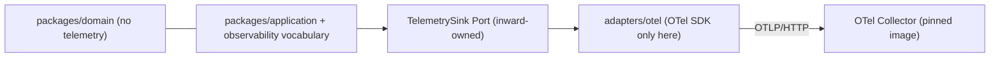
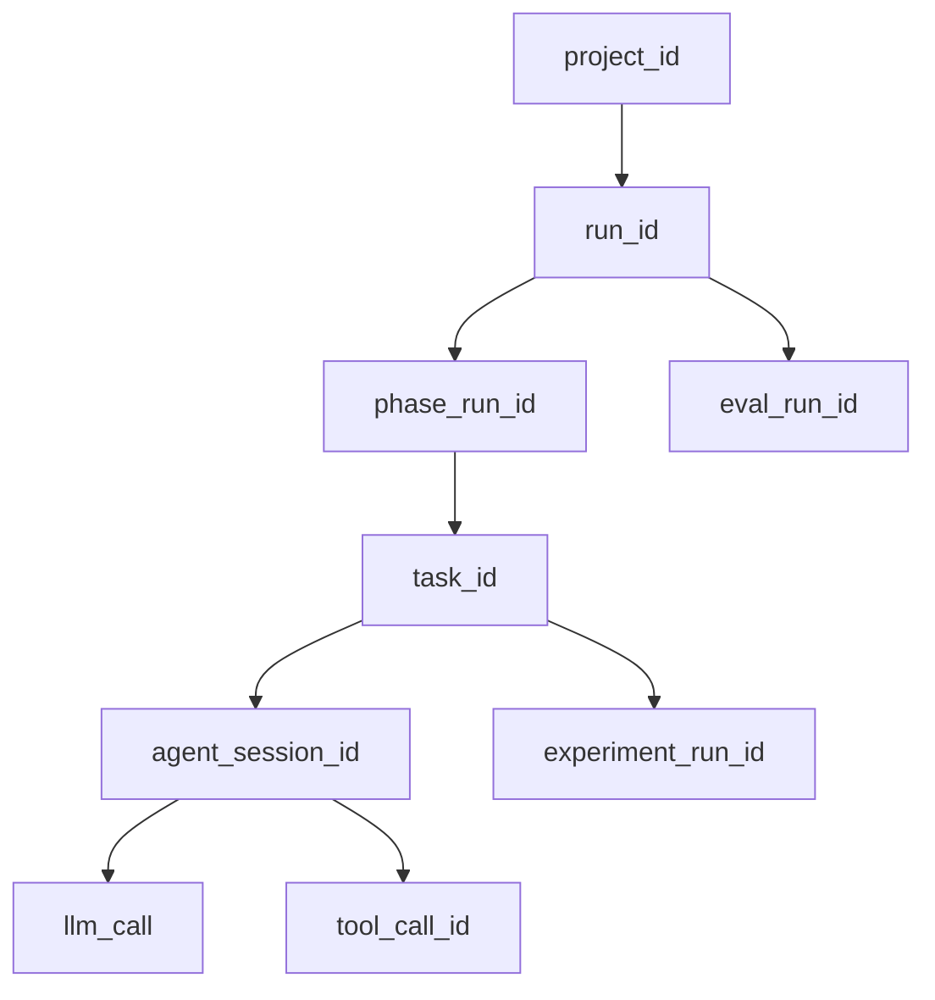

> Authorization: this user request. Roadmap authority is `docs/roadmap/MILESTONES.md` §M15 (Purpose / Scope / Non-goals / Key Deliverables / Entry Gate M11 PASS). Persist as `PLAN-20260828-024-m15-observability-cost-eval-operations.md` via the `all-plan` skill, indexed in `.cursor/plans/ALL_PLAN.md`. Single milestone, no M15A/M15B.

# M15 — Observability / Cost / Eval Operations

## 1. Current signal and source inventory

Verified by reading the repository. What exists:

- Domain events: 34-member `EventType` StrEnum in `packages/domain/events.py`; tamper-evident `EventEnvelope` that already carries `project_id / run_id / phase_run_id / task_id / agent_session_id / trace_id`. 16 types have producers; 18 are declared with no producer.
- Transactional outbox: `outbox_events` table, `adapters/postgres/outbox.py`, `adapters/postgres/outbox_relay.py`, `adapters/sqlite/outbox.py`; drained by `OutboxRelayScheduler` in `services/api/scheduler.py`.
- Redaction primitives: `packages/domain/redaction.py` (`REDACTED`, `redact_text`, `select_safe_headers`, `SAFE_RESPONSE_HEADERS`), enforced in `PortError.__init__` at `packages/application/ports/errors.py`.
- Usage truth: `UsageLedgerEntry` + `LedgerCostStatus{KNOWN,UNKNOWN}` in `packages/domain/budget.py`; `BudgetLedger` port; SQLite/Postgres/Fake adapters; `budget_usage_entries` table.
- Real token extraction: `CompletionResult.prompt_tokens/completion_tokens/total_tokens/usage_unavailable_reason` in `packages/application/ports/model_gateway.py`, populated by `adapters/relay/chat_api.py` and `adapters/relay/responses_api.py`.
- Eval truth: `EvalReport` + `FrozenConditions.comparison_digest()` in `packages/domain/eval_result.py`; `compare_reports` in `packages/application/evaluation/regression.py`; `EvalFindingStatus.INFRA_ERROR`.
- Read surface: `RunProjection` port (`list_tasks`, `events`), computed on read; `GET /runs/{id}/usage` in `services/api/routers/inspection.py`; Console `features/inspection/`.

What is absent: no OpenTelemetry usage in first-party code (OTel 1.39.1 / semconv 0.60b1 exist in `uv.lock` only transitively via `openhands-sdk → lmnr`); no `logging`/`structlog` anywhere; no metrics, no `/metrics`, no health endpoint; no telemetry port or module; no monetary pricing of any kind; no eval persistence, port, table, or run linkage; no trend or cost projection.

## 2. Canonical truth vs telemetry projection

Business truth (must survive collector loss, never derived from telemetry):

- `ResearchRun` / `ResearchTask` / lease / idempotency — PostgreSQL `runs`, `tasks`, `leases`, `idempotency_records`
- Domain audit — `outbox_events` (`EventEnvelope`, digest-verified)
- Usage — `budget_usage_entries` (`UsageLedgerEntry`, append-only)
- Evidence / Claim / Memory / Artifact — existing ledgers and content-addressed store
- Evaluation verdict — `EvalReport.gate_verdict` from `compute_verdict`, and regression verdict from `compare_reports`

Telemetry projection (may be sampled, delayed, dropped; never a source of truth):

- Spans for run / phase / task / agent session / LLM call / tool call / experiment / evaluation
- Metrics for latency, retry, queue lag, lease expiry and recovery, outbox backlog, eval verdict counts
- Cost view: derived from `budget_usage_entries` plus a pricing snapshot, never from spans
- Eval trend view: derived from stored `EvalReport` bodies, never from spans

Hard rules encoded as tests: telemetry is never read back by any application decision; the cost projection's only usage input is `BudgetLedger.snapshot()`; the trend projection's only input is the eval report store.

## 3. WP1 — Telemetry plane and OpenTelemetry qualification

### 3.1 Qualification (do first, gates everything else)

Produce `docs/references/upstream/M15_OTEL_QUALIFICATION.md` following the M14 report shape (`docs/references/upstream/M14_TEMPORAL_QUALIFICATION.md`): upstream repo, pinned version/tag/revision, license + evidence URL, qualification date, adopted surfaces, rejected/deferred surfaces, compatibility and stability risks, decision.

Question matrix to answer from official docs and the pinned repository (no bulk clone; isolated reads only, revision recorded):

- SDK/API stability guarantees for `opentelemetry-api` and `-sdk` 1.x; semantic-conventions `0.60b1` pre-release status and churn risk
- OTLP/HTTP vs gRPC choice; batching, queue limits, export timeout, retry, shutdown/flush semantics
- Resource attributes, context propagation model, sampling
- GenAI semantic conventions: enumerate each attribute and record adopt/reject per attribute, with privacy rationale. Default posture: reject every content-bearing attribute; adopt only identity/usage/latency/status shapes, and only as an adapter-side mapping from Research OS vocabulary.
- Collector failure behavior under down / timeout / 500 / slow / restart / malformed endpoint
- License: Apache-2.0 for SDK and collector

Rejected in M15 (recorded explicitly): auto-instrumentation, logs signal (no logging pipeline exists to instrument), gRPC exporter, vendor SDKs, any content-capturing GenAI attribute.

### 3.2 Internal telemetry vocabulary (Research OS owned)

New `packages/application/observability/`:

- `signals.py` — `OperationScope` StrEnum (`PROJECT, RUN, PHASE, TASK, AGENT_SESSION, LLM_CALL, TOOL_CALL, EXPERIMENT_RUN, EVAL_RUN, WORKFLOW_QUEUE, OUTBOX_RELAY, LEASE_RECOVERY`), `OperationOutcome` StrEnum (`OK, FAILED, TIMEOUT, CANCELLED, DENIED, SKIPPED`), frozen `CorrelationRef` (all existing business ids, optional), frozen `OperationBegin(span_ref, parent_span_ref, scope, name, correlation, attributes, started_at)` and `OperationEnd(span_ref, outcome, failure_category, attributes, ended_at)`.
- `attributes.py` — closed `AttributeKey` StrEnum (the allow-list: provider, model_id, tool_id, resource_type, attempt, retry_count, status_code_class, failure_category, token counts, payload digest, payload size, queue lag ms, lease ttl, circuit state, verdict, scorer count, reviewer count, dataset digest, image digest, exit code, and similar), `MetricName`/`MetricKind`/`MetricLabel` closed enums, frozen `MetricSample`, and `sanitize_attributes()` which drops unknown keys, coerces to `str | int | bool`, runs `redact_text` on strings, and truncates.
- `scope.py` — `operation(...)` context manager that derives `span_ref`/`parent_span_ref` deterministically from `CorrelationRef`, computes duration, always emits `OperationEnd`, and swallows sink errors.

There is no content channel in this vocabulary. Consequence: prompt, response, reasoning, tool args, tool output, source text, artifact body and credentials are structurally unrepresentable, so there is no `capture_content` switch and **no content Debug Mode in M15** — recorded as an explicit design decision and non-goal in ADR-0026 and OBSERVABILITY.md.

`MetricLabel` deliberately excludes every high-cardinality id. Business ids live only on spans via `CorrelationRef`.

### 3.3 Port and adapter boundary

New `packages/application/ports/telemetry_sink.py`:

```python
@runtime_checkable
class TelemetrySink(Protocol):
    """operational signal sink；fail-open，实现不得抛出，不是 Audit Store。"""
    def begin_operation(self, begin: OperationBegin) -> None: ...
    def end_operation(self, end: OperationEnd) -> None: ...
    def record_metric(self, sample: MetricSample) -> None: ...
```

The port has real consumers from day one (relay gateway, workflow engine, outbox relay, schedulers, execution backend, eval runner, orchestration), so it is not a formalism.




New `adapters/otel/`: `config.py` (endpoint, headers via `CredentialResolver`, timeouts, queue size, sampling, enable flag), `resource.py`, `span_mapping.py` (`OperationBegin/End` to real spans with explicit parent context and explicit start/end timestamps, keyed by `span_ref`), `metric_mapping.py`, `sink.py`, `provider.py` (init/shutdown/flush), `failsafe.py` (`FailSafeTelemetrySink` wrapper that catches everything and counts drops).

New `adapters/fakes/telemetry_sink.py`: `FakeTelemetrySink` (captures all signals, exposes `calls` per the contract-suite convention) and `NullTelemetrySink` (the default when telemetry is disabled). Registered in `tests/contracts/registry.py`.

Wiring only in `services/api/composition.py` / `services/api/pg_composition.py`; new `ApiSettings` fields in `services/api/settings.py` (`RESEARCHOS_OTEL_ENABLED` default off, endpoint, timeout, sample ratio); provider init/shutdown in the `_lifespan` of `services/api/app.py`.

### 3.4 Trace hierarchy and instrumented sites




Trace ids are correlation only and never replace domain identity — asserted by test.

Signal sites, all at adapter or orchestration boundaries:

- LLM: `adapters/relay/gateway.py` — provider/model, latency, status class, stable `FailureCategory`, retry attempt (inside `_request`, so internal retries become visible), token counts when reported, circuit state.
- Tool: ToolProvider adapters plus the policy-wrapped executor — provider/tool, latency, success/failure, retry/rate-limit, effect and risk metadata.
- Workflow: `adapters/postgres/workflow_acquire.py` / `workflow_ops.py` / `leases.py`, `adapters/sqlite/workflow_engine.py` — queue lag at claim, task duration, retry, lease expiry, lease recovery count; `adapters/postgres/outbox_relay.py` — backlog and drained count; `services/api/scheduler.py` — per-pass outcome, which also closes the current silent-swallow gap.
- Experiment: `adapters/execution/` docker backend — duration, outcome, resource observation, infra failure class.
- Evaluation: `packages/application/evaluation/runner.py` — duration, verdict, scorer and reviewer counts, `INFRA_ERROR` count.
- Run / phase / task spans: `packages/application/run_orchestration/` via an optional sink on deps, mirroring the existing optional `publish` callback pattern.

No SLO definitions and no alert rules (M19).

### 3.5 Failure isolation

`FailSafeTelemetrySink` plus a bounded exporter queue plus a hard bound on flush at shutdown. Injected fault set: collector down (connection refused), OTLP timeout, exporter 500, slow collector, exporter queue full, malformed endpoint URL, collector restart mid-run, network interruption. For each, assert the PostgreSQL transaction, queue claim, lease heartbeat, outbox write, experiment, evaluation and evidence commit all still succeed, and that the run's canonical state is byte-identical to a telemetry-off baseline.

## 4. WP2 — Usage to cost operations

Chain stays `Runtime → UsageLedger → Cost Aggregation → Cost Projection → API/Console`. Telemetry is never a cost input.

### 4.1 Additive ledger corrections (approved defect fixes)

- `packages/domain/budget.py`: add `quantity_status: LedgerQuantityStatus = KNOWN` (new `{KNOWN, UNKNOWN}` enum), `unavailable_reason: str | None = None`, `attempt: int = 1`. Defaults keep every existing construction and invariant valid. New invariant: `UNKNOWN` quantity must carry a reason.
- `adapters/sqlite/budget_ledger.py` and `adapters/postgres/budget_ledger.py`: full-fidelity encode/decode — stop dropping `currency`, `agent_id`, `tool_id`, `source`, `occurred_at`, and persist the new fields. Legacy rows decode as `quantity_status=KNOWN` so no historical number is reinterpreted; documented explicitly.
- `adapters/relay/parsing.py` and `adapters/relay/streaming.py`: streaming results must set `usage_unavailable_reason` when no usage arrives, so streamed usage becomes `UNKNOWN` instead of a false measured zero.
- `packages/application/experiments/usage_collection.py` and `packages/application/experiments/budget_entries.py`: map unavailable usage to `quantity_status=UNKNOWN` (never `quantity=0`), and include `attempt` in derived `entry_id`s so retried batches append instead of colliding.
- Failure-path accounting: record usage for retried, failed, cancelled and budget-exhausted work via attempt-scoped ids in `packages/application/run_orchestration/task_executor.py` / `task_phase_helpers.py` and the OpenHands failure branch. Existing `reserve/release`, gate, evidence and evaluation semantics are untouched.

### 4.2 Pricing snapshot

- `schemas/pricing-table.schema.json` (`$id` = `https://research-os.local/schemas/pricing-table.schema.json`, `additionalProperties: false` throughout) registered in `expected_schema_files` of `.cursor/skills/system-spec-check/scripts/validate_bundle.py`.
- `examples/config/pricing.yaml` shipped with one version `unpriced_v1` containing zero price entries, so the default posture is `MONETARY_UNAVAILABLE` for every dimension.
- `adapters/contracts/pricing_loaders.py` following the `resource_loaders.py` / `eval_loaders.py` pattern; `packages/application/cost/pricing.py` holds `PriceEntry`, `PricingTable`, deterministic `pricing_digest()`, `pricing_version`, `currency`, `effective_from`, `calculation_method`.
- No vendor price is hardcoded, and no price lives in Domain.

### 4.3 Cost projection

`packages/application/cost/projection.py` + `aggregation.py`, pure functions over `LedgerSnapshot` plus an optional `PricingTable`:

- `CostAmountStatus` StrEnum: `ACTUAL, ESTIMATED, MONETARY_UNAVAILABLE, USAGE_UNKNOWN, ZERO` — exhaustively switched, `unknown` never collapses to `0`.
- Every projected amount is stamped with `pricing_version` and `pricing_digest`; a later price-table change produces a new version and cannot mutate a historical projection.
- Dimensions: run, phase, task, agent/model, tool, experiment, evaluation. Deterministic scorers produce no model cost.
- Reconciliation checks: retry, timeout, failure, cancellation, re-evaluation and event replay must not under-count, double-count, or fabricate.

## 5. WP3 — Evaluation trend and regression operations

M11 remains the only verdict authority. `FrozenConditions` and its digests are **not** modified, so all existing eval report digests and `schemas/eval-score.schema.json` stay valid.

### 5.1 Storage

- New port `packages/application/ports/eval_report_store.py`: `put(StoredEvalReport)`, `get(report_digest)`, `query(EvalReportQuery) -> tuple[EvalReportIndexEntry, ...]`.
- Stored record keeps the verbatim canonical report bytes (digest-verifiable via `report_digest`) plus derived index columns: report digest, comparison digest, dataset id/version/digest, gate config id/version/digest, scorer versions, system version, aggregated evaluator identity (read from `ReviewerFinding.model_identity` in the body), verdict, pass/fail/infra counts, usage/cost refs, optional `run_id`, timestamp.
- `adapters/postgres/migrations/005_eval_state.sql`, plus `adapters/postgres/eval_report_store.py`, `adapters/sqlite/eval_report_store.py`, `adapters/fakes/eval_report_store.py`, registered in the contract registry.
- The projection never replaces the original `EvalReport`; a rebuild-from-bodies test proves the index is reconstructible.

### 5.2 Comparability

`packages/application/evaluation/comparability.py` with closed `ComparabilityVerdict` StrEnum: `COMPARABLE, CASE_SET_CHANGED, DATASET_CHANGED, GATE_CONFIG_CHANGED, SCORER_CHANGED, EVALUATOR_CHANGED, SYSTEM_VERSION_CHANGED, SEGMENTED, INCOMPATIBLE_GENERATION`. Derived by field-wise diff of the two index entries, which is strictly more informative than today's two-reason refusal in `compare_reports` while producing the same comparable/not-comparable decision.

`packages/application/evaluation/trend.py` refuses to emit a score delta unless the verdict is `COMPARABLE`; otherwise it emits a segmented series with the divergence reason. Known limitation to state honestly: rubric text is folded into `dataset_digest`, so a rubric-only change surfaces as `DATASET_CHANGED` unless the dataset is available for a finer diff.

### 5.3 Failure semantics

`INFRA_ERROR` is carried as its own series and count: never scored 0, never averaged into quality, never PASS, never dropped. `missing evaluation` is a distinct third state from `quality failure`. Regression verdicts are read from `compare_reports`; the trend layer and the dashboard invent no threshold.

## 6. Control Plane API and Console

New router `services/api/routers/operations.py` with DTOs in `services/api/dto/operations.py` and a mapper in `services/api/mappers/operations.py`:

- `GET /runs/{run_id}/telemetry` — telemetry summary projection (span/metric counts, durations, retry, queue lag, lease and outbox signals, exporter drop count), redacted, sourced from domain state and the sink's own counters — not from a telemetry vendor.
- `GET /runs/{run_id}/cost` — `CostViewDto` with per-dimension amounts and explicit status plus pricing version and digest.
- `GET /evaluations/trend` — trend series with comparability verdicts and regression markers.

`GET /runs/{run_id}/usage` and `BudgetViewDto` keep their current shape so M13 contracts and tests stay green; new fields are additive.

Console: add an `operations` view to `ConsoleView` / `NAV_ITEMS` / `ConsoleBody` in `apps/web/src/App.tsx`, a new `apps/web/src/features/operations/` (panel, `useOperations` hook, presentational views) modeled on `features/inspection/`, three client methods in `apps/web/src/api/client.ts`, and hand-mirrored types in `apps/web/src/api/types.ts`. The browser computes no cost, invents no threshold, and never talks to a telemetry backend.

## 7. WP4 — Privacy, resilience, operational validation

- Canary test: inject unique markers (fake API key, prompt marker, tool-arg marker, source-body marker, artifact-body marker, `Authorization` marker, PostgreSQL DSN password marker), run a real workflow with telemetry on, then scan the actual OTLP payload bytes captured by an in-repo OTLP/HTTP receiver, the collector's file-exporter output, application output, and the Console telemetry response. Zero occurrences required. Not unit-test-only.
- Metric cardinality audit: a test enumerates every emitted `MetricSample` label key and asserts membership in `MetricLabel`; asserts no run/task/trace id, no raw error text, no path or body appears as a label.
- Backpressure and resource: repeated telemetry-off vs telemetry-on runs comparing latency, RSS, exporter queue depth, thread count, and clean shutdown/flush; `tools/probes/probe_telemetry_soak.py` for the longer manual run. No SLO, but no leak and no instability.
- Architecture tests: new `.importlinter.otel` confining the OTel SDK to `adapters.otel`; add `opentelemetry*` to the forbidden lists in `.importlinter.domain`, `.importlinter.application`, `.importlinter.fakes`, `.importlinter.sqlite`, `.importlinter.postgres`, `.importlinter.relay`, `.importlinter.mcp`; new `tests/architecture/python/test_otel_boundaries.py`. Also start executing `.importlinter.postgres`, which exists today but no test runs — required for the new forbidden entry to be real.
- Additional asserted boundaries: cost never derives canonical usage from telemetry; the eval dashboard owns no verdict; the collector is not an audit store; the Console has no telemetry-vendor dependency (wire `tests/architecture/typescript/production-boundaries.test.mjs` into the root `test` script so its static scan actually runs).
- Fix the tautological snapshot gate: `tests/contracts/test_openapi_snapshot.py` currently regenerates the file in place and compares it to itself, so it cannot detect drift. Capture the committed bytes before regeneration. Without this, the three new endpoints could silently drift.

## 8. Collector topology and deployment

- New `docker-compose.m15.yml` with a single `otel-collector` service pinned by digest, plus `adapters/otel/collector/collector.yaml` (OTLP receiver, batch processor, `debug` + `file` exporters — no vendor backend).
- Register the collector image as an `UPSTREAM_COMPONENTS.yaml` `DOCKERFILE` component via `adapters/otel/collector/Dockerfile` (`FROM otel/opentelemetry-collector-contrib@sha256:...`), mirroring `research_os_sandbox_image`, because the validator's `_check_dockerfile_adopted` path requires `source.path` plus a sha256 `base_index_digest`.
- Deterministic default gate uses the in-repo OTLP/HTTP receiver (`tests/observability/otlp_receiver.py`), a real socket server decoding real OTLP protobuf. The pinned collector run is a `requires_collector`-marked evidence suite, mirroring how `postgres` and `requires_docker` tests are isolated today, so the m0 profile stays offline and deterministic.
- Update `docs/architecture/DEPLOYMENT_PROFILES.md` to describe the real collector wiring instead of an unconfigured component name.

## 9. Upstream pins and supply chain

Promote from transitive to direct, pinned to the versions already in `uv.lock` so the lock stays stable: `opentelemetry-api==1.39.1`, `opentelemetry-sdk==1.39.1`, `opentelemetry-exporter-otlp-proto-http==1.39.1`, `opentelemetry-exporter-otlp-proto-common==1.39.1`, `opentelemetry-proto==1.39.1`, `opentelemetry-semantic-conventions==0.60b1`. Add to both `[project].dependencies` and `[dependency-groups].dev` in `pyproject.toml` — the validator derives `direct_packages` from the dev group only.

Flip the existing `opentelemetry` entry in `UPSTREAM_COMPONENTS.yaml` from `PLANNED` to `ADOPTED` with `source.kind: PYPI`, `resolution.digest` = the sdist sha256 from `uv.lock`, Apache-2.0 SPDX plus an https license evidence URL, and an `upgrade_gate` with `explicit_approval: true`; add one component per package plus the collector image, and matching rows in `docs/references/LICENSE_MATRIX.md`. `PLANNED` entries must not carry `resolution`/`license`/`upgrade_gate`, and `ADOPTED` entries must carry all of them.

Also record the semconv `0.60b1` pre-release stability risk, and note that `openhands-sdk → lmnr` already pulls OTel, so version alignment is a compatibility constraint.

## 10. Documentation and contract assets

New: `docs/adr/ADR-0026-otel-adapter-boundary.md` (adapter boundary, no content channel, no Debug Mode, telemetry is not audit truth), `docs/references/upstream/M15_OTEL_QUALIFICATION.md`, `docs/roadmap/M15_COMPLETION_RECORD.md`.

Updated: `docs/architecture/OBSERVABILITY.md` (implementation-map section like `EVALUATION.md` §8), `docs/architecture/BUDGET_QUOTA.md`, `docs/architecture/EVALUATION.md`, `docs/architecture/PORTS.md` (TelemetrySink, EvalReportStore), `docs/api/CONTROL_PLANE_API.md`, `docs/api/openapi.m13.json` (regenerated), `docs/INDEX.md`, `docs/roadmap/MILESTONES.md` (M15 status row), `BACKLOG.md`, `CHANGELOG.md`. New required docs registered in `required_files()` of the bundle validator. Every claim must be supported by code, schema, example, test or runtime behavior.

## 11. Test and fault-injection inventory

- Telemetry: vocabulary and sanitization unit tests; trace hierarchy and parent derivation; correlation-id mapping; span/metric mapping against real OTLP bytes via the receiver; privacy canary; collector outage; exporter backpressure; failure isolation with canonical-state equality against a telemetry-off baseline; shutdown/flush.
- Cost: actual / estimated / unknown / unavailable / explicit-zero; pricing version and digest stamping; historical stability under a price-table change; retry, timeout, failure, cancellation, re-evaluation; duplicate event replay; deterministic scorers produce no model cost; ledger round-trip fidelity including the previously dropped fields.
- Eval operations: comparable trend; each `ComparabilityVerdict` branch; changed dataset / gate config / scorer / evaluator; regression detection sourced from `compare_reports`; `INFRA_ERROR` isolation; missing evaluation; index rebuild from stored bodies.
- API/Console: three new endpoints; OpenAPI snapshot (with the drift fix); Console operations view render, refresh and recovery; no frontend truth duplication.
- Architecture: OTel confinement, all forbidden lists, cost-not-from-telemetry, dashboard-owns-no-verdict, collector-not-audit-store, Console vendor independence.
- M14 regression: existing `tests/postgres/**`, `tests/e2e/test_pg_crash_restart.py`, `tools/probes/*` re-run with telemetry on and off.
- Full regression: `uv run --frozen --no-sync python -B .cursor/skills/cursor-framework-check/scripts/run_all_checks.py --profile m0 --keep-going` must stay at 19/19 with `python/tests` green.

## 12. Definition of Done evidence plan

Each of the 21 exit criteria maps to a named artifact: qualification report (1); import-linter contracts plus `test_otel_boundaries.py` (2, 19); trace-hierarchy test against a real run (3); per-signal tests across LLM/tool/workflow/experiment/evaluation (4); vocabulary-has-no-content-channel test plus canary (5); OTLP receiver and pinned-collector payload canary (6); collector-outage canonical-state equality test (7); audit-vs-telemetry separation test (8); cost-input test proving `BudgetLedger.snapshot()` is the only usage source (9); five-status cost tests (10); pricing-version historical-stability test (11); retry and failure accounting tests (12); trend-store provenance test (13); comparability branch tests (14); verdict-provenance test (15); `INFRA_ERROR` isolation tests (16); Console projection-only tests (17); soak and resource comparison (18); m0 profile 19/19 plus M14 suites (20); `recheck` skill run from the original acceptance conditions (21).

Report at completion: signal matrix, qualification report, upstream pin evidence, telemetry coverage, redaction evidence, outage and backpressure evidence, usage-to-cost reconciliation, actual/estimated/unknown examples, eval trend and regression evidence, comparability evidence, Console/API integration, M14 compatibility, resource evidence, full regression log, remaining non-blocking debt, DoD PASS/FAIL matrix, M15 final verdict, M16 and M19 readiness. Stop at the milestone boundary.

## 13. Sequencing

WP1 qualification and vocabulary land first because the adapter boundary and privacy model gate everything else. WP2 and WP3 are independent of each other and can proceed in parallel once the port exists. WP4 validation runs last but its tests are written alongside each WP. Subagent fan-out is capped at 3 per wave, batched in a single message, with no nested delegation.