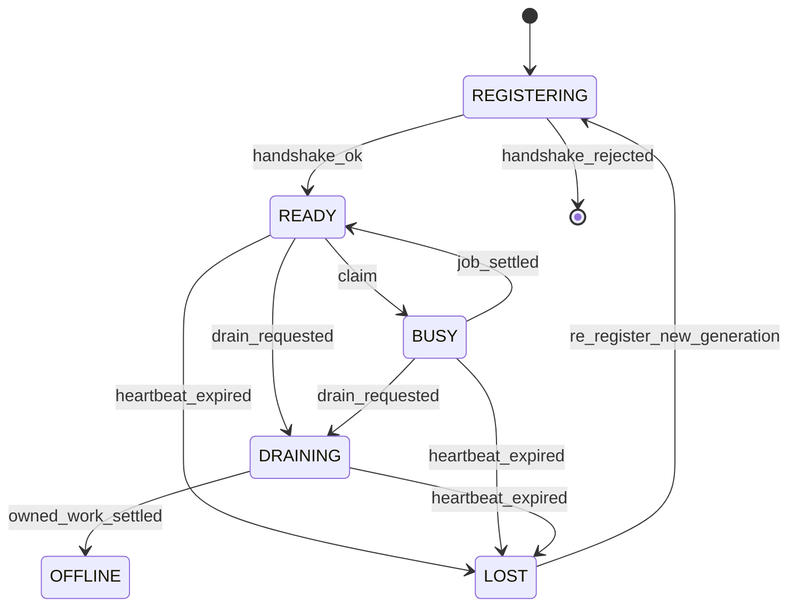
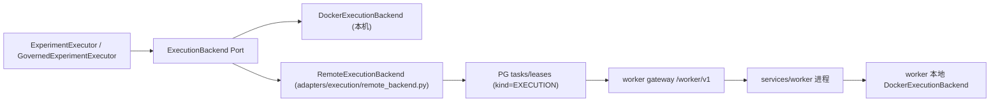
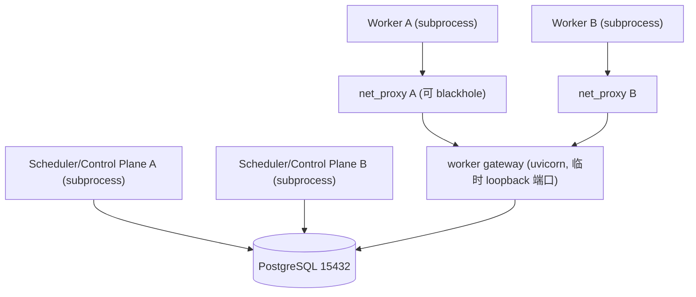

> 说明：本文中「工作单元」= 一次需要在远端沙盒里跑命令的执行作业；「fencing」= 用单调令牌拒绝已失去所有权的旧 Worker 提交结果；「分区」= 把待办作业按稳定哈希分桶，作为路由过滤条件（不是所有权）。

# Research OS M16 — Distributed Execution + Remote Sandbox / Worker

权威范围来自 [docs/roadmap/MILESTONES.md](../../docs/roadmap/MILESTONES.md) M16 节（第 777-828 行）：多 worker 注册/心跳/下线、分区调度、远程 sandbox adapter、worker 故障转移、SWE-ReX 或等价 qualification。Non-goals：GPU 调度、多租户配额、自动扩缩容、公有云多地域。

## 1. Current Execution / Scheduler Architecture Inventory（实测）

队列/租约内核（可复用，不重建）：

- [packages/application/ports/workflow_engine.py](../../packages/application/ports/workflow_engine.py)：`submit / acquire_lease(task_id) / heartbeat / complete / cancel / cancel_run / cancelled_task_ids / recover_expired_leases`，全同步。**没有 claim-next**——`acquire_lease` 要求调用方已知 `task_id`。
- [adapters/postgres/migrations/001_initial.sql](../../adapters/postgres/migrations/001_initial.sql)：`tasks`（PK task_id、`idempotency_key` 唯一部分索引）、`leases`（PK task_id、`lease_id`、`expires_at`、`heartbeat_at`）、`idempotency_records`、`outbox_events`、`artifacts`。迁移已到 007。
- Fencing **已经是跨进程持久的**：`leases` 每 task 只有一行 `lease_id`；heartbeat/complete 都带 `WHERE task_id = %s AND lease_id = %s`，reclaim 时轮换 `lease_id`（[adapters/postgres/workflow_ops.py](../../adapters/postgres/workflow_ops.py) 第 30-41、78-95 行）。`_owned_lease_ids` 只服务「同一 owner 幂等重取」，不是拒绝路径的依据。
- `recover_expired_leases` 是全仓唯一 `FOR UPDATE SKIP LOCKED` 查询；由 `LeaseRecoveryScheduler`（30s 守护线程，[services/api/scheduler.py](../../services/api/scheduler.py)）+ `start_run` 懒触发驱动。

单进程约束（M16 必须处理）：

- 驱动模型是 push：`RunOrchestrationService` → `execute_phases` → `execute_task`（[packages/application/run_orchestration/task_executor.py](../../packages/application/run_orchestration/task_executor.py)）在同进程 for 循环内联执行，没有任何进程轮询队列。
- 没有 worker 守护进程/CLI。仅有的长循环是 API 进程内的三个守护线程（lease recovery / outbox relay / retention）。
- 租约到期比较用**注入的应用时钟** `now_iso(now)`，而 `outbox_events.created_at` 用 PG `now()` —— 时钟源不统一。
- `leases` 不记录**谁**持有租约（`agent_id` 来自 `tasks.assigned_agent_id`，不是 worker 身份）。
- Domain/Application 完全没有 worker / node / partition / shard 概念（`capability` 现有语义全是 tool/model/role 匹配）。
- 两个 composition root 都注入 `FakeAgentRuntime`（[services/api/composition.py](../../services/api/composition.py) 第 229 行、`pg_composition.py` 第 86 行）；真实 agent 会话路径尚未接入编排层。

执行/工作区/产物边界：

- `ExecutionBackend` = `execute(spec, timeout_seconds) -> ExecutionRun` + `close()`，同步、**无 cancel**、timeout 产出 `ExecutionStatus.TIMED_OUT`。
- 唯一真实实现 `DockerExecutionBackend`（[adapters/execution/docker_backend.py](../../adapters/execution/docker_backend.py)）：本机 `docker.from_env()`；bind-mount `spec.workspace_path`（宿主绝对路径）；`NetworkMode=none`、`CapDrop ALL`、`no-new-privileges`、`ReadonlyRootfs`、tmpfs `/tmp`、NanoCpus/Memory/PidsLimit；stdout/stderr 取 `Digest.of_bytes` 并写入工作区 `stdout.log`/`stderr.log`。
- 远程化的两个硬阻塞点：本机 Docker 客户端；`workspace_path` 是宿主本地路径。`WorkspaceSnapshot` 只带 `digest`，内容在 `root/.snapshots/<hex>/`，**没有 export/import**。
- `ArtifactStore.put` 服务端强制 `Digest.of_bytes(content) == artifact.digest`；`get`/`verify` 复验；blob 按 digest 去重。这是现成的完整性边界。
- `packages/domain/enums.py` 已有 `FailureCategory.WORKER_LOST` 与 `ToolBindingKind.REMOTE_WORKER`，无需新枚举表达 worker 丢失。

安全/可观测现状：

- Control Plane API **完全没有认证**（[services/api/](../../services/api/) 只有 `IdempotencyMiddleware`；全仓没有 `compare_digest`/bearer 校验）。这是既有 M18/M19 债务，M16 不整体补齐，但 worker 面必须有认证。
- 遥测是闭集词表：`OperationScope`(12) / `MetricName`(15) / `AttributeKey`(27) / `MetricLabel`(7)，`sanitize_attributes` 先脱敏后截断 256、`sanitize_metric_labels` 枚举折叠 + 64 上限；**没有 `capture_content` 运行时开关**（结构性不存在）。fail-open 三层兜底。
- m0 profile = 动态 23 项（6 python + 9 ts + 8 framework），`python/tests` 跑全量 pytest。markers 严格：`requires_docker / requires_live_llm / postgres / requires_collector`。
- 架构门禁会强制新 adapter 注册：`tests/architecture/python/test_otel_boundaries.py` 比对 `adapters/` 实际子目录与 `.importlinter.otel`，漏配即失败。`tests/tooling/test_python_source_limits.py`：单文件 >450 行硬失败、>300 行告警、单函数 >50 行硬失败。

## 2. M16 Distributed Responsibility Matrix

- Canonical 真相 + 授权：PostgreSQL（`tasks`/`leases`/`artifacts`/域表）。唯一权威。
- 队列 + 租约 + fencing：现有 PG 内核。**不新建第二套**。
- 调度决策（能力/分区/健康匹配）：Control Plane Application。
- Worker 注册表 / 心跳 / drain / lost 判定：Control Plane，服务端时间为准。
- 作业输入输出内容：ArtifactStore（content-addressed，服务端验 digest）。
- 远端命令执行：Worker 进程 + 其本地 `DockerExecutionBackend`。
- Worker 本地磁盘 / 容器状态 / RPC 消息 / 遥测：**都不是业务真值**。
- Console：只经 Control Plane 只读 API 观察，绝不直连 Worker。

## 3. Worker 生命周期设计（WP1）

新增 `packages/domain/workers.py`，显式状态机（照 [packages/domain/task_state.py](../../packages/domain/task_state.py) 的形状写，带 `terminal()` 与转移表，新增变体在穷尽检查处失败）：




`WorkerRegistration`（有界字段，**不是硬件清单**）：`worker_id`、`protocol_version`、`runtime_version`、`capabilities: frozenset[str]`、`backend_kinds: frozenset[str]`、`platform`（仅 os/arch）、`partition_slots`、`max_concurrency`、`registration_generation`、`state`、`last_heartbeat`、`drain_requested`。GPU/内存/拓扑等资源平面属 M17，M16 不表达。

Drain：`READY/BUSY → DRAINING`（claim 查询排除该 worker）→ 已持有作业按正常路径 settle 或由 lease 恢复 → `OFFLINE`。不做自动扩缩容、不做 rolling orchestration。

## 4. Worker 身份与认证模型（WP1）

- 入网：预共享 enrollment secret，经现有 `CredentialResolver` 解析（新增 WORKER 凭据域 ref，与 TOOL/MODEL 域隔离），`hmac.compare_digest` 常量时间比较。
- 注册成功后 gateway 生成 256-bit **session token**，仅返回一次；库里只存 `sha256(token)` + `registration_generation`。后续请求 `Authorization: Bearer <token>`，按 hash 常量时间查表。
- 反冒充：请求体的 `worker_id` 必须与 token 解析出的身份一致，否则 401。
- 反重放：`registration_generation` 单调递增，重新注册即作废旧 token；旧 session 一律 fail closed。
- 明文边界：token 不落日志（`packages/domain/redaction.py` 的 `_BEARER_RE` 已覆盖 `Bearer …`）、不入遥测（闭集词表结构上无法承载）、不入 durable task payload、不入 Artifact。
- 生产 transport：默认要求 TLS（`RESEARCHOS_WORKER_GATEWAY_REQUIRE_TLS=1`）；绑定非 loopback 地址且未启用 TLS 时**拒绝启动**（对齐 M15 collector 的 loopback-only 姿态）。测试用 loopback 明文，通过显式配置开关，不删除生产分支。
- 结果体大小上限 + 拒绝畸形 payload（413/422），Worker 输入一律按 untrusted 处理。

## 5. Heartbeat 与时钟语义（WP1/WP2）

- 心跳间隔默认 10s，stale 阈值默认 30s（3 次错失），均为配置项。
- **服务端时间是唯一权威**：新增 `WorkerReaperScheduler`（15s，形状照 `LeaseRecoveryScheduler`）用 PG `now()` 判定 stale → `LOST`。
- 同时把租约到期比较从注入的应用时钟改为数据库侧时间表达式：`adapters/postgres/workflow_acquire.py` 第 76 行与 `workflow_ops.py` 的 `expires_at <= now_iso(now)` 改为「生产走 `now()`，注入测试时钟时走参数」的时间源抽象，保留现有确定性时钟测试。
- Worker 自报时间戳只作遥测属性，绝不参与 expiry / fence / canonical ordering。
- 重复心跳：幂等 upsert，`last_heartbeat = greatest(stored, now())`。
- 乱序心跳：`registration_generation` 小于库中值即拒绝；不会把 `last_heartbeat` 往回拨。
- 重连不恢复旧权威：session 被拒 → 必须重新注册（新 generation）；重连前的在飞租约由 `recover_expired_leases` 收敛，其迟到结果被 fencing 拒绝。
- Lost worker 的租约释放**仍只走 `recover_expired_leases`**（把「owner 已 LOST」并入同一条恢复 SQL 的判定，保持单一租约权威）。

## 6. Worker Protocol 与版本策略（WP1/WP3）

Transport 选型（先比较再决定）：

- Worker 直连 PostgreSQL：零新表面，但把整库权威交给每台远端主机，直接违反「Worker 不得获得整个数据库/Secret authority」。**拒绝**。
- gRPC / Redis / NATS / RabbitMQ：新增 pin 上游 + 事实上的第二队列风险。**M16 拒绝**。
- HTTP/JSON worker gateway（**采用**）：复用已 ADOPTED 的 `fastapi==0.141.1` / `uvicorn==0.52.4` / `httpx==0.28.1`，无新上游；权威留在 Control Plane；loopback 真实 socket 可测。

形态：`services/api/worker_gateway/` 提供独立 ASGI app（`create_worker_app(deps)`，自带 auth 依赖与独立 DTO 模块），可单独绑定地址；单进程开发可挂载进主 app。Worker 侧 HTTP 客户端在新 adapter 包 `adapters/worker/`。

协议面（`/worker/v1`，全部幂等键化）：

- Control → Worker：work/execution identity（`task_id`）、`lease_id` + `fence`、`ExecutionSpec` 引用、输入 bundle artifact ref + digest、policy/config fingerprint、timeout、cancel 标志、`required_capability`。
- Worker → Control：accept/reject、heartbeat/status、执行生命周期、归一化 `ExecutionRun`、输出 artifact refs + digests、结构化失败（映射 `FailureCategory`）、usage/resource 观测。
- 大结果不进 RPC body：走 ArtifactStore content-addressed 引用。

版本兼容 fail closed：注册时握手 `protocol_version` + `capabilities` + `backend_kinds` + 支持的 execution contract 版本。不兼容 → 注册直接拒绝并计数 `protocol_mismatch`，或标记 `unschedulable`；**绝不「连上就算兼容」**，也不允许跑到一半才发现。

## 7. Scheduler / 分区模型（WP2）

新增 Port 方法（增量，不新建队列）：

- `WorkflowEngine.claim_next(request) -> TaskLease | None`：`SELECT ... FROM tasks WHERE kind='EXECUTION' AND status='QUEUED' AND NOT cancelled AND required_capability = ANY(%s) AND partition = ANY(%s) ORDER BY created_at FOR UPDATE SKIP LOCKED LIMIT 1`，命中后走现有 `_insert_lease` 路径并写入 `worker_id` 与 `fence`。
- `TaskLease` 增补 `worker_id: str | None = None`、`fence: int = 0`（有默认值 → 现有构造与冻结契约套件不破）。
- 新 Port `WorkerRegistry`（`register / heartbeat / drain / mark_lost / get / list`）+ Fake + PG 实现 + 注册进 `tests/contracts/registry.py`。

一个队列、一份 payload 表：执行作业**不新建队列**。`tasks` 新增 `kind TEXT NOT NULL DEFAULT 'AGENT_SESSION'`（Domain 侧 `TaskKind` StrEnum，默认值向后兼容），执行作业为 `kind='EXECUTION'`；明细放 `execution_jobs(task_id PK REFERENCES tasks)`——与现有 `experiment_plans`/`experiment_runs` 同属「类型化 payload 投影」，不是第二队列。现有 agent-session 任务 kind 保持默认，永不被远程 worker claim，M12 参考工作流关键路径不受影响。

分区：

- 为什么需要：把待办作业按稳定键分桶，得到 run 亲和性（同一 run 的作业倾向同一分区 → 工作区/产物本地性），并在 worker 之间做无锁分流。
- 稳定分区键：`partition = sha256(run_id)[:4] mod partition_count`（默认 16），落 `tasks.partition SMALLINT`。
- **partition authority 不存在**：分区只是 claim 查询的过滤条件；唯一所有权权威是 `leases` 表的行（PK task_id + `lease_id` + `fence`）。因此同一 authoritative work 在结构上不可能被两个分区同时拥有——这一点用「给两个 worker 配置重叠分区，断言仍只有一个 claim 成功」的测试证明。
- rebalance 安全性：修改 worker 分区集合只影响下一次 claim，不触碰在飞租约，fencing 不受影响。
- Worker offline 后重分配：租约到期 → `recover_expired_leases` → `QUEUED` → 任何能力匹配的 worker（可跨分区）重新 claim。饥饿兜底：某分区无 worker 覆盖超阈值后放宽为「仅按能力匹配」，并发遥测信号。
- 不做 GPU 优化、成本优化器、自动扩缩容、bin packing、多地域。correctness > sophistication。

多 Scheduler 并发：claim 与 recovery 都用 `FOR UPDATE SKIP LOCKED`，PostgreSQL 事务即协调机制，**不引入新共识系统**。用多进程并发 claim 测试证明无 split-brain。

## 8. M14 lease/fencing 复用策略（WP2）

保持 M14 语义不变，只补「可审计的世代号」：

- `tasks.fence_seq BIGINT NOT NULL DEFAULT 0` 单调递增；每次 (re)claim 递增后写入 `leases.fence`。`lease_id` 轮换机制原样保留。
- 拒绝面覆盖：task completion、execution result、artifact publication、final status、retry completion——全部先校验 `(task_id, lease_id, fence)` 与活跃租约一致，再落任何 authoritative 写。
- 远程 Worker 返回结果**不自带权威**；gateway 校验租约后才由 Control Plane 在 PG 事务内写入。
- 重复物理执行不产生重复业务事实：作业幂等键 = `digest_of({spec, input_bundle_digest, attempt, task_id})` 落现有 `idempotency_records` + `tasks.idempotency_key` 唯一索引；结果接受受 fence 门禁；输出 artifact content-addressed（同字节重复上传为 no-op，digest 不符即被 `ArtifactStore.put` 拒绝）。不用全局串行逃避并发。

## 9. Local vs Remote ExecutionBackend 映射（WP3）

同一个 Port，两个 adapter，Application 零分支：




`RemoteExecutionBackend.execute(spec, timeout_seconds)`：导出工作区 bundle 为 Artifact → 提交 `kind='EXECUTION'` 作业（带能力/分区/输入 digest/policy fingerprint/幂等键）→ 按 `timeout_seconds` deadline 轮询（形状照 `DockerExecutionBackend._wait`）→ 结果落地时经 `ArtifactStore.verify` 复验输出 → 把 stdout/stderr 物化回本地工作区，使现有 `store_log_artifact` 路径不变 → 归一化为 `ExecutionRun`（`compute_usage_summary` 增补 worker ref / image digest / elapsed）→ 超时则下发 cancel 并返回 `TIMED_OUT`。

不创建 `DistributedExperimentRun`，不建第二套 Experiment Domain；`ExperimentExecutor` / `GovernedExperimentExecutor` 代码不变，local/remote 由 composition root 选择。

Cancel：给 `ExecutionBackend.execute` 增加可选关键字 `cancelled: Callable[[], bool] | None = None`（默认 None = 现有行为），`DockerExecutionBackend._wait` 轮询它 → kill + `ExecutionStatus.CANCELLED`。这与 `GovernedExperimentExecutor` 已有的取消回调模式一致，避免为取消再造一层机制。

并行边界（诚实声明）：M16 不改 run 内 phase/session 的顺序执行模型。跨机并行来自**并发的多个 run / 多个独立作业**；phase 内并行分发列为 M17 非阻塞债务，避免动摇 M12 已验证关键路径。

## 10. Workspace / Artifact 传输策略（WP3）

- `WorkspaceBackend` 增补 `export_bundle(lease, snapshot)` / `import_bundle(workspace, artifact_ref)`（`FileWorkspaceBackend` + `FakeWorkspaceBackend` 同步实现，契约套件已参数化覆盖两者）。
- 两道独立完整性校验：bundle 字节 vs `artifact.digest`（`ArtifactStore.put/verify` 已有）；物化后重算工作区树 digest vs `snapshot.digest`（`workspace_tree_digest` 已有）。
- 输入 immutable：远程执行只接受 snapshot digest + artifact ref，不接受可变宿主路径。
- 输出一律进正式 ArtifactStore；Worker 本地磁盘不是 canonical。
- 必须拒绝并有测试：错误 digest、截断上传、错 run/task 的 artifact、重复上传、畸形结果、bundle 内符号链接与 `..` 路径穿越（`FileWorkspaceBackend` 已有 `_reject_symlinks` + `is_relative_to(root)`，导入路径必须复用）。
- Worker 自报 digest 一律由服务端/ArtifactStore 实际复验，不信自报。

## 11. Credential / Scoping 模型（WP3）

- 最小下发：作业只带**该作业实际需要且 Policy 允许**的凭据 scope。不需要就不下发。
- 信任域保持隔离：WORKER（入网/会话）、TOOL、MODEL、ArtifactStore 各自独立 ref，沿用现有 `CredentialResolver` 与 `RegistryCredentialResolver`。
- 绝不把凭据放进 durable task payload / `execution_jobs` 行 / Artifact / 遥测。
- 不提前建 M19 中央 Secret Manager。
- 秘密枚举面：gateway 不提供任何「列出凭据」接口；测试专项断言 worker 无法拉取未授权 ref。

## 12. Remote Sandbox 安全边界（WP3/WP4）

远端 Worker 不是可信 host。远程执行继续受：workspace scope、execution policy、network policy（`NetworkMode=none` 默认）、mount policy（只 bind workspace）、timeout、cancellation、进程/资源边界（CapDrop ALL / readonly rootfs / PidsLimit / NanoCpus / Memory）、secret scope 约束。「已发到远端」不解锁 unrestricted host shell——`build_local_workspace` 的 `HostShellDeniedError` 与 Docker `host_config` 默认拒绝保持不变，并有专项断言。

## 13. SWE-ReX / 等价上游 Qualification 计划（WP3）

输出 [docs/references/upstream/M16_REMOTE_EXECUTION_QUALIFICATION.md](../../docs/references/upstream/M16_REMOTE_EXECUTION_QUALIFICATION.md)，形状照 [M14_TEMPORAL_QUALIFICATION.md](../../docs/references/upstream/M14_TEMPORAL_QUALIFICATION.md)（真实 `git ls-remote` / PyPI JSON pin、隔离 spike、import-linter 边界检查、逐题证据方法 + 结论）。

不预设采用。至少评：license、维护/稳定性、API/SDK 边界、sandbox/isolation 模型、远程执行模型、文件系统/工作区模型、cancellation、timeout、artifact 传输、进程/资源控制、网络控制、安全假设、部署模型、语言/运行时兼容、能否置于 ExecutionBackend Adapter 之后、是否要求 Domain 依赖上游类型、与 M9/M14 契约的适配成本。

对照基线至少两个：本方案的原生 HTTP worker；Docker-over-TCP / docker context。附带按 M14 报告要求复检 Temporal 的 M16 重评条件（worker > 50、跨 run saga、p95 claim latency > 200ms）并记录是否触发。

初步观察（**待 spike 证实，不作为结论**）：SWE-ReX 面向交互式 shell session + Modal/Fargate/Daytona 部署后端，而 Research OS 需要一次性 `ExecutionSpec → ExecutionRun` 批式契约 + digest 化产物，方向存在结构性错配。

裁决三态：ADOPT（则 pin repo/tag/revision + license + 置于 Adapter 边界 + 过 ExecutionBackend 契约 + 上游类型不进 Domain/Application + 上游持久化不成为 canonical，并写 `UPSTREAM_COMPONENTS.yaml` resolution/digest/license/upgrade_gate）/ REJECT / DEFER（记录 evidence、具体 mismatch、替代方案、重议条件）。不采用 SWE-ReX 不等于 M16 FAIL；M16 必须交付的是**远程执行能力 + 上游决策证据**。

## 14. Failure / Recovery 拓扑（WP4）

单一恢复权威链：worker 心跳过期 → `LOST`（服务端时间）→ `recover_expired_leases` 释放其租约并 `LEASED → QUEUED` + 发 `TASK_RETRY_SCHEDULED` → 其他 worker claim（fence 递增）→ 旧 worker 迟到结果因 `(lease_id, fence)` 不匹配被拒。Scheduler 进程崩溃不影响该链，因为全部状态在 PostgreSQL。

## 15. M15 遥测集成（WP4）

闭集词表增量（每项都过 `sanitize_attributes` / `sanitize_metric_labels`，并做基数与隐私审计）：

- `OperationScope`：`WORKER_SESSION`、`WORKER_DISPATCH`、`REMOTE_EXECUTION`。
- `MetricName`：`worker.count`、`worker.registered_total`、`worker.heartbeat_lost_total`、`worker.drain_total`、`worker.protocol_mismatch_total`、`scheduler.claim_latency_ms`、`scheduler.partition_lag`、`remote_execution.duration_ms`、`remote_execution.failover_total`、`remote_execution.stale_result_rejected_total`、`remote_execution.artifact_transfer_failed_total`。
- `AttributeKey`：`worker_ref`（`worker_id` 的稳定短 digest，**原始 id 不入遥测**）、`worker_state`、`protocol_version`、`partition`、`fence`、`rejection_reason`。
- `MetricLabel`：`worker_state`、`partition`（有界 0..15）、`rejection_reason`（闭集）。`worker_ref` 不做 label（基数）。
- `OperationFailureReason`：`worker_lost`、`stale_result_rejected`、`protocol_mismatch`、`artifact_integrity_failed`。

继续零内容通道（无 `capture_content` 可翻）；task 输入输出、凭据、工作区内容不入遥测；隐私 canary 扩展 worker token 与 bundle 内容标记。遥测故障不得破坏 M16 正确性（沿用现有 fail-open 三层）。

Usage/Budget：远程执行经现有 `BudgetLedger` 记账，`ResourceType.WALL_CLOCK`（可得时加 `CPU_TIME`），entry_id 命名空间 `usage:{task}:remote-exec`（+`:attempt-{n}`），沿用 `record_usage` 严格去重 / `record_usage_batch` 重放 no-op。**不建第二套 usage counter**，不做 M17 GPU 计费、不做 M18 chargeback。

Console：只在 `services/api/routers/operations.py` 增只读 `GET /cluster/workers`、`GET /runs/{run_id}/placement`（DTO 进 `dto/operations.py`，映射进 `mappers/operations.py`），Console 侧新增 `apps/web/src/features/operations/useCluster.ts` + 面板。UI 不拥有 Scheduler 真相，Console 不直连 Worker。

## 16. 跨进程 / 网络 E2E 拓扑（WP4）

已确认采用：真实 subprocess worker + loopback HTTP/TCP + docker-compose PostgreSQL（`docker-compose.m14.yml`，端口 15432），沿用 `tests/postgres` 的取证模式，ubuntu + windows 门禁都能跑。核心证据不来自同一 Python object graph。




- 进程：`subprocess.Popen([sys.executable, "-B", "-m", "services.worker", ...])`，注入 `PYTHONPATH`；机器可读 stdout 行用于断言（照 `tests/postgres/worker_cross_process.py`）。
- 端口：ephemeral `bind(("127.0.0.1", 0))` + `server.started` 轮询（照 `tests/contracts/test_tool_provider_contract.py:96-115`）。
- 分区注入：`tests/distributed/net_proxy.py` 小型 loopback TCP 代理，可 drop/blackhole 单个 worker 的连接（形状照 `tests/observability/fault_collector.py`）。
- 远程执行侧后端：默认门禁用「真实独立 worker 进程 + 注入的确定性执行后端」取证调度/租约/failover/artifact 平面；真实 Docker 远程执行 E2E 打 `requires_docker`，进 ubuntu container job。
- 新增 `distributed` marker（`--strict-markers` 要求先在 `pyproject.toml` 注册）+ `tests/distributed/conftest.py`（PG 可达性 skip / `RESEARCHOS_REQUIRE_POSTGRES=1` fail-closed，照 `tests/postgres/conftest.py`）。

## 17. 测试与故障注入（WP4）

场景 A–J 全部落 `tests/distributed/`：

- A 多 worker 并行：≥2 独立 worker，多个独立可并行作业（并发 run 提交），断言两者都真实取到作业、作业集互不相交、authoritative state 正确、artifact/workspace 不串线。
- B Worker 崩溃：执行中 `os._exit(9)`，无 graceful shutdown；断言心跳/租约丢失被检测、requeue、B 接管完成、无 stuck、无永久孤儿、无重复 authoritative completion。
- C Stale Worker Result（**BLOCKER 级**）：A 失去租约，B 接管完成，A 再提交旧结果 → 必须被 fencing 拒绝并计入 `stale_result_rejected_total`。
- D 网络分区：worker 进程存活但经代理隔离；断言心跳丢失 → 租约到期 → 恢复 → 迟到结果被拒 → 重连后**不自动恢复旧权威**。
- E 重复投递：duplicate delivery / retry / reconnect replay 只产生一个合法 authoritative completion。
- F Scheduler 重启：运行中 crash/restart，新 Scheduler 依 PG canonical/lease state 恢复；Worker 不依赖原 Scheduler 进程内存。
- G Worker drain：A 进入 DRAINING 不再分配、既有作业按策略收尾、B 接新作业、drain 完成后安全 offline。
- H Artifact 损坏：错 digest / 截断 / 错作业 artifact / 畸形结果 → 拒绝或正确失败；worker 不能自称 artifact valid。
- I Cancellation：cancel 传播、worker ack、timeout/失败兜底、租约状态、迟到结果 fencing；网络断开时物理不可立即停止，但迟到结果不污染 canonical。
- J 版本不兼容：旧/不兼容 worker 注册即被拒或标记 unschedulable，不允许执行中途才发现。

时钟偏移：worker 以 `RESEARCHOS_WORKER_CLOCK_SKEW_SECONDS=+3600` 启动（仅影响自报时间戳），断言 lease expiry / fence / canonical ordering 不受影响。

分布式安全攻击套件：伪造 worker 注册、被盗/过期 worker 凭据、重放 completion、错误 fence、跨 task artifact、跨 workspace 访问、路径穿越、符号链接、未授权网络、host mount、secret 枚举、恶意结果 payload、超大结果。

契约与回归：`WorkflowEngine` 契约套件（Fake/SQLite/PG 三实现，含新 `claim_next` 与 fence）；`WorkerRegistry` 契约套件；`ExecutionBackend` 契约套件加 remote 实现与 `cancelled` 参数；多 Scheduler 并发 claim；重叠分区单一所有权；M9 / M14 / M15 / M12 关键路径回归 + m0 profile 全量。

架构回归：Domain/Application 不得 import `adapters.worker` / `httpx` / worker DTO；新 adapter 包 `adapters/worker` 必须登记进 `.importlinter.otel`（否则 `test_otel_boundaries.py` 直接失败）并新增 `.importlinter.worker` 覆盖 `adapters.worker` + `services.worker`；断言迁移集里仍只有一个队列表与一个租约表；断言 PostgreSQL 仍是 canonical（worker 本地文件/DB 不被回读为真相）；遵守 450/300/50 行门槛，实现阶段就按小模块切分。

CI：把 `tests/distributed` 接入 `.github/workflows/m0-quality.yml` 的 PG 作业（已带 `RESEARCHOS_REQUIRE_POSTGRES=1`），并同步更新 `tests/tooling/test_m0_ci_coverage.py` 的覆盖断言。

## 18. Frozen Contract 影响面

- `WorkflowEngine` Port：新增 `claim_next`；`TaskLease` 增补有默认值的 `worker_id` / `fence`。Fake / SQLite / PG 三实现同步（SQLite 无 `SKIP LOCKED`，实现单进程版并在 docstring 诚实声明）。
- `ExecutionBackend` Port：`execute` 增可选关键字 `cancelled`（默认 None，行为不变）。
- `WorkspaceBackend` Port：新增 `export_bundle` / `import_bundle`。
- 新 Port `WorkerRegistry`：写入 [docs/architecture/PORTS.md](../../docs/architecture/PORTS.md) 「M16 新增 Port」节 + `tests/contracts/registry.py` + Fake。
- Domain 增量：`packages/domain/workers.py`（`WorkerState` 状态机 + `WorkerRegistration`）、`TaskKind` StrEnum（默认 `AGENT_SESSION`）。不新增 failure 枚举（复用 `WORKER_LOST`）。
- 迁移 `008_worker_plane.sql`：新表 `workers`；`tasks` 增 `kind` / `partition` / `required_capability` / `fence_seq`；`leases` 增 `worker_id` / `fence`；payload 表 `execution_jobs(task_id PK REFERENCES tasks)`。全部 additive + 幂等，沿用 `migration_version` 门。
- ADR：新增 `ADR-0027-distributed-execution-plane.md`（Worker 为 untrusted 执行方；Control Plane 独占授权；HTTP worker gateway；不建第二队列/租约/Artifact 真相）；若 ADOPT 上游再加一条上游采用 ADR。
- 文档同步：`MILESTONES.md` M16 完成注记、`PORTS.md`、`WORKFLOW_RELIABILITY.md` §2、`WORKSPACE_RUNTIME.md`、`OBSERVABILITY.md`、`DEPLOYMENT_PROFILES.md`（Profile B/C）、`THREAT_MODEL.md`、`IDENTITY_AND_ACCESS.md`、`SECRET_MANAGEMENT.md`、`DATABASE_SCHEMA.md`、`CONTROL_PLANE_API.md`、`OPERATIONS_RUNBOOK.md`、`docs/INDEX.md`、`UPSTREAM_COMPONENTS.yaml`、`CHANGELOG.md`、`BACKLOG.md`。`VERSION` 仍是唯一版本源，不另起并行版本号。
- 流程资产：`.cursor/plans/tasks/PLAN-2026xxxx-025-m16-distributed-execution.md` + `ALL_PLAN.md` 活动索引 + 完成时 `RECHECK-...-025`、`docs/roadmap/M16_COMPLETION_RECORD.md`。

## 19. DoD 证据与验证命令

以 MILESTONES M16 DoD 为准，逐条给可复现证据：worker 生命周期、认证与握手、跨 worker 合法分配、分区无双重所有权、remote 场景下 lease/fencing 成立、stale result 被拒、remote ExecutionBackend 过契约、Workspace/Artifact digest 完整性、崩溃恢复、分区后旧权威不复活、重复物理执行不产生重复 canonical fact、scheduler 重启不丢 authoritative state、cancellation/迟到结果语义、协议不兼容 fail closed、远程沙盒/凭据/工作区安全边界、上游 qualification 证据与 ADOPT/REJECT/DEFER 依据、PostgreSQL 仍唯一 canonical、遥测可观察分布式故障且不泄漏内容、Usage/Budget 无第二真相源、M0–M15 关键回归 + m0 profile 全绿、独立复审 PASS。

PowerShell 验证命令（UTF-8 环境，uv frozen）：

```powershell
$env:PYTHONUTF8 = "1"; $env:PYTHONIOENCODING = "utf-8"
docker compose -f docker-compose.m14.yml up -d
$env:RESEARCHOS_REQUIRE_POSTGRES = "1"
uv run --frozen --no-sync python -B -m pytest tests/distributed tests/postgres -q
uv run --frozen --no-sync python -B -m pytest tests/contracts tests/architecture -q
uv run --frozen --no-sync python -B .cursor/skills/cursor-framework-check/scripts/run_all_checks.py --profile m0 --keep-going
uv run --frozen --no-sync python -B .cursor/skills/system-spec-check/scripts/validate_bundle.py
uv run --frozen --no-sync python -B .cursor/skills/governance-check/scripts/validate.py
```

独立复审用 `architecture-reviewer` / `security-governance-reviewer` / `verification-reviewer` 三个子代理并行，根代理负责交叉核对与最终裁决。M16 PASS 后停在阶段边界，不自动进入 M17/M18。

## 明确不做

M17 GPU/HPC 调度、M18 多租户资源配额、自动扩缩容、Kubernetes autoscaler、公有云多地域、集群联邦、成本优化引擎、DeepSeek Harness 迁移、Temporal 采用（除非 M16 重评条件被真实证据触发）、Console 全面认证（M18/M19）。这些能力缺失不构成 M16 未完成。