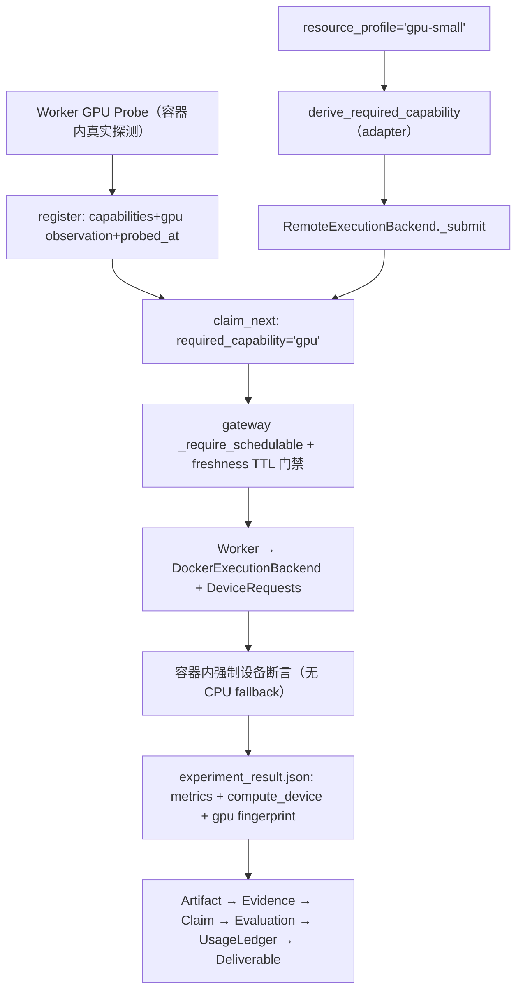

## 环境事实与诚实边界（已用户确认）

只读探测结果（`nvidia-smi` / `docker info` / `wsl -l -v`，2026-09-02）：

- GPU：`NVIDIA GeForce RTX 4060 Laptop GPU`，WDDM 驱动模型，8188 MiB 总显存（桌面已占约 2010 MiB）
- Driver `581.80`，驱动上报 CUDA `13.0`；compute capability 8.9（Ada）
- Docker Desktop server `29.2.1`，`linux/amd64`，WSL2 后端（`Ubuntu-24.04` + `docker-desktop`）
- **已注册 `nvidia` runtime（`nvidia-container-runtime`）** —— NVIDIA Container Toolkit 已在位，无需安装
- 本地无任何 CUDA 镜像

用户决策：物理远程服务器当前不可用，M17 在本机 GPU 上执行，worker 仍走 M16 的**跨进程 + 跨网络（HTTP worker gateway）untrusted-worker 边界**。

**强制诚实条款（写入 ADR-0029 / M17 Completion Record / MILESTONES M17 节）：**

- `real GPU execution` = VERIFIED（真实设备、真实 CUDA、真实计算）
- `process/network-remote worker boundary` = VERIFIED（复用 M16 已验证的 gateway/lease/fencing 平面）
- `physically-remote GPU host（GPU 主机 ≠ Control Plane 主机）` = **NOT VERIFIED / DEFERRED**
- 不得在任何文档中把本机 GPU 描述为「远程服务器 GPU」

## M16 现状映射（实测代码）

- Worker capability 是自由字符串集合：`[packages/domain/workers.py](../../packages/domain/workers.py)` `WorkerRegistration.capabilities: frozenset[str]`（`MAX_CAPABILITIES=32` / `MAX_CAPABILITY_LENGTH=64`），模块 docstring 明确写「GPU/内存/拓扑等资源平面属 M17」——这是被预留的扩展点
- 任务侧需求是**单字符串** `tasks.required_capability`，匹配为精确相等：`[adapters/postgres/workflow_claim.py](../../adapters/postgres/workflow_claim.py)` `required_capability = ANY(%s)`；SQLite 等价实现在 `[adapters/sqlite/workflow_ops.py](../../adapters/sqlite/workflow_ops.py)`
- 服务端 claim 门禁已存在且 fail-closed：`[services/api/worker_gateway/jobs.py](../../services/api/worker_gateway/jobs.py)` `_require_schedulable`（state ∈ READY + capabilities/partitions ⊆ 注册事实）
- 注册是 upsert + generation+1，capability 整体替换（`[adapters/postgres/worker_registry.py](../../adapters/postgres/worker_registry.py)`），**但没有任何 capability freshness/TTL 概念**
- 容器执行安全基线在 `[adapters/execution/docker_backend.py](../../adapters/execution/docker_backend.py)` `_create_container`：`NetworkMode=none` / `CapDrop=ALL` / `ReadonlyRootfs=True` / `no-new-privileges` / 非 root uid 1000 / 仅挂载 workspace；**无 `DeviceRequests`、无 `Runtime`、无 GPU 字段**
- 资源需求载体是字符串 `resource_profile`，adapter 侧解析：`[adapters/execution/profiles.py](../../adapters/execution/profiles.py)` `resolve_resource_profile`（`default/small/large`，未知值 fail-closed）
- **已存在的真实缺陷（M17 必修）**：`[adapters/execution/remote_backend.py](../../adapters/execution/remote_backend.py)` `_submit` 用 `capability = spec.backend_kind.lower()` → `"sandbox"`，而 worker 默认 capability 是 `"docker"`（`[services/worker/__main__.py](../../services/worker/__main__.py)`），真实实验的远程分发**永远匹配不到 worker**
- Domain 已有 `ResourceType.GPU_TIME`（`[packages/domain/budget.py](../../packages/domain/budget.py)`）与 `max_gpu_hours` schema 字段，**零消费方**
- `MetricName.REMOTE_EXECUTION_*` 与 `OperationScope.REMOTE_EXECUTION` 已注册但**从未发射**

## 数据流（M17 目标态）

## WP0 — 环境发现 + GPU runtime qualification（先行门，未过不写业务代码）

- 在 WSL2/Docker 内实测：`docker run --rm --gpus all <pinned cuda image> nvidia-smi`、device 可见性、`torch.cuda` 初始化、`get_device_properties(0)`（name / total_memory / capability）、`torch.version.cuda`、cudnn 版本
- **关键风险实测**：`ReadonlyRootfs=True` + nvidia hook 的 `ldconfig` 是否冲突。决策树：
  - 通过 → GPU profile 完整保留现有安全基线，仅增 `DeviceRequests`
  - 不通过 → **仅 GPU profile** 放开 rootfs 只读，其余（network none / CapDrop ALL / 非 root / no-new-privileges / tmpfs / pids-mem 限额 / 仅 workspace 挂载）全部不变，写入 ADR-0029 并加「GPU profile 与 CPU profile 仅在一个记录维度上不同」的安全断言测试
- 产出 `docs/references/upstream/M17_GPU_RUNTIME_QUALIFICATION.md`（M5R 形状：版本/digest/许可证/边界/拒绝理由/重评条件），并在 `UPSTREAM_COMPONENTS.yaml` 按 digest pin GPU 基础镜像
- 基础镜像候选：`pytorch/pytorch:<tag>@sha256:...`（推荐，torch+CUDA 预装，单一供应链入口）；备选 `nvidia/cuda:12.x-runtime@sha256:...` + 构建期 pin 安装 torch。必须验证 sm_89 支持
- WP0 输出「实际测试硬件」事实块，后续所有文档以它为准，不硬编码型号到业务逻辑

## WP1 — GPU Capability 发现与 freshness

GPU capability schema（**最小、有界、观测性质，不建 Hardware Inventory**）：

- 新增 `WorkerGpuObservation` 值对象（放 `packages/domain/workers.py`，该模块已预留 M17）：`device_name`、`device_count`、`driver_version`、`cuda_runtime_version`、`total_vram_bytes`、`framework`（如 `torch-2.x`）、`probed_at`、`probe_digest`。全字段有界、fail-closed 构造，纯数据不含任何 provider SDK 类型
- **调度键只有一个 token：`gpu`**。理由：`tasks.required_capability` 是单字符串精确匹配，为单 worker 环境发明第二套数值匹配系统属于 theater。VRAM/CUDA/framework 需求改为**执行期契约**（见 WP3 第 3 层），不进调度谓词
- Worker 侧：启动时在 GPU 容器内真实探测；探测失败则**不声明** `gpu`（退化为 CPU-only 注册），不猜测、不读缓存
- 持久化：additive migration `adapters/postgres/migrations/009_worker_gpu.sql`（`ALTER TABLE workers ADD COLUMN gpu_observation_json JSONB`），SQLite 等价列；DTO 扩展 `services/api/worker_gateway/dto.py`
- 不把 `nvidia-smi` 文本作为 canonical state；只存结构化观测 + digest

Freshness 策略（四层）：

1. **注册即真相**：注册是 upsert + generation+1，restart/reconnect 必然重新探测并整体替换 capability 与观测
2. **TTL 门禁（服务端 fail-closed）**：claim 请求含 `gpu` 时，gateway `_require_schedulable` 额外校验 `now() - probed_at <= TTL`（默认 900s，可配），超期返回 409 `gpu_capability_stale`。**不改动已验证的 claim SQL**
3. **周期性重探 → 重注册**：worker 每 N 次心跳重探；`probe_digest` 变化或探测失败 → 触发 re-register（新 generation）。GPU 消失后新注册不含 `gpu`，调度自动停止派发
4. **执行期再验证**：每次 GPU 执行在容器内强制断言设备（WP3），这是最终安全网

## WP2 — GPU 执行需求与调度

- 复用 `resource_profile` 字符串作为唯一需求载体（Domain 不新增 GPU 类型）：`adapters/execution/profiles.py` 新增 `gpu-small`（1 device、显存契约、cuda 下限、framework 要求）与 `gpu-oom-probe`；未知 profile 继续 fail-closed
- 新增 `derive_required_capability(spec) -> str`，**修掉 `backend_kind.lower()` 缺陷**：GPU profile → `"gpu"`；非 GPU → 现有 CPU 路径 token（并使其与 worker 默认声明一致，附回归测试证明真实实验的远程分发可被 claim）
- CPU 任务语义不变：`resource_profile` 非 GPU → 不请求 GPU、不要求 `gpu` capability。系统里存在 GPU worker 不改变 CPU 任务需求

Scheduler 正确性测试（Fake + SQLite + PostgreSQL 三实现契约套件）：

- GPU-required task + 仅 CPU-only worker → **永不被 claim**（QUEUED 保持）
- GPU-required task + GPU worker → 正常 claim
- CPU task + 存在 GPU worker → 不被升级为 GPU 需求
- 伪造 claim：CPU-only worker 自报 `gpu` → gateway 子集校验拒绝
- 过期 GPU 观测 → `gpu_capability_stale` 拒绝
- 无可用 GPU worker → `RemoteExecutionBackend` 到期返回**明确的 UNSCHEDULABLE/TIMED_OUT + GPU 基础设施失败分类**，绝不落到 CPU 执行
- capability metadata 可以在这些测试里模拟；**真实 GPU 执行 DoD 不允许模拟**

## WP3 — 真实 GPU Runtime + 禁止静默 CPU fallback

- 新增 pinned GPU sandbox 镜像 `adapters/execution/sandbox/Dockerfile.gpu` → `research-os-gpu-sandbox:m17-v1`；构建期联网装依赖，**执行期保持 `NetworkMode=none`**
- `docker_backend.py` `_create_container` 增加（仅 GPU profile 生效）：`DeviceRequests=[{"Driver":"nvidia","Count":1,"Capabilities":[["gpu","compute","utility"]]}]`；其余 host_config 不变
- `compute_usage_summary` 增补：`gpu_device_name`、`driver_version`、`cuda_runtime_version`、`framework_version`、`peak_gpu_memory_bytes`、`gpu_elapsed_seconds`

CPU fallback 防线（四层，任一层失败都必须 FAIL 而非降级）：

1. **调度层**：无 `gpu` capability 的 worker 拿不到 GPU 任务（WP2）
2. **容器层**：GPU profile 但 `DeviceRequests` 无法满足 → Docker 创建失败 → 映射为 `GPU_UNAVAILABLE`，不重试为 CPU
3. **容器内契约层（决定性）**：实验入口强制断言 `torch.cuda.is_available()` + `device_count>=1` + `get_device_properties(0)` 满足 profile 的 VRAM/CUDA 下限，并**只在 `cuda:0` 上执行计算**。GPU slice 代码中禁止出现 `device = 'cuda' if available else 'cpu'` 模式（加静态检查）
4. **证据层**：`experiment_result.json` 记录真实 `compute_device` / 版本 / `max_memory_allocated`；新增判别性测试——声明 GPU 但记录到 CPU device 的结果必须在 evidence admission / Evaluation 被拒（复用 M11 对抗测试形状）

关键负向测试（独立复审的 BLOCKER 项，做成一等公民）：隐藏 GPU（`CUDA_VISIBLE_DEVICES=""` 与不带 `DeviceRequests` 两种方式）重跑同一实验 → **必须 FAIL 或 UNSCHEDULABLE**；若仍 PASS 即为 BLOCKER。

## WP4 — GPU 失败语义 / OOM / timeout / cancellation

- `FailureCategory` 新增两个值（additive，所有映射点保持穷尽）：`GPU_UNAVAILABLE`（device 不可见 / CUDA init 失败 / driver-runtime 不兼容 / framework 无 CUDA）与 `GPU_OOM`
- 更新映射点：`docker_backend._build_run` / `_map_docker_error`、`remote_backend._map_failure`、`packages/application/experiments/classification.py`、`docs/reliability/FAILURE_MODEL.md` 矩阵
- **明确区分**：`模型指标未改善` → 继续走已有 `SCIENTIFIC_NEGATIVE_RESULT` / `ExperimentRun.NEGATIVE_RESULT` 终态；`CUDA OOM` → `GPU_OOM` execution/resource failure。加测试固定这条边界不被混淆

OOM（受控、不损伤机器稳定性）：

- 专用 `gpu-oom-probe` profile + 容器内分块分配（256 MiB 步进，上限 = 实测 free VRAM + 小余量，配 `set_per_process_memory_fraction` 上限），捕获 `torch.cuda.OutOfMemoryError`
- OOM 后验证：进程终止、容器 force remove、workspace 清理、**新起探针容器确认显存已释放**、worker 仍 READY、**下一个 GPU job 成功**、canonical state = FAILED/`GPU_OOM`

Cancellation：

- 60–120s 级真实 GPU 计算 job，从 Control Plane 取消 → 协作式 cancel flag → worker `cancelled()` 探针 → 容器 kill
- 验证：cancel 传播、GPU 进程收敛、容器/进程清理、显存释放、lease 释放、最终状态 CANCELLED、usage 记录
- 物理进程未能立即取消时：注入 stale-fence 迟到结果 → **必须被 M16 fencing 拒绝**（复用场景 C/D harness）

## WP5 — UsageLedger 映射 + Telemetry

UsageLedger（复用单一 experiment 路径，**不建第二记账命名空间**，遵守 M16 F-5）：

- `ExperimentUsage`（`packages/application/experiments/budget_entries.py`）新增可选 GPU 观测字段；`experiment_entries` 追加 `ResourceType.GPU_TIME` 条目（`unit="seconds"`，quantity = 实测 GPU 执行时长）——首次为已存在但零消费的枚举建立真实消费路径
- **货币成本**：`cost_status=UNKNOWN` + `unavailable_reason="no GPU price source configured"`，**绝不写 0**；加测试断言 GPU 条目不出现 `estimated_cost_minor=0`
- **只记可靠量**：peak GPU memory 取 `torch.cuda.max_memory_allocated()`（框架级可靠）；WSL2 下 NVML 利用率/per-process 显存不可靠 → **完全不记录 utilization%**，不记录 GPU energy、不记录 cloud billing
- 设备身份 / driver / CUDA / framework 版本走 `compute_usage_summary` → `ReproducibilityAudit` → Deliverable，不作为预算数量

Telemetry（闭集词汇最小增量）：

- 新增 `MetricName`：`GPU_EXECUTION_DURATION_MS`、`GPU_OOM_TOTAL`、`GPU_UNAVAILABLE_TOTAL`
- 至多 1 个新 `AttributeKey`：`gpu_device_ref`（设备身份的 digest 短码，非原文）；其余复用 `resource_type` / `failure_category`
- 补发目前已定义但从未发射的 `OperationScope.REMOTE_EXECUTION` span（worker 侧执行段）
- 继续 `capture_content` 结构性不存在；不发送 code body / dataset / model params / secret / artifact body；扩展隐私 canary 测试覆盖 GPU 路径

## WP6 — 真实 GPU Research Slice + 可复现性

**实验选题（自包含、无外网、8GB 显存内数十秒~2 分钟可完成）**：合成数据上的小型神经网络训练/推理，**双分支对照 = FP32 baseline vs 混合精度（TF32/bf16 autocast）candidate**，外加 **GPU vs CPU 同 workload 计时对照**作为「GPU 真的在算」的量化证据。

- 研究问题：固定训练预算下，混合精度能否在保持准确率的同时提升吞吐
- metrics：baseline/candidate test accuracy、每 epoch 墙钟、samples/sec、peak GPU memory、device identity
- 准确率下降 → 合法 Negative Result；吞吐无提升 → 合法结论。不下载任何模型/数据集，容器保持 `network=none`
- 形状对齐现有 `[examples/experiments/m12_reference_classification.py](../../examples/experiments/m12_reference_classification.py)`（确定性种子、代码内造数据、输出 `experiment_result.json`）

链路**复用** `[packages/application/m12_reference/clean_run.py](../../packages/application/m12_reference/clean_run.py)`，注入 GPU 依赖（RemoteExecutionBackend over 真实 worker + GPU profile），**不新建第二套 Experiment Domain、不新建 `GpuExperimentRun`**：

`Research Objective` → 新 `examples/protocols/m17_gpu_research_v1.yaml` → Manifest 冻结 → Task → Scheduler → Remote GPU Worker → ExecutionBackend → ExperimentRun → Artifact → Metric → Evidence → Claim → 新 `examples/eval/datasets/m17_gpu_v1.yaml`（复用 M12 scorers + 新增 GPU device / no-fallback scorer）→ UsageLedger → Deliverable

可复现性策略：

- 关键实验至少重复 2 次（同 seed、同 image digest）
- 记录：image digest、code/input digest、seed、device identity、driver/CUDA/cudnn/torch 版本、TF32 与 autocast 开关、metrics + `semantic_metrics_digest`
- 确定性控制：`manual_seed` + `use_deterministic_algorithms(True)`（可行处）+ `cudnn.deterministic` + `CUBLAS_WORKSPACE_CONFIG=:4096:8`
- **契约 = 语义结果在声明容差内一致，不声称 bit-for-bit**；`ReproducibilityAudit` 扩展 GPU fingerprint 字段与 `allowed_variance`；实测到的浮点非确定性如实记录，容差由实测得出而非事后凑

## WP7 — M16 回归 + 安全 + 过度宣称审计

M16 fencing 回归（GPU job 更长 → race 暴露面更大，这是重点）：

- 重跑 `tests/distributed` 全套；新增 GPU 场景变体：长 GPU job vs lease renewal/heartbeat、GPU job 中 kill worker → 租约过期 → requeue → 无重复业务事实、网络分区 → 迟到 GPU 结果被 fence 拒绝、stale-fence artifact 上传被拒
- 验证未破坏：worker 认证、协议兼容、分布式调度、lease/fencing、stale result rejection、分区恢复、Artifact 完整性

安全测试（GPU profile 变体，复用 `test_docker_backend_security_e2e.py` 形状）：

- host home 未挂载、Docker socket 不存在、network none 在带 GPU 时仍生效、非 root uid、`no-new-privileges`、非 privileged、`CapDrop=ALL` 未因 `--gpus` 放宽、device 节点仅限 nvidia、无 host 文件系统逃逸、secret 枚举面为零、dataset/workspace scope 不变
- 明确断言：**GPU device access ≠ host authority**

过度宣称审计（确定性检查，直接服务独立复审 §11）：

- 新增 grep 门禁：`multi-GPU|NCCL|Slurm|PBS|MPI|HPC|RDMA|InfiniBand|multi-node|distributed training|autoscaling|GPU fleet` 不得出现在 supported/implemented 语境；只允许出现在 Deferred / Not Verified 语境
- 同一门禁校验 `physically-remote GPU worker = NOT VERIFIED` 声明存在

## WP8 — Completion Record + DoD 证据 + 复审交接

- `docs/roadmap/M17_COMPLETION_RECORD.md`：19 条 Exit Criteria 逐条证据（含实际测试硬件事实块、实际执行 workload 清单、failure/cancel/OOM 证据、Artifact/Evidence/Eval、Usage、reproduction、显式 Deferred 清单、`physically-remote = NOT VERIFIED`、SI-1 readiness 判定）
- `docs/adr/ADR-0029-gpu-execution-boundary.md`：GPU capability 观测 vs 调度键的分离、单 token 调度决策、freshness 分层、rootfs 决策树结果、同主机诚实边界
- 同步 `docs/roadmap/MILESTONES.md`（M17 状态 + Upstream 表）、`docs/INDEX.md`、`BACKLOG.md`、`CHANGELOG.md`、`UPSTREAM_COMPONENTS.yaml`
- 过程资产：`.cursor/plans/tasks/PLAN-20260902-028-m17-remote-gpu-execution.md` + `ALL_PLAN.md` 索引行 + `RECHECK-20260902-028-m17.md`
- 全量门禁：`tests/distributed`、GPU E2E、`tests/contracts`、`tests/architecture`、`tests/observability`、m0 profile、`validate_bundle.py`、`governance-check/validate.py`、ruff/format/mypy、450/300/50 行门槛
- 完成后**停止**，交由独立复审窗口（PART B）执行；不自动进入 SI-1

## 明确不实现（Deferred，保持 ADR-0028 清单，禁止 Fake/Mock 宣称 supported）

multi-GPU scheduling、multi-GPU training、NCCL、distributed training、multi-node execution、Slurm、PBS、MPI、HPC scheduler、RDMA、InfiniBand、heterogeneous accelerator fleet、GPU autoscaling、cluster federation、HPC quota system；外加本次新增 **physically-remote GPU host**。

## 执行顺序（用户指定）

Implement → Capability Tests → Scheduler Tests → Real GPU Smoke → Real GPU Experiment → OOM/Failure → Cancellation → Network/Fencing Regression → Research Slice → Reproduction → Evidence/Eval/Usage → Full Regression → DoD。GPU 被识别或单次 CUDA kernel 成功**不构成结束条件**。

## 待你在实施期确认的两个决策点

- WP0 若实测 `ReadonlyRootfs=True` 与 nvidia hook 冲突：是否批准「仅 GPU profile 放开 rootfs 只读 + 其余安全控制全保留 + ADR 记录 + 差异断言测试」
- GPU 基础镜像：`pytorch/pytorch@sha256:...`（推荐）vs `nvidia/cuda@sha256:...` + 构建期 pin 安装 torch

