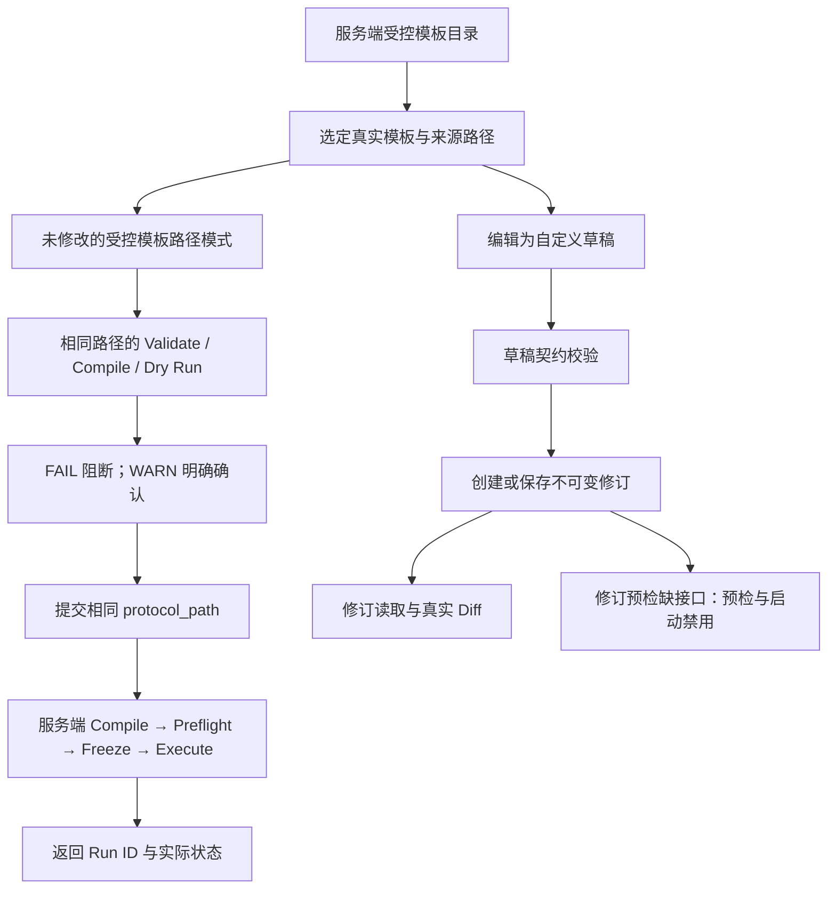

# Research Console 前端高保真重建计划

## 1. 已确认目标与交付定义

Research Console 指 Research OS 的前端控制台。本次采用“**界面层重新实现，真实契约与经过验证的业务逻辑保留**”的方式，不继续在上一轮界面上做局部换肤。

用户已确认：

- 完整覆盖设计稿，高保真还原布局、主题、密度和交互；只为真实业务契约与可访问性做必要调整。
- 接入已有真实 API；缺失能力明确说明、禁用对应操作，单独登记后端缺口。
- 当前只制定计划，确认后才开始实施。

交付范围：设计稿的 **28 个域内页面 + 设置、通知中心 + Command Center 指挥中心**；另外保留现有计算节点、运维观测两个能力页面，共 **33 个规范路由**。页面内部的 Tab、抽屉、对话框和状态也纳入验收，不以路由数量代替完成质量。

完成意味着：

1. 每页有可追溯的设计来源、组件实现、数据来源或明确的不可用原因。
2. 已支持操作真正调用 API，并正确处理失败、冲突和刷新恢复。
3. 未支持页面仍还原其工具栏、分栏、表头、详情区域等结构；不把所有页面替换成同一个“即将推出”卡片。
4. 视觉还原验收与真实数据集成验收分别通过。

范围外：新建后端业务/API、修改 Domain 或 Schema、数据库迁移、多租户/账户系统、运行时更换、真实付费模型测试、公开部署、Git commit/push、发布 Manifest 刷新。

## 2. 调查依据与必须纠正的问题

### 2.1 设计来源的优先级

- 整站导航与页面组成：以 [AppShell.jsx](d:/research-system/docs/references/design/console-design/components/AppShell.jsx) 和 [App.html](d:/research-system/docs/references/design/console-design/App.html) 实际加载的顶层组件为准。
- 颜色、字号、间距、圆角与密度：以 [styles/tokens.css](d:/research-system/docs/references/design/console-design/styles/tokens.css) 为准。
- 协议编辑器细节：结合 [交付说明](d:/research-system/docs/references/design/console-design/subpackage_protocol_visual_editor/README.md) 与顶层 [ProtocolEditor.jsx](d:/research-system/docs/references/design/console-design/screens/ProtocolEditor.jsx)、[DryRun.jsx](d:/research-system/docs/references/design/console-design/screens/DryRun.jsx)。子包与顶层文件先比较内容摘要，重复只登记一次，差异逐项记录。
- [Overview.html](d:/research-system/docs/references/design/console-design/Overview.html) 是设计画板总览，仍包含旧的五域说明和旧入口，作为辅助设计材料，不替代最新八域导航，也不增加一个重复产品页面。
- Command Center.html 是独立的 2560×1440 大屏设计，单独实现（归档于 `docs/references/design/console-design/`）。
- 产品字段、状态、权限与执行语义：始终以仓库 Schema、API 路由和应用用例为准。原型中的 `protocol.yaml` 不是冻结的产品 `RunManifest`。

确认后更新 [CONSOLE_REBUILD.md](d:/research-system/docs/frontend/CONSOLE_REBUILD.md)，使其成为本次八域设计的当前说明；上一轮计划和复检保留历史，不覆写其结论或证据。

### 2.2 已由源码与现存图片确认的问题

- [App.tsx](d:/research-system/apps/web/src/App.tsx) 没有处理 `assets/compute`，页面会落入默认协议编辑器。
- [ProtocolDraftEditor.tsx](d:/research-system/apps/web/src/features/protocol/editor/ProtocolDraftEditor.tsx) 的 Validate 调用了保存，Diff 只切换到阶段区块。
- [protocolDocument.ts](d:/research-system/apps/web/src/features/protocol/editor/protocolDocument.ts) 对空文档直接读取 `phases`；现有协议页截图已经包含空值错误提示。
- [protocolSerialize.ts](d:/research-system/apps/web/src/features/protocol/editor/protocolSerialize.ts) 从简化对象重新生成 YAML，不能作为注释、未知字段及单数 `task_contract` 无损保留的证据。
- [stub-api.ts](d:/research-system/apps/web/tests/e2e/stub-api.ts) 对未匹配请求统一返回空数组；旧 `screenshots.spec.ts` 部分页面只等待外壳出现，可能把缺页或错误态录为正常基准（重建中由 design-fidelity.spec.ts 取代并加页面身份断言）。
- [useRunEventStream.ts](d:/research-system/apps/web/src/features/runs/useRunEventStream.ts) 监听默认 `message`，而 [run_events.py](d:/research-system/services/api/routers/run_events.py) 发出具名 `event:` 帧；需要按真实浏览器事件行为验证与修正。

最重要的数据一致性问题是：编辑器当前预检固定示例，而不是正在编辑的草稿。

```8:8:apps/web/src/features/protocol/editor/usePreflightAndStart.ts
const PREFLIGHT_SOURCE = "m12_reference_research_v1.yaml";
```

```18:21:apps/web/src/features/protocol/editor/usePreflightAndStart.ts
      const [report, projection] = await Promise.all([
        api.compileAndPreflight(PREFLIGHT_SOURCE),
        api.dryRun(PREFLIGHT_SOURCE),
      ]);
```

当前 [ProtocolSourceDto](d:/research-system/services/api/dto/team_protocol.py) 只接受路径；[草稿路由](d:/research-system/services/api/routers/protocol_drafts.py) 没有草稿修订预检接口。虽然 [运行路由](d:/research-system/services/api/routers/runs.py) 支持草稿引用并在服务端重新预检，前端仍不能将示例报告标成草稿的预检结果。

本次处置：**受控模板路径保留真实预检和启动；自定义草稿支持编辑、契约校验、保存和差异查看，匹配修订的预检与启动入口明确禁用。** 补齐该后端契约另行立项，不用前端绕过。

本轮证据来自只读源码与已有图片检查，尚未运行设计原型、构建或测试；实施阶段必须先建立可重复的运行基线。

## 3. 全量页面与真实数据接入范围

以下 API 使用后端路径；浏览器经现有同源 `/api` 前缀访问。`project_id` 当前按既有单项目能力处理，不伪造多项目资源目录。

### Plan：规划，3 页

- `#/plan/overview`：还原概览卡片、摘要和快捷入口。只聚合当前选定 Run、任务、Claims、预算和有效预检结果；无运行或无预检时显示未选择/未执行，不自动发起预检探测。
- `#/plan/protocol`：双栏编辑器与报告，接协议模板、草稿校验、草稿修订及路径式 compile/preflight/dry-run；草稿限制见第 5 节。
- `#/plan/team`：接 `/roles`、`/team-templates`、`/projects/{id}/agents`、`PATCH /agents/{id}` 和项目设置；展示 Role 与 Agent 的区别、独立模型绑定及真实能力信息。

### Portfolio：项目与运行集合，4 页

- `#/portfolio/projects`：还原列表/看板/卡片切换及详情结构。只能展示现有项目设置所确认的单项目上下文；项目名称、生命周期等缺失字段显示未提供。创建、归档、删除、多工作区切换禁用。
- `#/portfolio/experiments`：接 `/runs/{id}/experiments`，明确当前 Run 范围；队列/矩阵/日历视图保留结构，排队、调度及缺失的日期/状态数据不可伪造。
- `#/portfolio/runs-history`：接 `/projects/{id}/runs`，实现真实列表筛选、选择、详情跳转和刷新恢复；筛选注明作用于已加载范围。
- `#/portfolio/compare`：比较选定 Runs 的已返回状态、摘要、用量、成本、实验指标。指标同名但单位、来源或可比条件不明时并列显示，不计算虚假的提升率、置信区间或排名。

### Run：运行，3 页

- `#/run/timeline`：接 Run 详情、tasks、events；还原运行状态条、任务区域、事件列表、筛选和详情抽屉。缺少阶段时间/依赖映射时保留对应区域并说明，不以任务顺序编造泳道时长。
- `#/run/approvals`：接待决审批与 decide；真实风险、上下文、策略来源和版本确认可操作，不出现“一键全部同意”。
- `#/run/workspace`：接 experiments、evidence、export；保留文件树/预览分栏，但文件浏览、内容预览、文件级 Diff 没有接口时禁用。Artifact ID 不是文件下载地址。

### Library：资源，7 页

- `#/library/prompts`：还原列表、编辑/版本/A-B 区域；提示词管理和实验操作缺后端，禁用业务修改。
- `#/library/datasets`：还原目录、详情、字段/版本/血缘区域；数据集注册、上传、删除及数据查询禁用。
- `#/library/notebooks`：还原列表与阅读/编辑布局；创建、保存与执行禁用。
- `#/library/model-registry`：接 `/models`、模型更新、probe、compatibility；仅展示实际 ModelDefinition/兼容性信息，不假定已有训练模型制品仓库、部署或晋升功能。
- `#/library/lineage`：仅用 API 明确返回的 Run、Evidence、Artifact、Model 引用构造当前运行的来源关系；全局数据集/提示词血缘缺失部分标注不可用，禁止猜测连边。
- `#/library/endpoints`：真实中转站创建、修改、测试、健康与模型发现；无删除接口则不提供有效删除操作。
- `#/library/setup`：重建首次接入向导，保留 URL + API Key + Model ID 的真实流程。

### Evidence：证据，1 页

- `#/evidence/claims`：接 claims/evidence，图谱与表格切换、详情联动；关系来自 `ClaimDto.relations`。展示无支持证据、矛盾和降级状态；人工裁定、独立 Review 等无接口动作禁用。

### Insights：报告与分析，2 页

- `#/insights/reports`：还原报告列表、阅读预览和编辑抽屉结构；报告生成、编辑、PDF 和发布缺后端，禁用。可链接真实运行导出，但不能将 JSON bundle 冒充报告。
- `#/insights/cost-analytics`：接 Run cost/usage，保留成本分布、明细和比较结构；没有日序列、预测或完整维度时相应图表显示数据不可用。

### Ops：运行维护，6 个设计页 + 2 个兼容页

- `#/ops/alerts`：告警规则和收件箱无对应 API，保留列表/详情/规则结构，配置与处理禁用。
- `#/ops/incidents`：事件处置流程无对应 API，不能把失败 Run 直接转换成已登记事故。
- `#/ops/schedules`：计划任务和日历保留结构，创建/启停/触发禁用。
- `#/ops/integrations`：集成目录与配置结构保留；没有 Tool Provider 管理 API，不以模型端点接口代替。
- `#/ops/data-health`：保留质量指标和数据详情布局，无后端质量报告时明确不可用。
- `#/ops/matrix`：交付明确标注的“界面状态说明”，呈现加载、空、错误、权限、未知等组件状态，不冒充实时运维状态。
- `#/ops/compute`：保留现有 `/cluster/workers`、`/runs/{id}/placement` 只读能力；不添加 GPU 拓扑、位置或调度控制的虚构信息。
- `#/ops/observability`：保留 `/runs/{id}/telemetry`、`/runs/{id}/cost`、`/evaluations/trend`，包括分段、不兼容、缺失与截断语义。

### Govern：治理，2 页

- `#/govern/budget`：接 usage/cost，展示已知小计、未知条目、币种与预留；预算调整无对应契约时禁用。
- `#/govern/audit`：保留 Audit / Export / Memory 三个 Tab。仅将 Run events 标作运行事件记录，不能宣称全平台审计；Export 使用真实导出接口；产品 Memory 管理缺 API，禁用，绝不读取 `.cursor/memory` 补充。

### 全局与大屏，3 页

- `#/settings`：保留 Profile、Notifications、API Keys、Security、Workspace、Preferences、Billing 七个分区；主题/语言/密度是真实本地偏好，支持的项目设置字段走真实 API；账户、平台 API Key、双因素认证、计费等无 API 的区块锁定并说明。
- `#/notifications`：保留通知中心结构；无通知持久化 API，不显示虚构通知、未读数或“已读保存成功”。待审批数量只出现在明确标作待审批的入口。
- `#/command-center`：独立大屏布局，复用已验证的运行、任务、证据、成本和观测查询；跨项目统计、全球节点位置及预测等缺失区域明确不可用。刷新时间与实时连接状态分别展示。

## 4. 架构、职责与数据流

### 4.1 技术路线与模块边界

沿用 [apps/web/package.json](d:/research-system/apps/web/package.json) 的 React 19、TypeScript、Vite，以及现有 CSS 自定义属性/CSS Modules、`yaml` 和 Playwright。保留根锁定的 pnpm/Node 版本，不引入 Next.js、全局状态框架或大型图编辑框架。

- [App.tsx](d:/research-system/apps/web/src/App.tsx)：只负责组合 Provider、外壳与路由页面；移除按字符串逐项判断后静默回退的页面分派。
- [navigation](d:/research-system/apps/web/src/navigation)：类型化路由、参数、别名与渲染注册。导航和页面完整性测试消费同一注册表。
- [layout](d:/research-system/apps/web/src/layout)：重写 Sidebar、TopBar、AppShell；新增命令面板和上下文选择组件。只持有界面状态。
- [components](d:/research-system/apps/web/src/components)：领域中立的按钮、字段、表格、对话框、抽屉、状态和布局；图表基础放到职责明确的 `components/charts/`，无网络请求。
- [api/http.ts](d:/research-system/apps/web/src/api/http.ts)：集中请求、错误、版本头、幂等键和取消。领域客户端按 endpoint、model、team、protocol、run、inspection、operations 职责拆分，不扩大一个万能 `client.ts`。
- [api/types.ts](d:/research-system/apps/web/src/api/types.ts)：只镜像现有 API DTO；新增页面专用展示模型放在各功能的 `viewModel.ts`，不加入 DTO 文件。
- [features](d:/research-system/apps/web/src/features)：每个业务区域由 `Page/Panel + use… Hook + 纯展示转换` 组成。保留旧 Hook 中已测试的逻辑，但针对本次发现的问题重新验证，不原封不动信任。
- 新增 [navigation/pageSupport.ts](d:/research-system/apps/web/src/navigation/pageSupport.ts)：记录页面/操作的已支持、部分支持、不可用及原因。这是前端接入清单，不是产品 Tool Capability，也不是授权判定。

新增文件使用项目命名约定。源码目标不超过 300 行，超过 450 行必须拆分；函数、参数、复杂度继续受既有门禁约束。所有 import 在顶部，不通过动态 import 或关闭 lint 绕过边界。

### 4.2 读取与刷新


- 业务真相仍在服务端领域实体及持久化存储。生产 PostgreSQL 与已有 SQLite 测试/本地配置按既有装配工作，本次不迁移、不更换。
- 查询按项目、Run、资源 ID 区分；切换对象取消旧请求、忽略迟到响应，禁止上一 Run 的证据或成本闪现在下一 Run。
- 缺数据、未配置、无权限、未知金额和网络失败分开表示；`null` 不转换成 `0`。
- 支持局部失败：成本请求失败不抹掉已加载的任务和事件。顶层中转站请求失败也不应让所有说明页与设置页失去导航。
- 图表只做格式化、筛选和证据充分的展示聚合，不重新判断 Policy、预检、可复现性或实验可比性。

### 4.3 用户操作与写入


- 同一写入意图的安全重试复用幂等键；不同操作生成新键。不可将“按钮已点击”当作保存、审批或运行成功。
- `409` 展示业务状态冲突；`412` 保留本地编辑并允许查看服务器最新版本与 Diff；`422` 显示可定位问题；`403` 保留权限说明；`501/503` 分别解释未实现和服务不可用。
- 支持读取的资源版本才发送 `If-Match`。项目设置目前没有这套版本契约，不伪造并发锁；保存前展示变更、使用最新已读完整载荷，记录最后写入覆盖的限制。
- 模型测试、发现、Probe、Compile/Preflight 可能触发真实外部探测，只由明确按钮触发，不因页面挂载自动运行。
- API Key 仅在接入表单短暂存在，通过现有请求提交；完成、取消或离开后清理，不进入 URL、持久存储、日志、截图或错误正文。

### 4.4 状态所有权

- URL：规范页面、已选择的 Run/草稿/详情 ID、可分享的筛选条件；不包含凭据或协议正文。
- 浏览器持久化：仅主题、密度、语言、编辑模式等已批准的界面偏好。
- 功能 Hook：可丢弃的服务端查询缓存、请求状态与连接状态。
- 编辑器 reducer：未保存正文、最后保存修订、校验结果与冲突状态；正文不写 localStorage/IndexedDB。
- 服务端：草稿修订、Run、审批、模型配置、证据、预算与冻结 Manifest。

## 5. 协议编辑器与实时运行的专项设计

### 5.1 高保真外观与真实字段

保留设计稿的工具条、Form/YAML 切换、DIRTY 提示、错误汇总、左侧区块导航、粘性操作栏与右侧六区报告。

[protocol.schema.json](d:/research-system/schemas/protocol.schema.json) 的真实顶层是 `id/version/phases`，不写入原型的虚构 `manifest/objectives/evaluation/budget/policy` 对象：

- Manifest 区映射协议身份和真实草稿元数据；工程版本仅来自根 `VERSION`，协议自身版本原样读取，不采用原型的 `1.4`，也不强制改成项目版本。
- Objectives 的卡片交互映射阶段及阶段名称、输入输出、依赖；阶段依赖使用可测试的选择控件，必要时增加只读 DAG（有向无环图）预览，不扩为拖拽流程引擎。
- Team 区映射阶段 Role 需求；Agent/模型绑定编辑链接至真实团队页。
- Evaluation 区保持导航与说明，但没有协议字段对应的实验网格控件只读/禁用，不把设计字段偷偷写入 YAML。
- Budget/Policy 区保留结构，展示可用的真实报告或不可用原因；没有演示管理员开关。
- Gates 区编辑真实 phase `gate`、timeout、stop conditions；不加入 Schema 不支持的门禁类型。
- `task_contract` 与 `task_contracts` 两种真实字段均保留，不在 Form/YAML 往返时相互覆盖或遗漏。

YAML 采用现有 `yaml` 文档树作定点修改，保留注释与未编辑节点；空文档、列表/标量根节点、未知枚举、非法字段和解析错误给出明确状态，不能静默默认成合法协议。

### 5.2 两条诚实的数据路径




- Validate 只验证，不保存；Apply/保存明确写入修订；Diff 比较当前正文与最后保存正文，冲突时可比较服务器最新修订。
- 模板来源仅取受控目录，转换为 API 接受的相对路径；不接受用户任意文件系统路径。
- 预检报告关联实际请求的来源路径与当前界面上下文。编辑正文、切换模板或修改已知团队/模型/项目设置后失效，并清除 WARN 确认；这只是 UI 防串状态，不宣称服务器已签署同一配置快照。
- 启动要等待服务端响应，再跳转对应 Run；服务端返回 FAILED 就展示 FAILED，不预先显示 RUNNING。
- 自定义草稿缺口单独登记，验收必须证明不会向固定示例发起“代替预检”。

### 5.3 实时事件流

`Run JSON 快照 + JSON events replay → 订阅对应 Run SSE → 按 event_id 去重 → 更新事件投影 → 按需刷新 Run/tasks/approvals`。

需覆盖：具名 SSE 事件、重复帧、分批重放、断线续传、畸形载荷、旧 Run 迟到事件、卸载清理、终态表现和连接状态。只有确认连接有效的事件视图显示实时；轮询、离线和尚未连接分别标注。

暂停/恢复端点目前直接进行领域状态迁移。接线前必须核实端到端执行效果；如果只能证明状态改变，不能将其承诺为已暂停实际执行，相关按钮按能力限制处理并登记缺口。

## 6. 实施阶段与完整 TODO

每项完成时写入：变更路径、对应页面/验收条件、实际命令及结果、截图或接口证据。证据入计划后才勾选。

### 阶段 A：冻结来源与验收范围

- [x] **T01 归档完整设计来源。** 在拟新增的 [console-design 参考目录](d:/research-system/docs/references/design/console-design/) 登记原始路径、文件摘要、入口关系与子包差异；保留源文件，不把原型加入产品构建。建立独立、依赖已 pin 的参考预览，生成逐页与关键状态参考图，避免以仓库旧截图为设计来源。
- [x] **T02 固定逐页与逐操作映射。** 新增 [CONSOLE_PAGE_MAP.md](d:/research-system/docs/frontend/CONSOLE_PAGE_MAP.md)，逐项记录设计位置、规范路由、子视图、API/DTO 字段、可用等级和差异原因；列明草稿预检、单项目、通知/账户、预算单位及暂停执行效果等缺口。导航和操作无未分类项才进入扩面实施。
- [x] **T03 建立针对已知问题的失败基线。** 为缺失路由、空 YAML、Validate 副作用、Diff 行为、YAML 丢字段、固定示例预检、具名 SSE 事件和宽松 API 替身编写定向回归测试；保存旧界面截图为问题证据，不覆盖旧历史记录。

阶段交付：来源记录、33 页清单、能力缺口、基线失败证据。参考图尚未完成时，不能宣称高保真验收已具备。

### 阶段 B：设计系统与完整应用外壳

- [x] **T04 重建视觉令牌与字体。** 重写 [tokens.css](d:/research-system/apps/web/src/styles/tokens.css)、[base.css](d:/research-system/apps/web/src/styles/base.css)。落实设计中的深浅主题、4/8/12/16/24/32/48 间距、字体层级及 normal/compact 行高；原型 README 提及 comfortable，但当前令牌与控件没有完整实现，本次不额外发明第三密度。IBM Plex Sans/JetBrains Mono 如需补齐，必须先固定来源、版本/commit、digest、许可证，再自托管；生产不加载 Google Fonts/CDN/Babel。
- [x] **T05 重建共用控件与交互模式。** 在 [components](d:/research-system/apps/web/src/components/) 实现 Button、Field、Panel、Table、Chip、StatusBadge、Tabs、Tooltip、Drawer、ConfirmDialog、Empty/Error/Unavailable 状态及必要图表基础。表格选择、排序、焦点、Escape 关闭、关闭后焦点返回都有测试；状态同时使用文字、图标/形状与颜色。
- [x] **T06 重建八域外壳与路由。** 重写 [AppShell.tsx](d:/research-system/apps/web/src/layout/AppShell.tsx)、[Sidebar.tsx](d:/research-system/apps/web/src/layout/Sidebar.tsx)、[TopBar.tsx](d:/research-system/apps/web/src/layout/TopBar.tsx)、[registry.ts](d:/research-system/apps/web/src/navigation/registry.ts)。还原 220px/56px 侧栏、48px 顶栏、16px 工作区间距、域展开子导航、面包屑、命令入口与独立大屏入口。每条规范路由必须有独立页面身份，未知地址进入明确的未找到页。
- [x] **T07 统一界面上下文与国际化。** 扩展 [preferences.ts](d:/research-system/apps/web/src/layout/preferences.ts)、[useHashRoute.ts](d:/research-system/apps/web/src/navigation/useHashRoute.ts) 和 [i18n](d:/research-system/apps/web/src/i18n/)。中文默认、英文完整覆盖正文/错误/图表/无障碍文案；主题与密度即时生效。Run/草稿选择通过 URL 恢复；无端点时提供向导入口，避免用全局请求失败遮住全部页面。命令面板只搜索已加载真实对象与已注册页面，创建菜单按支持情况禁用。

阶段交付：可导航的完整外壳、组件状态样例与“外壳 + 协议双栏 + 端点列表详情”三种样板。样板须完成对稿记录后才扩展业务页面。

### 阶段 C：数据接入基础

- [x] **T08 收拢 API 请求与写入语义。** 重构 [http.ts](d:/research-system/apps/web/src/api/http.ts)、[client.ts](d:/research-system/apps/web/src/api/client.ts)、[draftClient.ts](d:/research-system/apps/web/src/api/draftClient.ts)，抽取重复请求处理并按职责拆客户端；补已有端点的前端封装，不新增服务器端点。测试分类错误、空响应、资源版本、取消与同一意图的幂等重试。
- [x] **T09 建立按对象隔离的页面资源状态。** 各功能 Hook 组合 DTO 与纯 `viewModel.ts`；支持 loading/empty/error/partial/forbidden/unavailable/stale/unknown，资源切换防串、迟到请求丢弃、写后按范围刷新。查询缓存不充当业务真相，不为 33 页建立一个巨型全局业务 Store。
- [x] **T10 重建严格测试数据入口。** 替换 [stub-api.ts](d:/research-system/apps/web/tests/e2e/stub-api.ts) 的空数组兜底：未匹配请求立即使测试失败；已支持 API 的样例遵循真实 DTO。无后端页面的填充数据只进入隔离的视觉测试组合入口，不加入生产路由、生产 API 客户端或可切换 demo 模式。

### 阶段 D：协议编辑与安全启动

- [x] **T11 修复协议文档模型。** 修改 [protocolDocument.ts](d:/research-system/apps/web/src/features/protocol/editor/protocolDocument.ts)、[protocolSerialize.ts](d:/research-system/apps/web/src/features/protocol/editor/protocolSerialize.ts)。覆盖空/非对象 YAML、注释、字段顺序、非法枚举、单复数任务契约字段、显式 false、切换模式保留正文；无法无损表示的文档留在 YAML 并解释原因。
- [x] **T12 按设计重写编辑器与报告。** 重写 [editor 目录](d:/research-system/apps/web/src/features/protocol/editor/)，将七个设计区块按第 5 节映射到真实能力；新增独立 `ProtocolReportPanel.tsx`，展示状态、发现项、解析资源、预算、审批与风险六区。错误可跳转字段，右侧报告不会被隐藏或缩成一个状态标签。
- [x] **T13 接通真正的校验、保存、修订和 Diff。** 修正 `useSaveDraft.ts`（后续会话并入 `useProtocolDocument.ts`） 与编辑器动作。实现模板选择、草稿打开/恢复、Validate 零写入、Apply 保存、Discard 回退、修订查看、差异抽屉和 412 冲突保留；离开未保存页面有确认，旧请求结果不覆盖新输入。
- [x] **T14 修正预检来源与启动闭环。** 重写 `usePreflightAndStart.ts`（后续会话并入 `useProtocolDocument.ts`/`useEditorActions.ts`），删除固定示例代检；实现未修改模板同源预检/启动、FAIL 阻断、WARN 确认失效、启动失败反馈和成功后的 Run 导航。自定义草稿缺预检契约时，测试确认相关按钮禁用且不发请求。

### 阶段 E：真实能力页面逐组重建

- [x] **T15 重建接入向导、端点与模型目录。** 修改 [setup](d:/research-system/apps/web/src/features/setup/)、[endpoints](d:/research-system/apps/web/src/features/endpoints/)、[models](d:/research-system/apps/web/src/features/models/)。完成端点列表/详情/编辑、测试、发现、手动模型、Probe、兼容性与指纹缺失说明；失败可恢复，凭据不回显，已有配置不会因重新进入向导被覆盖。
- [x] **T16 重建团队与项目设置。** 修改 [team](d:/research-system/apps/web/src/features/team/)，实现真实模板选择、Agent 创建/模型绑定、Role 能力检查和有接口支持的项目设置。运行中的冻结模型/工具集合不能被“编辑团队”改写；政策引用等无安全选择依据的字段只读，不增加管理员演示模式。
- [x] **T17 重建概览、运行历史与比较。** 新增 [overview](d:/research-system/apps/web/src/features/overview/)、[run-history](d:/research-system/apps/web/src/features/run-history/)、[run-comparison](d:/research-system/apps/web/src/features/run-comparison/)。共享真实 Run 查询，完成筛选、选择、详情导航、比较对象恢复与不可比原因展示；不循环无上限拉取所有运行详情。
- [x] **T18 重建时间线与真实事件消费。** 修改 [runs](d:/research-system/apps/web/src/features/runs/)，抽离事件传输与合并职责，消费服务端具名 SSE 帧。还原任务区、事件筛选、自动滚动控制、详情抽屉、断线和落后状态；切换 Run、重复事件、重连及卸载都有浏览器验证。
- [x] **T19 重建审批与运行操作。** 修改 [approvals](d:/research-system/apps/web/src/features/approvals/) 和 [RunActions.tsx](d:/research-system/apps/web/src/features/runs/RunActions.tsx)。审批展示真实后果与版本，冲突刷新；取消要求确认并显示后端结果；暂停/恢复按实际执行语义通过验收后启用；Fork、运行中换模型/调预算保持禁用。
- [x] **T20 重建工作区与实验页面。** 修改 [workspace](d:/research-system/apps/web/src/features/workspace/)，新增 [experiments](d:/research-system/apps/web/src/features/experiments/)。实现 Run 级实验列表、已有指标、Artifact/镜像/环境摘要和复现可用性说明；保留文件区布局但不给无接口按钮假成功，实验创建/排队/日历缺口清晰。
- [x] **T21 重建 Claims 与来源关系视图。** 改造 [inspection](d:/research-system/apps/web/src/features/inspection/)，新增 [lineage](d:/research-system/apps/web/src/features/lineage/)。图谱与表格共用同一 DTO 投影，真实关系选中联动、证据详情、unsupported/contradictory/degraded 状态可验证；不存在的引用显示断开的关系，而非自动补节点事实。
- [x] **T22 重建预算、成本与评估趋势。** 从 [operations](d:/research-system/apps/web/src/features/operations/) 和 inspection 中提取相应展示逻辑到 [cost-analysis](d:/research-system/apps/web/src/features/cost-analysis/)、[budget](d:/research-system/apps/web/src/features/budget/)。使用服务端金额/币种/价格摘要；单位比例未获契约证据前显示原始 minor units，不照抄原型互相矛盾的除数。保留未知、部分计量、币种冲突和趋势分段；没有时间序列就不画虚构折线。
- [x] **T23 保留并重建计算与观测能力。** 将 [ClusterPanel.tsx](d:/research-system/apps/web/src/features/operations/ClusterPanel.tsx) 接入 `ops/compute`，将遥测/趋势接入 `ops/observability`。展示真实心跳、worker 状态、placement 与 GPU 观察摘要；不外推为跨地域、多卡或 HPC 能力。

### 阶段 F：全量设计页面与缺失能力的诚实呈现

- [x] **T24 完成项目集合页。** 新增 [projects](d:/research-system/apps/web/src/features/projects/)，还原三种视图、筛选、详情及创建/编辑结构。生产只展示服务端确认的当前项目上下文；缺字段有说明，多项目和管理动作锁定。测试断言无创建/删除伪请求、无前端持久化项目列表。
- [x] **T25 完成提示词、数据集与笔记页。** 新增 [prompts](d:/research-system/apps/web/src/features/prompts/)、[datasets](d:/research-system/apps/web/src/features/datasets/)、[notebooks](d:/research-system/apps/web/src/features/notebooks/)。逐页还原各自列表、详情与子视图，支持不涉及业务写入的切换/展开；后端缺口按操作解释，隔离视觉样例不得打进生产。
- [x] **T26 完成报告和运维缺口页。** 新增 [reports](d:/research-system/apps/web/src/features/reports/)、[alerts](d:/research-system/apps/web/src/features/alerts/)、[incidents](d:/research-system/apps/web/src/features/incidents/)、[schedules](d:/research-system/apps/web/src/features/schedules/)、[integrations](d:/research-system/apps/web/src/features/integrations/)、[data-health](d:/research-system/apps/web/src/features/data-health/)、[state-reference](d:/research-system/apps/web/src/features/state-reference/)。保留每页独特布局与内层 Tab，禁用未实现业务；状态说明页标注其说明性质。
- [x] **T27 完成治理、设置与通知中心。** 新增 [governance](d:/research-system/apps/web/src/features/governance/)、[settings](d:/research-system/apps/web/src/features/settings/)、[notifications](d:/research-system/apps/web/src/features/notifications/)。运行事件与全局审计清楚区分；Export 为真实本地下载；Memory、账户、平台凭据、通知已读与 Billing 无接口动作禁用；偏好设置和已有项目设置真正保存到各自所有者。

### 阶段 G：大屏与全站视觉收口

- [x] **T28 实现 Command Center。** 新增 [command-center](d:/research-system/apps/web/src/features/command-center/)，按独立大屏设计重建运行、健康、证据、成本、告警、实验、模型活动与事件区。复用查询，不建立第二套运行状态；缺指标区域保留版式并说明；只有大屏使用设计所需适配，普通页面不整页缩放。
- [x] **T29 完成响应式、国际化、可访问性与性能检查。** 普通控制台检查 1440/1280/1024/768/390 宽度，大屏增加 2560×1440 与 1920×1080。窄屏收拢侧栏，双栏按需要堆叠，表格在自身容器滚动；键盘、可见焦点、标签、对话框焦点约束及减少动画偏好可用。检查全部中英文与双主题/双密度组合，长文本和空态不裁切，长事件流有明确显示窗口而不是无限 DOM 增长。

### 阶段 H：验证、迁移与正式交付

- [x] **T30 建立真实 API 浏览器集成测试。** 新增 [live-api-workflow.spec.ts](d:/research-system/apps/web/tests/e2e/live-api-workflow.spec.ts) 和测试专用 [console_api_app.py](d:/research-system/tests/api/console_api_app.py)，复用 [run_fixtures.py](d:/research-system/tests/api/run_fixtures.py) 的 Fake Port 装配，通过真实 FastAPI HTTP 与浏览器验证。API 层真实、外部模型/工具为确定性替身；覆盖模板预检/启动、草稿校验保存与禁用边界、Run 查询/SSE、审批冲突、证据和导出，不依赖真实凭据或付费 LLM。
- [x] **T31 建立严格视觉与持续集成门禁。** 修改 [playwright.config.ts](d:/research-system/apps/web/playwright.config.ts)，新增 [design-fidelity.spec.ts](d:/research-system/apps/web/tests/e2e/design-fidelity.spec.ts)、[console-shell.spec.ts](d:/research-system/apps/web/tests/e2e/console-shell.spec.ts)（严格路由身份/别名/未找到页）、[rebuild-baseline.spec.ts](d:/research-system/apps/web/tests/e2e/rebuild-baseline.spec.ts)（严格替身兜底失败），在 [.github/workflows/m0-quality.yml](d:/research-system/.github/workflows/m0-quality.yml) 新增 console-frontend job 接入。使用已 pin 的动作和 Playwright 浏览器版本，测试服务端口受控、不复用不明运行进程；截图前必须断言页面身份、关键控件、预期数据和无意外错误。
- [x] **T32 完成旧路由兼容与文档交付。** 更新 [CONSOLE_REBUILD.md](d:/research-system/docs/frontend/CONSOLE_REBUILD.md)、[CONSOLE_INFORMATION_ARCHITECTURE.md](d:/research-system/docs/product/CONSOLE_INFORMATION_ARCHITECTURE.md)、[docs/INDEX.md](d:/research-system/docs/INDEX.md)，新增 [CONSOLE_DELIVERY.md](d:/research-system/docs/frontend/CONSOLE_DELIVERY.md)。交付逐页完成表、操作支持清单、缺口、设计差异、参考/实现截图、测试命令与结果、回退方法；清理确定无引用的旧呈现模块，保留用户无关改动。
- [x] **T33 执行完整验收与证据化复检。** 按原始目标重新检查第 7 节，执行范围相关 validators/tests；通过后关联新 Recheck，更新工程计划为 DONE。出现核心契约/后端缺口超出本计划时保持明确受限状态，或将相关项标为 BLOCKED，不修改 validator 让其通过。

实施依赖：A → B/C → D → E/F → G → H。各阶段完成后应用保持可启动；公共组件、路由和 DTO 变更由主实施者统一整合。同一波确有独立价值的委派最多 3 项，禁止嵌套委派，不并行重负载全量测试。

## 7. 验收方法与硬性条件

### 7.1 外观验收与回归截图分开

- 设计参考：来自冻结设计交付包，不是新实现自己生成的截图。
- 外观验收：逐页比较布局、字号、间距、颜色、状态、分栏、表格密度和关键交互。契约导致的差异逐项记录，不能用“截图有变化”解释一切。
- 回归基线：设计对照通过后，才把实现截图批准为后续回归参考。禁止批量更新截图掩盖错误。
- 覆盖：33 个路由都有深色/标准/中文主截图；协议、端点、时间线、审批、证据、成本等高风险页面增加双主题×双密度×中英文的完整 8 组合。全部路由均做组合切换与主要布局断言。
- 每个有 API 的页面覆盖真实数据、空、加载、失败、权限与部分不可用；无 API 页面覆盖明确不可用状态，并在隔离视觉测试中检查填充布局。
- 仅对确实不可固定的时间/ID做最小遮罩，不遮罩错误、状态、缺失内容或整块业务面板。

### 7.2 功能与真实性硬门禁

1. 33 条规范路由与旧别名全部正确，刷新/前进后退/直达不会串页。
2. 每个可点击业务动作有真实请求、正确载荷与成功/失败证据；未支持操作没有假成功反馈。
3. 协议校验不保存，Diff 显示真正差异，空文档无异常提示，YAML 往返不丢字段。
4. 模板预检和启动同源；编辑使预检失效；自定义草稿不得借用示例报告启动。
5. 原生浏览器收到真实服务端具名 SSE 帧；断线、重连、去重和 Run 切换正确。
6. UNKNOWN、未计价、缺失、币种冲突、模型指纹不可用、实验不可比都保留其真实语义。
7. 凭据不进入存储、日志和视觉证据；原型身份、管理员开关、伪通知及假实时标记不进入产品。
8. 设计填充样例与严格 API 测试替身不进入生产构建；原型代码不被生产路径引用。
9. 编译依赖方向、命名、复杂度和既有安全边界保持不变。

### 7.3 计划执行的验证命令

在仓库根目录、PowerShell UTF-8 环境执行，以下为待执行命令，不是本轮已经通过的结果：

- 设置 `$env:PYTHONUTF8 = "1"` 与 `$env:PYTHONIOENCODING = "utf-8"`。
- `pnpm --dir apps/web lint`
- `pnpm --dir apps/web typecheck`
- `pnpm --dir apps/web test`
- `pnpm --dir apps/web build`
- `pnpm boundaries`
- `pnpm test`
- `pnpm --dir apps/web test:e2e`
- `uv run --frozen --no-sync python -B -m pytest tests/api tests/contracts/test_openapi_snapshot.py tests/architecture/test_module_file_naming.py -q`
- `uv run --frozen --no-sync python -B .cursor/skills/system-spec-check/scripts/validate_bundle.py`
- `uv run --frozen --no-sync python -B .cursor/skills/governance-check/scripts/validate.py`
- 最终使用 `uv run --frozen --no-sync python -B .cursor/skills/cursor-framework-check/scripts/run_all_checks.py --profile typescript --keep-going` 检查根工具链与前端综合门禁。

首次依赖准备使用冻结锁文件。新增本地字体/测试依赖先经过来源、许可证、确切版本和 digest 核对，再更新锁文件；不得使用浮动 `@latest`。如修改 Compose/容器构建文件，补跑其现有定向测试；本次不把实际生产容器重建或启动写入默认验收。

## 8. 兼容性、治理与交付风险

### 旧路由映射

- `#/assets/endpoints` → `#/library/endpoints`
- `#/assets/models` → `#/library/model-registry`
- `#/assets/compute` → `#/ops/compute`
- `#/run/runs` → `#/portfolio/runs-history`，保留选择对象并可进入时间线。
- `#/evidence/inspection` → `#/evidence/claims`，保留证据检查入口。
- `#/govern/approvals` → `#/run/approvals`
- `#/govern/operations` → `#/ops/observability`
- `#/setup` → 共用 `library/setup` 向导，保留首次配置/返回来源流程。
- 既有 Plan 和 Workspace 路由保持可达。

沿用 [vite.config.ts](d:/research-system/apps/web/vite.config.ts) 的 `/api` 代理和 [Dockerfile.console](d:/research-system/infra/docker/research/Dockerfile.console) 的构建入口，不替换部署架构。以实际响应检查安全头，不将旧文档里“保持 CSP”的表述当作已验证的运行事实。

### 计划记录与回退

- 用户确认后用 `all-plan` 建立新任务，按当时索引计算编号；当前预计路径为 [PLAN-20260908-034-console-design-reconstruction.md](d:/research-system/.cursor/plans/tasks/PLAN-20260908-034-console-design-reconstruction.md)，并更新 [ALL_PLAN.md](d:/research-system/.cursor/plans/ALL_PLAN.md)。本轮不写入这些仓库文件。
- 保留上一轮计划、复检与错误截图的历史来源，新发现与本次修正记入新计划。
- 按功能组逐步替换并记录变更白名单；回退只涉及本次前端实现及相应静态构建，不删除草稿/数据库数据，不执行 destructive clean/reset。
- 不自动提交、推送、创建发布或更新 `FRAMEWORK_MANIFEST.json`；根 `VERSION` 不因本次 UI 重建新增并行版本。

### 能力与上游影响

- 当前可见 Impeccable 标称版本与仓库锁一致，但本轮未完成内容 digest 核验；实施前未验证通过时按 `capability unavailable` 处理，继续依据仓库规范和提供的设计稿实施。shadcn 不是本计划新增依赖。
- 设计稿的静态 React 18/Babel 只属于参考预览，产品保持现有 React 19；字体及参考预览依赖必须隔离并 pin。
- 本次不修改 Domain/API/Schema，也不引入生产数据库迁移。主要风险为页面覆盖遗漏、设计字段超出现有契约、路由迁移、视觉基准失真及事件/编辑器状态串用，分别由页面映射、不可用策略和专项测试控制。

最终交付包包含：更新后的前端、设计来源记录、33 页与操作支持清单、数据流说明、完整待办与证据、设计差异记录、视觉对照、测试结果、后端缺口清单、兼容/回退说明及通过的 Recheck。