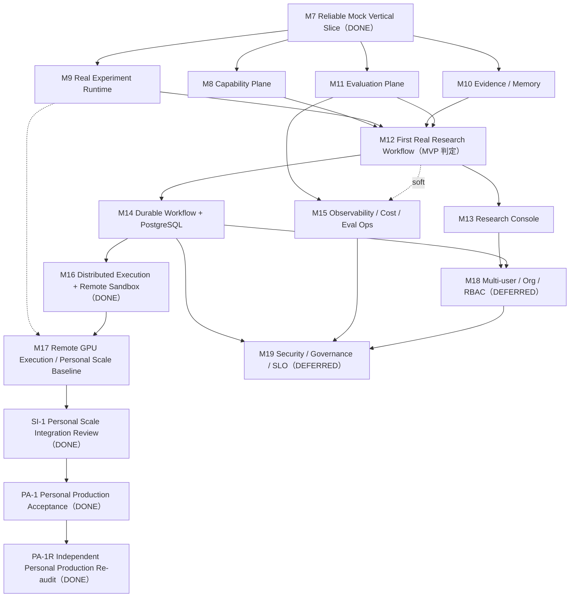

# Milestones v0.4.0

M0-M7 里程碑详细定义保留在 `CODEX_BOOTSTRAP.md`（历史契约）；Post-M7
未来里程碑的编号、名称、顺序与详细定义以本文件为**唯一权威来源**
（`BACKLOG.md` 与 `CODEX_BOOTSTRAP.md` 只保留指针，不维护第二套路线）。
本文件对 M0-M7 只提供执行索引与完成状态，不改写已完成历史。

## 当前状态

```text
Foundation / Executable Research Kernel = completed（M0-M7 含 M5R，2026-08-14）
Post-M7 产品能力 M8-M16 = completed（M16 Distributed Execution，2026-08-31；attempt-2 独立复审 PASS 2026-09-01）
RM-P2 Personal Roadmap Rebaseline = completed（2026-09-02，ADR-0028）：M17 收缩为 Remote GPU Execution / Personal Scale Baseline；M18/M19 DEFERRED；新增 SI-1 / PA-1 / PA-1R
M17 Remote GPU Execution = completed（2026-09-02，ADR-0029）：真实单卡 GPU 全链 VERIFIED；physically-remote GPU host = NOT VERIFIED/DEFERRED
SI-1 Personal Scale Integration Review = PASS（2026-09-02）
PA-1 Personal Production Acceptance = PASS（2026-09-03）
PA-1R Independent Personal Production Re-audit = PASS（2026-09-06）：Research OS Personal Production Baseline = COMPLETE
Post-baseline = 固定 Milestone 主线暂停；进入 Usage-driven Development；M18/M19 继续 DEFERRED
```

完成矩阵与证据见 [COMPLETION_MATRIX_M0_M7.md](COMPLETION_MATRIX_M0_M7.md)；
M7 集成里程碑记录见 [M7_COMPLETION_RECORD.md](M7_COMPLETION_RECORD.md)。
M7 之后进入产品能力建设阶段；未来 Milestone 路线见本文 Post-M7 Roadmap
节（唯一权威），执行索引见根 `BACKLOG.md`。

## 真实完成顺序

```text
M0 → M1 → M3 → M2 → M4 → M5 → M5R → M6 → M7
```

与数字编号不一致：**M3 先于 M2**（M2 Preflight 的 Model eligibility 消费
M3 Model Relay 产物）。文档以真实依赖关系为准，不按编号改写历史。

## Milestone Index

| Stage | 范围 | 完成 | Status | 证据 |
| --- | --- | --- | --- | --- |
| M0 | Repository Foundation Quality Gate：可复现 Python/TypeScript 工具链、`domain/application/adapter/entry` 依赖边界、architecture/contract test 入口、Windows/Linux CI 门禁 | 2026-08-11 | DONE | commit `3cc6130`；[retrospective plan](../../.cursor/plans/tasks/PLAN-20260814-009-m0-foundation-retrospective.md) |
| M1 | Domain Kernel & Contract Assets：实体/值对象/枚举/状态机/RunManifest/Revision/digest/loaders | 2026-08-11 | DONE | commit `185a752`；[PLAN-20260811-001](../../.cursor/plans/tasks/PLAN-20260811-001-m1-domain-kernel.md)；[RECHECK-20260811-001](../../.cursor/plans/rechecks/RECHECK-20260811-001-m1-domain-kernel.md) |
| M3 | Model Relay Compatibility：用户中转站/ModelDefinition/probe/eligibility/health/熔断/fingerprint/脱敏 | 2026-08-11 | DONE | commit `7bfcd3c`；[PLAN-20260811-002](../../.cursor/plans/tasks/PLAN-20260811-002-m3-model-relay.md)；[RECHECK-20260811-002](../../.cursor/plans/rechecks/RECHECK-20260811-002-m3-model-relay.md) |
| M2 | Protocol Compiler + Preflight：Role/Agent/Model/Tool/Workspace/Budget/Policy resolution → CompiledRunPlan/PreflightReport | 2026-08-12 | DONE | commit `1035a64`；[PLAN-20260812-003](../../.cursor/plans/tasks/PLAN-20260812-003-m2-protocol-compiler-preflight.md)；[RECHECK-20260812-003](../../.cursor/plans/rechecks/RECHECK-20260812-003-m2-protocol-compiler-preflight.md) |
| M4 | Role/Team/Task：26 Role fixtures、TeamTemplate、per-Agent binding、TaskContract/AcceptanceCriteria/HandoffBundle | 2026-08-12 | DONE | commit `7c68e92`；[PLAN-20260812-004](../../.cursor/plans/tasks/PLAN-20260812-004-m4-role-team-task.md)；[RECHECK-20260812-004](../../.cursor/plans/rechecks/RECHECK-20260812-004-m4-role-team-task.md) |
| M5 | Ports + Fakes：14 inward-owned Ports、统一错误模型、12 Fake、contract suite | 2026-08-12 | DONE | commit `c75db51`；[PLAN-20260812-005](../../.cursor/plans/tasks/PLAN-20260812-005-m5-ports-fakes.md)；[RECHECK-20260812-005](../../.cursor/plans/rechecks/RECHECK-20260812-005-m5-ports-fakes.md) |
| M5R | Upstream Qualification：OpenHands v1.42.0 源码审计、14 Port 现实校验、S1-S6 spikes、revision lock | 2026-08-12/13 | DONE | commits `717545d`/`5fc23d0`；[PLAN-20260812-006](../../.cursor/plans/tasks/PLAN-20260812-006-m5r-upstream-qualification.md)；[RECHECK-20260812-006](../../.cursor/plans/rechecks/RECHECK-20260812-006-m5r-upstream-qualification.md) |
| M6 | OpenHands Runtime Adapter：用户中转站 → OpenHands Native Agent → frozen Tool Set → safe Workspace；Policy Wrapper/cancel/错误映射 | 2026-08-13 | DONE | commit `f4b2168`；[PLAN-20260813-007](../../.cursor/plans/tasks/PLAN-20260813-007-m6-openhands-runtime-adapter.md)；[RECHECK-20260813-007](../../.cursor/plans/rechecks/RECHECK-20260813-007-m6-openhands-runtime-adapter.md) |
| M7 | Reliable Mock Vertical Slice：Compile → Preflight → Freeze → Lease/Idempotency/Outbox → Agent Session → Tool/Artifact/Evidence/Evaluation，故障注入 F-01..F-12 | 2026-08-14 | DONE | commit `782887d`；[retrospective plan](../../.cursor/plans/tasks/PLAN-20260814-010-m7-vertical-slice-retrospective.md)；[M7_COMPLETION_RECORD.md](M7_COMPLETION_RECORD.md) |

## 阶段依赖关系

```text
M0（工程门禁基线）
→ M1（Domain Kernel，消费 M0 门禁）
→ M3（Model Relay，早于 M2 完成）
→ M2（Protocol Compiler + Preflight，消费 M3 eligibility）
→ M4（Role/Team/Task，依赖 M1/M2 契约）
→ M5（Ports + Fakes，冻结 M1-M4 边界）
→ M5R（Upstream Qualification，对 M5 Port 现实校验）
→ M6（OpenHands Adapter，承接 M5R 审计结论）
→ M7（Reliable Vertical Slice，集成 M1-M6 全链）
```

## 里程碑详细定义

M0-M7 各阶段的原始定义保留在 `CODEX_BOOTSTRAP.md`（canonical milestone
details）与 [VERTICAL_SLICE_V0_4_0.md](VERTICAL_SLICE_V0_4_0.md)
（M7 场景/故障/DoD）；本文件不重复正文。

---

# Post-M7 Roadmap（唯一权威）

> 本节是 M8 及以后所有未来 Milestone 的**唯一权威定义**：编号、名称、
> 顺序、依赖 DAG、分层与下一阶段建议以此为准。`BACKLOG.md` 与
> `CODEX_BOOTSTRAP.md` 中的 Post-M7 内容均为指向本节的短指针，不维护
> 第二套路线。M0-M7（含 M5R）已完成历史不在此改写，见上方 Milestone
> Index 与 [COMPLETION_MATRIX_M0_M7.md](COMPLETION_MATRIX_M0_M7.md)。

## 产品现实（RM-P2 Rebaseline，2026-09-02）

- Research OS 当前服务于**单用户、个人长期使用的 Autonomous Research
  / R&D System**；暂无 multi-user / organization 产品需求，无
  Enterprise SaaS 部署目标。
- 真实资源：一台真实远程计算服务器；可真实验证的 GPU 资源仅为该
  服务器上的**单卡 GPU**；没有可真实测试的 multi-GPU / multi-node /
  Slurm / HPC 环境。
- 因此：**只把能够真实使用、真实验证、当前有产品价值的能力作为
  Active Roadmap**；不为编号完整性建设无法验证的基础设施。原
  M17 GPU/HPC 扩展面与 M18/M19 Enterprise 轨道据此收缩/推迟
  （ADR-0028），保留定义与依赖。M18/M19 仅在各节正式需求条件出现后
  评估重新激活；HPC Track 还必须先获得可实际执行和验证的真实环境。
  任何重新激活均需新 ADR + Plan Mode。

## 规划原则

```text
能力正确 → 可评测 → 真正科研 → 产品体验 → Durable → Distributed → Scale → Governance
```

- 先验证研究能力本身有价值，再投入 UI、Temporal、GPU 等基础设施；
  不为未来假设制造没有当前需求的基础设施。
- 每个 Milestone 可独立开发、独立复审，有可验证 Outcome，不只描述
  “写什么代码”。
- 一个阶段不同时横跨 Runtime、UI、Distributed、Governance、Research
  Quality 等多个问题域；强相关能力合并，弱相关能力拆分。

## 未来 Milestone 总览

| Stage | 名称 | 分层 | Hard Deps | 状态 |
| --- | --- | --- | --- | --- |
| M8 | Research Capability Plane（Tool Plane + Skill Registry） | MVP | M7 | DONE（2026-08-14） |
| M9 | Real Experiment Runtime | MVP | M7 | DONE（2026-08-15） |
| M10 | Evidence / Memory / Provenance | MVP | M7 | DONE（2026-08-15） |
| M11 | Evaluation Plane | MVP | M7 | DONE（2026-08-15） |
| M12 | First Real Research Workflow | MVP | M8+M9+M10+M11 | DONE（2026-08-22；R1 修复完成 2026-08-23；**2026-08-28 重新独立复审重判 PASS**（DoD-3 live relay 凭据闭环后由 PASS_WITH_WARNINGS 升 PASS）：RECHECK-20260828-023） |
| M13 | Research Console | Product | M12 | DONE（R1 修复 + 独立复审 PASS，2026-08-27） |
| M14 | Durable Workflow + PostgreSQL | Production | M12 | DONE（2026-08-28 立项；WP-J2 重判 PASS：RECHECK-20260828-022；Temporal DEFERRED，ADR-0025） |
| M15 | Observability / Cost / Eval Operations | Production | M11 | DONE（2026-08-29 首轮实施；2026-08-30 独立复审判定 FAIL 后修复轮 WP0–WP8 完成，6 BLOCKER 独立探针复现修复，m0 23/23 全绿；recheck PASS 见 `RECHECK-20260830-024`） |
| M16 | Distributed Execution + Remote Sandbox/Worker | Scale | M14 | DONE（2026-08-31） |
| M17 | Remote GPU Execution / Personal Scale Baseline（RM-P2 收缩，原 GPU / HPC） | Scale | M16+M9 | DONE（2026-09-02；真实单卡 GPU 全链 VERIFIED，physically-remote GPU host = NOT VERIFIED/DEFERRED，见 M17_COMPLETION_RECORD + ADR-0029） |
| M18 | Multi-user / Organization / RBAC | Enterprise | M13+M14 | DEFERRED（RM-P2，2026-09-02；激活条件见 M18 节） |
| M19 | Production Security / Governance + Backup/Recovery/SLO | Enterprise | M14+M15+M18 | DEFERRED（RM-P2，2026-09-02；激活条件见 M19 节） |
| SI-1 | Personal Scale Integration Review（非产品 Gate） | Gate | M17 | DONE（2026-09-02，PASS） |
| PA-1 | Personal Production Acceptance（非产品 Gate） | Gate | SI-1 | DONE（2026-09-03，PASS） |
| PA-1R | Independent Personal Production Re-audit（非产品 Gate） | Gate | PA-1 | DONE（2026-09-06，PASS；Personal Production Baseline = COMPLETE） |

## 依赖 DAG



文字版（`→` = 硬依赖，`-·` = 软依赖）：

```text
M7 → M8 → M12 → M14 → M16 → M17 → SI-1 → PA-1 → PA-1R
M7 → M9 → M12      M9 -· M17
M7 → M10 → M12
M7 → M11 → M12 → M13 → M18 → M19（M18/M19 DEFERRED：依赖保留，重新激活前不排期）
              M11 → M15 → M19
              M12 -· M15
              M14 → M18、M16、M19
```

### Integration Gates（汇聚门）

| Gate | 位置 | 条件 |
| --- | --- | --- |
| IG-1 | M12 Entry | M8、M9、M10、M11 全部通过独立复审 + m0 profile 全绿 |
| IG-2 | M14 Entry | M12 PASS（MVP 成立判定为 go） |
| IG-3 | M16 Entry | M14 PASS |
| IG-4 | M18 Entry | M13 + M14 PASS（M18 DEFERRED 期间门保留、不触发） |
| IG-5 | M19 Entry | M14 + M15 + M18 PASS（M19 DEFERRED 期间门保留、不触发） |
| SI-1 | M17 独立复审 PASS 后 | M17 PASS + 全链集成验证（Control Plane → Distributed Scheduler → Remote Worker → Real GPU → Experiment → Artifact → Evidence → Claim → Evaluation → Usage/Cost）+ 故障面（network failure / stale Worker / cancellation / GPU OOM / Artifact corruption / recovery） |
| PA-1 | SI-1 PASS 后 | Personal Production Acceptance 清单全部满足（见 Personal Scale Baseline 节） |
| PA-1R | PA-1 完成后 | 独立个人生产复审 PASS → 宣布 Research OS Personal Production Baseline = COMPLETE |

### 分层（MVP → Enterprise）

```text
MVP        M8-M12（M12 通过即 MVP 成立：真实任务 + 真实工具 + 真实实验 + 证据 + 评测闭环）
Product    M13（研究控制台：配置 / dry-run / 时间线 / 审批 / 证据地图）
Production M14-M15（PostgreSQL canonical state + durable workflow + 隐私优先观测 + 成本）
Scale      M16-M17（分布式 worker / 远程沙盒 / 远程 GPU 个人规模基线；M17 经 RM-P2 收缩）
Enterprise M18-M19（多租户 RBAC / 安全治理 / 备份恢复 / SLO；RM-P2 起 DEFERRED，激活条件见各节）
```

### 已完成主开发路径与历史并行策略

- 已完成串行主线：`M7 → M8 → M12 → M14 → M16 → M17 → SI-1 → PA-1 → PA-1R`。
- 历史并行组 1（M7 之后）：M8 ∥ M9 ∥ M10 ∥ M11。
- 历史并行组 2（M12 之后）：M13 ∥ M14 ∥ M15。
- 历史并行组 3（M14/M13 之后）：M16 ∥ M18；M18 经 RM-P2 延期，未随
  M16 推进。
- 历史推荐先推进 M8，在 IG-1 汇聚 M9/M10/M11，再于 M12 后推进
  M13/M14/M15；这些顺序只描述已完成路线，不是当前待办。
- PA-1R PASS 后固定 Milestone 主线暂停。当前只从真实 Research OS 使用问题
  发起 scoped improvement，并使用
  [UD 模板](USAGE_DRIVEN_IMPROVEMENT_TEMPLATE.md)；M18、M19 与 HPC Track
  只有满足各自正式触发条件后才能发起重新立项评估。

### Evaluation Plane 规则

M11 建立正式 Engineering Evaluation Plane。**M11 通过后**，以下变更的
重要程度由实现团队判定为 significant 的，必须进行 before/after
regression（以 Eval Harness + deterministic gates 为基准），不允许仅
凭 demo 判断效果：

- Model（ModelDefinition / ModelProfile / 绑定变更）
- Prompt（角色与任务提示变更）
- Skill（技能定义与组合变更）
- Tool（工具接入 / 升级 / 替换）
- Role Strategy（角色激活策略、团队模板变更）
- Runtime（AgentRuntime adapter 升级 / 替换）
- Research Workflow（协议、编排、门禁变更）

### Upstream Qualification 时间表

仅规划“何时需要进行 upstream qualification”；不批量 clone、不在本
路线阶段内开始正式集成。每次 qualification 按 M5R 模式执行：源码审计 +
最小可执行 spike + revision lock + 结论入 `docs/references/upstream/`。

| Milestone | Upstream | 动作 |
| --- | --- | --- |
| M8 | MCP ecosystem（Streamable HTTP + stdio） | 协议/生态 qualification，选 adapter 形态（已完成：`docs/references/upstream/M8_MCP_QUALIFICATION.md`） |
| M9 | Docker / execution sandbox 项目 | 镜像供应链与沙盒边界 qualification |
| M11 | evaluation 基础设施 | harness 选型 qualification |
| M14 | Temporal | 采用/不采用决策（ADAPTER 隔离，不进 Domain；若采用需 revision lock） |
| M15 | OpenTelemetry | collector/SDK qualification（genai 内容默认关闭） |
| M16 | SWE-ReX | 远程并行执行 qualification |
| M17 | GPU 运行时（单机单卡） | **DONE（2026-09-02）**：`M17_GPU_RUNTIME_QUALIFICATION.md`（pytorch/pytorch 2.9.1-cuda12.8 按 digest pin，sm_89 实测，readonly-rootfs×nvidia-hook 无冲突）+ `UPSTREAM_COMPONENTS.yaml` `research_os_gpu_base_image`；physically-remote GPU host = NOT VERIFIED/DEFERRED；原 Slurm/云 GPU API qualification 随 M17 Deferred Scope 移出（RM-P2） |
| M19 | OPA + Secret Manager | OPA 采用/不采用决策；Secret Manager 选型（M19 DEFERRED：暂不排期） |

### 当前开发方式

**固定 Milestone 主线暂停。** SI-1 已于 2026-09-02 PASS，PA-1 已于
2026-09-03 PASS，PA-1R 已于 2026-09-06 独立复审 PASS；既有记录据此宣布
Research OS Personal Production Baseline = COMPLETE。本节只同步该既有验收事实，
不把本次文档更新表述为重新执行验收。

后续等待真实 Research OS 使用中观察到的问题或机会，首先进入 Plan Mode，并按
[UD — Research OS Usage-driven Improvement 模板](USAGE_DRIVEN_IMPROVEMENT_TEMPLATE.md)
执行一次最小范围改进。M18/M19 仍为 DEFERRED；当前单卡 GPU 证据不构成
multi-GPU、multi-node、Slurm、HPC 或 physically-remote GPU host 支持。

> 历史说明：M8-M11 规划期（2026-08-14）本节推荐为 M8；M8-M11 完成后
> （2026-08-16，DOC-R1）本节更新为 M12；M12/M13 完成后（2026-08-28）
> 本节更新为 M14；M16 完成后（2026-09-02，RM-P2）本节更新为 M17；
> M17 完成后（2026-09-02）本节更新为 SI-1；随后 SI-1、PA-1、PA-1R
> 依次完成，2026-09-06 起转为 Usage-driven Development。历史 Milestone
> 定义不改写。

---

## M8 — Research Capability Plane（Tool Plane + Skill Registry）

### Purpose

为 Agent 提供真实、安全、可治理的科研工具能力，落地 ADR-0005/0009/0019。

### Plain-language Explanation

造一个“科研工具货架”：定义哪些工具可用、谁批准、怎么安装与撤销、
健康状态如何检查、凭证如何与 LLM 凭证隔离，让 Agent 真正能调用
文献检索、数据计算等工具而不是空转。

### Inputs

M7 的 ToolProvider Port + contract suite（`tests/contracts/`）；
M1/M4 的 `SkillSpec / Capability / CapabilityGrant / ToolSpec /
ToolProviderSpec / ToolPackManifest` Domain 实体；`PolicyEvaluator`、
`ArtifactStore`（大结果转储）、`CredentialResolver` Port。

### Scope

ToolCatalog/ToolResolver use case；MCP Streamable HTTP + stdio
adapter；ToolPack manifest/install/update/revoke 生命周期；tool
health/circuit breaker；tool credential separation；tool effect/risk
classes；large result artifact indirection；Skill Registry（Skill
生命周期、能力路由与复用）。

### Non-goals

不引入真实第三方工具库（仅契约 + mock provider）；不做 UI；不做
分布式工具执行；不做 ToolPack 市场/发布平台。

### Key Deliverables

`adapters/mcp/`；`packages/application/tool_plane/`（ToolResolver、
ToolPack 生命周期）；contract suite 扩展；至少 2 个 mock tool
provider；供应链 pin（digest）验证测试。

### Entry Gate

M7 DONE；M8 计划经 Plan Mode 批准。

### DoD / Exit Gate

MCP Streamable HTTP + stdio adapter 通过 ToolProvider contract
suite；ToolPack install/update/revoke 有单元 + 契约测试；health/
circuit breaker 故障注入测试；tool credential 与 LLM credential
隔离测试；供应链 pin 验证；独立复审 PASS + m0 profile 全绿。

> 完成状态（2026-08-14）：DoD 全部满足；逐项证据与独立复审修复记录
> 见 [M8_COMPLETION_RECORD.md](M8_COMPLETION_RECORD.md)。

### Dependencies

Hard：M7。Soft：M11（评测工具质量，但不阻塞 M8）。

### Parallelism

M9、M10、M11。

### Risks

MCP 生态多样性导致 adapter 抽象泄漏；工具风险分级不足造成安全漏洞；
ToolPack 供应链治理复杂度被低估。

### Next Readiness

解锁 M12（真实科研工作流可使用真实工具）。

## M9 — Real Experiment Runtime

### Purpose

让实验（代码执行）在隔离容器中真实运行并可复现，清偿 M7 遗留 P1 债。

### Plain-language Explanation

造一个“实验沙盒”：把 M7 里用 Fake 语义假装执行的实验步骤，变成在
容器里真实跑代码、采集指标、留下可复现的审计记录。

### Inputs

M7 的 ExecutionBackend Port + contract suite；M6 的 DockerWorkspace
映射代码；M1 的 `ExperimentPlan / ExperimentRun / Metric / Artifact`
Domain 实体；`WorkspaceBackend`、`ArtifactStore` Port。

### Scope

ExecutionBackend 容器实现（清偿 P1 债）；DockerWorkspace 容器链路
全量验证；ExperimentPlan → Run → Metric 执行链；
ReproducibilityAudit；retention/export bundle。

### Non-goals

不做远程执行/多 worker（M16）；不做 GPU（M17）；不做通用代码沙盒
强化（超出容器边界的系统级隔离）；不做 notebook 式交互 UI。

### Key Deliverables

`adapters/execution/`（容器执行）；experiment 执行 use case；
ReproducibilityAudit 模块；容器链路 E2E 测试。

### Entry Gate

M7 DONE；M9 计划经 Plan Mode 批准。

### DoD / Exit Gate

ExecutionBackend contract suite 以真实容器实现通过；DockerWorkspace
创建/挂载/清理全量验证；ExperimentRun 可复现（同 input 同 digest）；
容器超时/崩溃故障注入测试；镜像 pin 与供应链登记；独立复审 PASS +
m0 profile 全绿。

> 完成状态（2026-08-15）：DoD 全部满足；逐项证据与 M12/M17 readiness
> 见 [M9_COMPLETION_RECORD.md](M9_COMPLETION_RECORD.md)。

### Dependencies

Hard：M7。Soft：M16（远程执行是后续扩展）。

### Parallelism

M8、M10、M11。

### Risks

容器安全边界（默认 deny 清单被绕过）；宿主环境差异导致 CI 不稳定；
镜像供应链未 pin 造成不可复现。

### Next Readiness

解锁 M12（真实实验步骤）、M17（GPU 执行语义基础）。

## M10 — Evidence / Memory / Provenance

### Purpose

让研究结论有据可查、长期记忆可治理，落地 ADR-0003/0017 与 AGENTS.md §8。

### Plain-language Explanation

造一个“证据账本”：Agent 的每个结论都必须挂来源和置信度；写进长期
记忆要走提案门（schema → provenance → policy → curator）；记忆可以
删除，向量索引可以随时重建，绝不让聊天摘要自由入账。

### Inputs

M7 的 MemoryStore Port；M1 的 `SourceRecord / Claim / Evidence /
EvidenceRelation / MemoryRecord / MemoryWriteProposal` Domain 实体；
`EventPublisher`（domain events）。

### Scope

MemoryWriteProposal gate 全链路（schema validation → provenance
check → policy → curator/automatic gate → commit）；Memory
lifecycle/delete；derived vector index（可重建）；Claim/Evidence
relations 与 contradiction handling；negative result memory。

### Non-goals

不绑定具体 embedding 模型（derived index 可替换）；不做 UI；不做
多租户隔离（M18）；不把向量索引当 Canonical State（ADR-0002 边界）。

### Key Deliverables

`packages/application/memory/`（proposal gate pipeline）；向量索引
adapter（可重建）；矛盾检测 use case；provenance 测试套件。

### Entry Gate

M7 DONE；M10 计划经 Plan Mode 批准。

### DoD / Exit Gate

MemoryWriteProposal 全链路测试（无 provenance 拒绝、policy deny、
curator 通过三类路径）；删除后索引重建一致性测试；同一 Claim 冲突
证据检测测试；negative result 记忆用例；独立复审 PASS + m0 profile
全绿。

> 完成状态（2026-08-15）：DoD 全部满足；逐项证据与 M12 readiness
> 见 [M10_COMPLETION_RECORD.md](M10_COMPLETION_RECORD.md)。

### Dependencies

Hard：M7。

### Parallelism

M8、M9、M11。

### Risks

向量索引漂移与 Canonical State 不一致；provenance 粒度不足导致记忆
可信度低；proposal gate 过严阻碍有效记忆。

### Next Readiness

解锁 M12（研究结论有证据支撑、记忆可信）。

## M11 — Evaluation Plane

### Purpose

建立正式工程评测面，让 Model/Prompt/Skill/Tool/Role/Runtime/Workflow
的重要变更可 before/after regression，而不是只靠 demo 判断效果。

### Plain-language Explanation

造一把“尺子”：定义评测任务集、确定性打分器和回归面板；任何重要
变更先用尺子量过再上线，评测结果接入 CI 门禁。

### Inputs

M7 的 Evaluation use case 初版；`docs/evaluation/EVAL_HARNESS.md` 与
`QUALITY_GATES.md` 规格；`FakeAgentRuntime / FakeModelGateway`。

### Scope

Eval Harness（多模式：unit / integration / workflow）；deterministic
gates；reviewer panel；human calibration samples；canary/regression
dashboard（先以报告/CI 形式，UI 后置）；CI 门禁接入。

### Non-goals

不做生产观测（M15）；不做 UI dashboard（M13 之后可选）；真实付费
LLM 评测不作为默认 CI 依赖（只允许显式手动运行）；不做评分模型
训练。

### Key Deliverables

`packages/application/evaluation/` + `tests/evals/` harness；
deterministic gates 定义；calibration samples；CI eval 门禁；
EvalScore 报告 schema。

### Entry Gate

M7 DONE；M11 计划经 Plan Mode 批准。

### DoD / Exit Gate

harness 可复现运行（同输入同分数）；至少一个真实 before/after
regression 案例（变更被 gate 拦截）；CI 确定性接入；评测对象在
M8/M9 完成前可为 mock；独立复审 PASS + m0 profile 全绿。

> 完成状态（2026-08-15）：DoD 全部满足；逐项证据、反作弊专项与
> M12 readiness 见 [M11_COMPLETION_RECORD.md](M11_COMPLETION_RECORD.md)
> （DOC-R1 依据 repository evidence 重建）。

### Dependencies

Hard：M7。Soft：消费 M8/M9 产物（评测工具质量、评测实验执行）。

### Parallelism

M8、M9、M10。

### Risks

评测集过拟合；确定性 gate 过严阻碍迭代；M8/M9 未完成时只能评 mock，
评测面可能“校准”到错误对象上。

### Next Readiness

解锁 M12 的评测要求；此后所有重要变更必须 before/after regression
（见上文 Evaluation Plane 规则）。

## M12 — First Real Research Workflow

### Purpose

证明 Research OS 能端到端完成一个有价值的真实科研任务，作为 MVP
成立判定点。

### Plain-language Explanation

挑一个真实的科研问题，让系统用真实模型、真实工具、真实实验、真实
证据账本从头到尾跑完，产出可检验、可复现的结论，并复盘失败模式。

### Inputs

M8+M9+M10+M11 全部 PASS；M7 编排链；M3 relay adapter + M6 LLM 映射
（真实链路）。

### Scope

真实 relay 链路 E2E（清偿 usage 归账 P1 债）；工具 + 实验 + 证据
全链；目标科研任务定义（协议 + 验收标准）；失败复盘；MVP 判定报告
（go/no-go）。

### Non-goals

不做 UI（M13）；不做分布式（M14）；不做多任务基准（只做单个代表性
任务）；不对外宣称产品能力。

### Key Deliverables

一个 reference research protocol（真实任务，入
`examples/protocols/`）；E2E 真实运行记录；usage 归账闭环到
BudgetLedger；MVP 判定报告。

### Entry Gate

IG-1：M8、M9、M10、M11 全部通过独立复审 + m0 profile 全绿。

### DoD / Exit Gate

真实 relay + 真实工具 + 真实实验 + 证据账本完整闭环；usage 归账
闭环（预算消耗与真实用量一致）；任务验收标准经 M11 harness 客观
评测；MVP 判定报告；独立复审 PASS + m0 profile 全绿。

### Dependencies

Hard：M8+M9+M10+M11。

### Parallelism

无（MVP 汇聚点，IG-1）。

### Risks

真实模型成本与行为不可控；真实工具失败导致任务无法完成；MVP 判定
为 no-go（需回退 M8-M11 补强）。

### Next Readiness

解锁 M13（产品 UI）、M14（durable）、M15 软依赖。

> 完成状态（2026-08-22）：DoD 14 项逐项 PASS（原记录）。原 PASS 判定经
> M12-R1 独立复审证伪（13 Finding），修复完成于 2026-08-23（见
> [M12_R1_COMPLETION_RECORD.md](M12_R1_COMPLETION_RECORD.md)）；2026-08-28
> 重新独立复审**重判 PASS**（RECHECK-20260828-023；DoD-3 live relay 凭据
> 闭环）。正式计划见
> `../../.cursor/plans/tasks/PLAN-20260828-017-m12-first-real-research-workflow.md`
> 与 `PLAN-20260828-019-m12-r1-production-truth-closure.md`。

## M13 — Research Console

### Purpose

让用户能配置、运行、监控、审批研究工作流，落地 ADR-0008（自主产品
UI）。

### Plain-language Explanation

造一个“控制台”：首次打开向导式配好中转站；跑之前能 dry run；跑起来
能看任务时间线；高风险动作能审批/干预；结论有证据地图；预算与用量
可见，一切可审计导出。

### Inputs

M12 PASS（真实工作流已验证）；`docs/api/CONTROL_PLANE_API.md` 规格；
M0 的 TS 工具链（pnpm/ESLint/dependency-cruiser）。

### Scope

first-run relay wizard；models/probe page；team/agent model
assignment；protocol/preflight dry run；task/run timeline；
approvals/interventions；workspace diff；evidence/claim map；
budget/usage；audit/export。

### Non-goals

不做多租户（M18）；不做分布式集群管理（M16）；不做评测面板（M11
已定义、M15 生产化）；UI 不复制 Canonical State（只消费 API DTO）。

### Key Deliverables

`apps/web/` + `services/api/`（Control Plane API）；审批流 UI；
dry run 流程；timeline 视图。

### Entry Gate

IG-2：M12 PASS。

### DoD / Exit Gate

first-run 向导端到端可用；dry run 不触发真实副作用；审批流
deny/approve 全链路；审计导出可用；架构测试证明 UI 只消费 API DTO；
TS lint/typecheck/依赖边界门禁 PASS；独立复审 PASS + m0 profile
全绿。

### Dependencies

Hard：M12。

### Parallelism

M14、M15。

### Risks

UI 范围膨胀；API DTO 与 Domain 泄漏；审批流与 PolicyEvaluator 语义
不一致。

### Next Readiness

解锁 M18（多用户需要 UI 承载）。

> 完成状态（2026-08-27）：独立复审 FAIL（3 BLOCKER + 7 MAJOR + 4 UI Scope
> + 6 MINOR）后经 R1 修复轮闭环，adversarial re-audit 重判 PASS（m0 19
> checks、pytest 2054 passed；commit `b3f60a7`/`d5eb660`），见
> [M13_R1_COMPLETION_RECORD.md](M13_R1_COMPLETION_RECORD.md)。正式计划见
> `../../.cursor/plans/tasks/PLAN-20260828-018-m13-research-console.md`
> 与 `PLAN-20260828-020-m13-r1-console-remediation.md`。

## M14 — Durable Workflow + PostgreSQL

### Purpose

让工作流跨进程、跨重启真正 durable，Canonical State 落到 PostgreSQL，
完成 Temporal 采用/不采用决策。

### Plain-language Explanation

把 M7 的“单进程 SQLite 可靠内核”升级成“生产级持久化 + 可选 Temporal
调度”：任务在机器重启后照样续跑，多进程共享同一真相源，lease 超时
自动自愈。

### Inputs

M12 PASS（真实工作流验证了 durable 需求）；ADR-0002（PostgreSQL
Canonical State）；`SqliteWorkflowEngine` 的 contract suite（验收
基线）；ADR-0016（可靠性语义）。

### Scope

PostgreSQL adapter（canonical state + task queue，清偿 P1 债）；
`recover_expired_leases` 定时自愈（清偿 P2 债）；Temporal upstream
qualification 与采用/不采用决策；跨进程调度。

### Non-goals

不做多 worker 分区调度（M16）；不做 SLO 保障（M19）；不迁移
OpenHands 自身持久化；不把 Temporal history 当 Canonical State。

### Key Deliverables

`adapters/postgres/`；Temporal qualification 报告（采用 → adapter +
revision lock；不采用 → 理由与替代方案，必要时 ADR 增补）；跨进程
E2E 测试。

### Entry Gate

M12 PASS；Temporal qualification 可在 M12 进行中启动（只读调查），
adapter 实现需 IG-2 通过。

### DoD / Exit Gate

PostgreSQL adapter 通过 WorkflowEngine contract suite；跨进程重启
恢复 E2E；lease 定时自愈测试；Temporal 决策有证据闭环；m0 profile
全绿；独立复审 PASS。

### Dependencies

Hard：M12。

### Parallelism

M13、M15。

### Risks

Temporal 引入复杂度过高（严格评估，可拒绝）；PostgreSQL schema
迁移策略；SQLite→PostgreSQL 语义差异（锁、事务）。

### Next Readiness

解锁 M16（分布式）、M18/M19（多租户与治理基础）。

> 状态（2026-08-28）：**DONE（WP-J2 重判 PASS，RECHECK-20260828-022）**。
> Temporal qualification
> 完成（16Q：PASS 12/NEUTRAL 2/FAIL 2）并裁决 **DEFER**（ADR-0025）；
> PostgreSQL adapter 已实现并修复独立复审 BLOCKER-1/2/3 + MAJOR-1/2；
> Canonical State 域状态（runs/evidence/budget/approvals/artifacts/experiments/memory）
> 已迁移至 PG（`001-004_domain_state.sql` + `adapters/postgres/*store*.py`）；
> 真实跨进程套件（`tests/postgres/test_cross_process_real.py`）、parity 套件
> （`test_workflow_engine_parity.py`）、PG crash/restart E2E
> （`tests/e2e/test_pg_crash_restart.py`）、迁移幂等测试、M13 PG run E2E
> （`test_m13_pg_run_e2e.py`）、Experiment roundtrip、Memory/Claim 并发测试
> 已落地。**NV-A 已消除**（ruff 9 处修复、mypy 8 处测试类型修复）；
> **NV-B 已消除**（PG stores 下 console_demo run E2E 达 SUCCEEDED 有测试，
> 诚实标注：真实凭据/网络路径仍非默认 CI）。DS-1/DS-2/DS-3 债务全部清偿：
> Experiment Plan/Run/Audit PG 持久化 roundtrip 通过；retention 定时调度
> 自动触发 + 并发健壮 + 测试覆盖；Claim 注册/更新 rowcount 校验 +
> Memory PG 载体 + 同提案竞争 commit / delete vs update 真实 subprocess
> 测试通过。**独立复审复验（2026-08-28）**：m0 profile 19/19 确定性 checks
> PASS（`python/tests` 2154 passed / 2 skipped；ruff 0 errors；mypy 535 files
> 0 errors；TS 5 项 + framework 8 项全绿）。复审修复 3 项 gate 失败：
> format-check 2 文件、mypy 4 处、source-limit 3 文件（拆
> `experiment_rows.py`/`worker_memory_scripts.py`）。正式计划见
> `../../.cursor/plans/tasks/PLAN-20260828-021-m14-durable-workflow-postgresql.md`；
> 收口计划见 `.cursor/plans/m14_债务与_not-verified_收口计划_8f4a7bc8.plan.md`；
> qualification 见 `../references/upstream/M14_TEMPORAL_QUALIFICATION.md`。
> **WP-J2 独立复审重判 PASS（2026-08-28）：RECHECK-20260828-022**——DoD 19 条
> 逐项实测复核（真实 PG/subprocess/TTL 取证）；m0 19/19 单次聚合；
> `python/tests` 2162 passed/2 skipped。**完成状态（2026-08-28）：M14 = DONE**；
> M16/M18/M19 不自动开工。

## M15 — Observability / Cost / Eval Operations

### Purpose

让系统可观测、成本可见、评测可持续运营，落地 ADR-0020（隐私优先）。

### Plain-language Explanation

造“仪表盘和账本”：所有运行都有 redacted 遥测；钱花在哪里看得见；
评测分数随时间可追踪，退化可回查。

### Inputs

M11 PASS（评测面）；ADR-0020；`docs/architecture/OBSERVABILITY.md`
规格；`UsageLedgerEntry` Domain 实体。

### Scope

OTel collector 集成（genai 内容捕获默认关闭，只记 digest/size/
type/latency/token/status/redacted metadata）；cost 归集（UsageLedger
→ 成本视图）；eval 趋势存储与回归面板（M11 的运营化）。

### Non-goals

不做完整 LLM tracing 内容采样（仅显式 Debug Mode + retention
policy）；不做多租户成本隔离（M18）；不做 SLO 定义（M19）。

### Key Deliverables

`adapters/otel/`（或标准集成）；成本归集 use case；eval 趋势存储；
隐私默认的测试（prompt/参数不落遥测）。

### Entry Gate

M11 PASS。

### Dependencies

Hard：M11。Soft：M12。

### Parallelism

M13、M14。

### Risks

OTel 供应商绑定；隐私泄露（prompt/敏感参数误入遥测）；成本归集
粒度不足导致误导。

### Next Readiness

解锁 M19（SLO 需要观测基础）。

> 完成状态（2026-08-30 修复轮完成更新）：2026-08-29 首轮实施落地（OTel adapter
> 边界 ADR-0026、隐私 canary、五状态成本投影、EvalReportStore/趋势、
> operations API/Console）。2026-08-30 独立复审判定 FAIL（6 BLOCKER + ~24 MAJOR +
> ~25 MINOR）后，修复轮 `.cursor/plans/m15_fail_remediation_98df6116.plan.md`
> WP0–WP8 全部完成：6 个 BLOCKER 均以独立探针复现原始路径并确认修复，全量门禁
> m0 profile 23/23 deterministic checks PASS（2420 passed/5 skipped）。
> recheck PASS 见 `RECHECK-20260830-024`；**M15 DONE**。

## M16 — Distributed Execution + Remote Sandbox/Worker

### Purpose

让多任务跨机器并行执行，沙盒可远程运行，支持分区调度。

### Plain-language Explanation

造一个“分布式车间”：多个 worker 机器分头接任务、跑实验，统一
调度、统一心跳、统一故障恢复，沙盒在远端机器上运行。

### Inputs

M14 PASS（durable + PostgreSQL）；M9 的 ExecutionBackend 语义；
SWE-ReX qualification（`UPSTREAM_COMPONENTS.yaml` 中 PLANNED）。

### Scope

多 worker 注册/心跳/下线；分区调度；远程 sandbox adapter；worker
故障转移；SWE-ReX 或等价远程执行 qualification（按 M5R 模式）。

### Non-goals

不做 GPU 调度（M17）；不做多租户资源配额（M18）；不做自动扩缩容；
不做公有云多地域。

### Key Deliverables

worker 生命周期管理；分区调度器；远程 sandbox adapter；跨机故障
注入测试。

### Entry Gate

IG-3：M14 PASS。

### Dependencies

Hard：M14。Soft：M9。

### Parallelism

M18。

### Risks

分布式故障模式复杂度（脑裂、时钟漂移）；远程 sandbox 安全边界；
调度策略过早优化。

### Next Readiness

解锁 M17（GPU/HPC）。

## M17 — Remote GPU Execution / Personal Scale Baseline

> **M17 完成状态（2026-09-02）**：DONE。真实单卡 GPU 全链 VERIFIED
> （capability 发现 / GPU-required 调度 / 真实 CUDA 容器执行 / 无静默 CPU
> fallback / OOM·取消·故障语义 / Artifact·Evidence·Evaluation·Usage 闭环 /
> 可复现性），见 `M17_COMPLETION_RECORD.md` + ADR-0029。
> **诚实边界**：本节"真实远程 GPU Worker"在当前环境为**本机 GPU**（GPU 主机
> = Control Plane 主机）；`physically-remote GPU host`（GPU 主机 ≠ Control
> Plane 主机）= **NOT VERIFIED / DEFERRED**。M17 证明的是跨进程 + 跨网络
> untrusted worker 边界 + 真实 GPU，不得据此宣称多机 GPU 集群。

> RM-P2 Rebaseline（2026-09-02，ADR-0028）：原「GPU / HPC」定义面向
> Slurm/云 GPU/配额的资源平面，其可验证环境当前不存在。本节收缩 M17
> 的 Active Scope 为个人规模远程 GPU 执行；原扩展面移入下方 Deferred
> Scope（不删除、不标记完成）。

### Purpose

让已完成的 M16 Distributed Execution Plane 在当前真实远程 GPU Worker
（单机单卡）上跑通真实 GPU 研究计算：发现 GPU capability、调度
GPU-required task、建立真实 GPU container/runtime、运行真实计算实验，
并完成一条真实 GPU Research Slice。

### Plain-language Explanation

给 M16 的远程 Worker 加上"真 GPU"：任务声明需要 GPU 时，调度到那台
真实远程服务器上的 GPU worker；容器里能用上 CUDA；实验真的跑、真的
产生 Artifact/Metric/Usage；OOM、CUDA 错误、超时、取消都能被正确
处理并记录。不建通用 HPC 平台。

### Inputs

M16 PASS（分布式调度 / RemoteExecutionBackend / worker gateway /
fencing 已验证）；M9 的 ExperimentRun 语义与 `resource_profile` 映射；
真实远程服务器（单卡 GPU）访问凭据（仅经环境变量/密钥服务，不入
源码）。

### Active Scope

- GPU capability 发现与注册（runtime 探测进入 worker capability
  模型）；
- GPU-required task 调度（capability 匹配门禁：无可用 GPU worker
  时任务不误派）；
- 真实 GPU container/runtime（GPU 运行时 qualification 先行，见
  Upstream Qualification 时间表）；
- 真实计算实验执行（实验代码在 GPU 容器内真实运行并产出结果）；
- OOM / CUDA error / timeout / cancellation 的检测、处理与状态归一；
- Artifact / Metric / Usage 记录（含 GPU `remote-exec` 记账联动
  BudgetLedger）；
- 结果进入 Evidence / Evaluation（可评测闭环）；
- 完成一条真实 GPU Research Slice（E2E，非 mock）。

### Deferred Scope（RM-P2 正式移出 Active）

multi-GPU scheduling；multi-GPU training；NCCL；distributed
training；multi-node execution；Slurm；PBS；MPI；HPC scheduler；
RDMA；InfiniBand；heterogeneous accelerator fleet；GPU autoscaling；
cluster federation；HPC quota system。

规则：以上能力不删除未来路线、不标记完成、不作为 M17 PASS 条件；
禁止以 Fake/Mock 测试宣称 supported。HPC Track 只有在已经获得可实际执行和
验证的 multi-GPU、multi-node、Slurm 或 HPC 环境后，才能经新 ADR + Plan Mode
发起重新立项评估；只有需求或模拟环境时可以记录机会，但不得启动支持声明。
没有真实环境，不得宣布支持。

### Non-goals

不建通用 HPC 平台；不做训练框架集成；不做多集群联邦；不做成本
优化引擎；不删除/弱化 M16 已验证能力（multi-worker、fencing、
failover、partition scheduling 保持 `Implemented and validated`）。

### Key Deliverables

GPU capability probe/registration；GPU scheduling 门禁与测试；GPU
runtime qualification 报告（`docs/references/upstream/`）；GPU 任务
E2E 场景（真实 GPU + 故障注入：OOM/timeout/cancel/断网）；M17
Completion Record（DoD 逐条证据）。

### Entry Gate

M16 PASS（已满足：RECHECK-20260901-025-m16-attempt2）+ M17 计划经
Plan Mode 批准。

### Dependencies

Hard：M16+M9。

### Parallelism

无（Scale 层串行；M18/M19 DEFERRED）。

### Risks

单卡资源争用与排队；OOM/驱动级故障模式复杂；GPU 环境漂移（驱动/
CUDA 版本需记录 fingerprint）；远程 GPU 使用成本失控（BudgetLedger
联动 + 预算上限）。

### Next Readiness

历史 readiness：解锁 SI-1（Personal Scale Integration Review）；SI-1 已于
2026-09-02 PASS，后续 PA-1/PA-1R 也已完成。

## M18 — Multi-user / Organization / RBAC

> 状态（RM-P2，2026-09-02）：**DEFERRED — no current multi-user /
> organization requirement**。以下原定义原样保留为重新激活基线；当前
> 不实现 Tenant / Organization / cross-tenant data isolation /
> multi-user RBAC / tenant quota / tenant billing 的任何能力，不标记
> 部分完成。正式触发条件（满足其一）：出现真实第二用户、team、
> organization、shared service、RBAC 或 tenant isolation 需求。触发只允许
> 发起重新立项评估，不等于自动开工或部分完成；重新激活仍需新 ADR、
> Plan Mode 批准及原有依赖门槛。

### Purpose

支持多用户、组织隔离和基于角色的访问控制。

### Plain-language Explanation

造一个“多租户门禁”：多个用户各自有团队、预算、数据，租户间严格
隔离，权限按角色控制，越权访问被架构级拒绝。

### Inputs

M13 PASS（Console）；M14 PASS（PostgreSQL canonical state）；
`docs/security/IDENTITY_AND_ACCESS.md` 规格；`PolicyEvaluator` Port。

### Scope

多租户数据模型（schema 级隔离）；组织/团队；RBAC use case；审计；
越权测试（cross-tenant 负面测试）。

### Non-goals

不做 SSO/企业目录集成（M19 可选）；不做计费；不做租户间资源共享
市场。

### Key Deliverables

租户边界（schema 级）；RBAC use case；越权测试套件。

### Entry Gate

IG-4：M13 + M14 PASS。

### Dependencies

Hard：M13+M14。

### Parallelism

M16。

### Risks

跨租户数据泄漏（最高风险，需负面测试 + 架构断言）；RBAC 与
PolicyEvaluator 双轨失控；单租户数据迁移。

### Next Readiness

解锁 M19（企业治理）。

## M19 — Production Security / Governance + Backup/Recovery/SLO

> 状态（RM-P2，2026-09-02）：**DEFERRED — Enterprise track not
> activated**。以下原定义原样保留；不得标记为部分完成或 PASS。其中对
> 单用户同样有实际价值的能力（backup、restore、secret hygiene、
> PostgreSQL/Artifact recovery、release/version truth、operational
> recovery）不通过"提前做 M19"处理，纳入 PA-1 — Personal Production
> Acceptance（见 Personal Scale Baseline 节）。正式触发条件（满足其一）：
> 出现真实 Enterprise deployment、formal SLO、compliance、incident
> governance 或 enterprise secrets 需求。触发只允许发起重新立项评估，
> 不等于自动开工或部分完成；重新激活仍需新 ADR、Plan Mode 批准及原有
> 依赖门槛。

### Purpose

达到生产级安全、治理与可运维标准，落地 ADR-0018/0024。

### Plain-language Explanation

造“生产保险”：策略引擎（OPA 决策或确认 Native Policy 足够）、中心
密钥管理、备份恢复演练、SLO 承诺与监控，使系统可以对外承诺可靠性
和安全性。

### Inputs

M14+M15+M18 PASS；ADR-0018（Native Policy First, OPA Adapter
Later）、ADR-0024（Backup Canonical Domain and Artifacts）；
`docs/security/SECRET_MANAGEMENT.md`、
`docs/operations/BACKUP_RECOVERY.md`、
`docs/operations/SLO_AND_CAPACITY.md` 规格。

### Scope

OPA qualification 与采用/不采用决策；central Secret Manager；backup
/restore（按 ADR-0024：Domain + Artifacts，不备份 ephemeral
runtime）；SLO 定义与监控；发布门禁（deterministic release gate）。

### Non-goals

不做合规认证（SOC2 等）；不做多机房灾难恢复；不做全量内容审计
（与 ADR-0020 隐私边界冲突）。

### Key Deliverables

OPA adapter（若采用）；Secret Manager adapter；backup/restore 演练
记录；SLO dashboard 与告警；发布门禁流程。

### Entry Gate

IG-5：M14+M15+M18 PASS。

### Dependencies

Hard：M14+M15+M18。

### Parallelism

无（Enterprise 收敛点）。

### Risks

治理过度阻碍迭代；backup/restore 演练成本高；SLO 承诺过早导致
违约。

### Next Readiness

Enterprise 就绪；此后进入持续运营与迭代，新方向重新立项。
### M16 完成注记（2026-08-31）

M16 已交付（计划 `.cursor/plans/m16_分布式执行_1657b1d6.plan.md`，任务记录
`PLAN-20260831-025`）：Worker 生命周期（WorkerState 状态机 + WorkerRegistry
Port + gateway 认证，session token 仅存 sha256 + generation 作废）、
claim_next 分区调度（单队列 + fence 单调 + SKIP LOCKED 跨进程并发证据）、
RemoteExecutionBackend（bundle 双 digest 传输 + cancelled 协作取消）、
`python -m services.worker` 真实子进程跨进程 E2E（场景 A–J + 安全攻击套件 +
时钟偏移）、SWE-ReX qualification REJECT（对照原生 HTTP worker /
Docker-over-TCP，Temporal 重评条件未触发）、遥测闭集增量 + BudgetLedger
`remote-exec` 记账、Console 只读 cluster 视图、`.importlinter.worker` 门禁。
PostgreSQL 仍是唯一 canonical；迁移 008 全部 additive；agent-session 任务
默认 kind 不受影响。证据见 `docs/roadmap/M16_COMPLETION_RECORD.md`。

> **attempt-2 独立对抗复审（2026-09-01）**：第二次对抗复审发现上述交付中
> claim 未服务端强制 worker 状态/能力、跨任务 artifact provenance 缺失、
> `remote-exec` 记账为死代码、gateway/reaper/RemoteBackend 无生产组装点、
> 多个 E2E 场景弱证/空转，以及 attempt-1 记录一处不实声明（harness DSN 注入
> 未真正移除）。已全部整改（claim 强制 + provenance/ACL + 续租 + composition
> 入口 + 真实断言 + 端到端 canary），m0 23 检查全绿、distributed 24、5 对抗
> 探针全过。详见 `RECHECK-20260901-025-m16-attempt2.md`。M16 维持 DONE。

---

# Personal Scale Baseline（RM-P2 新增，2026-09-02）

本节由 RM-P2（PLAN-20260902-027，ADR-0028）建立，定义 M17 之后的非产品
Gate 与个人生产基线。以下均为 Gate/验收活动，不增加新产品功能。

## SI-1 — Personal Scale Integration Review

在 M17 独立复审 PASS 后执行的非产品 Milestone Gate。验证完整链路：

```text
Research Objective → Control Plane → Distributed Scheduler →
Remote Worker → Real GPU → Experiment → Artifact → Evidence →
Claim → Evaluation → Usage / Cost
```

并覆盖故障面：network failure；stale Worker；cancellation；GPU OOM；
Artifact corruption；recovery。SI-1 不增加新产品功能；结论为
PASS / FAIL（FAIL 时修复后重跑）。

SI-1 结果（2026-09-02）：**PASS** — 真实 GPU Research Run、跨阶段回归与
六类故障面均有证据，记录见
[SI-1 Review Record](../../scratch/si1-20260902/SI1_REVIEW_RECORD.md)。

## PA-1 — Personal Production Acceptance

SI-1 PASS 后执行。回答一个问题：**当前 Research OS 是否已经达到可以
长期作为个人 Autonomous R&D System 使用的生产基线？**

范围（逐项验收，均需真实证据）：

- reproducible deployment；
- PostgreSQL backup + actual restore；
- Artifact backup + actual restore；
- Secret hygiene；
- Remote Worker recovery；
- GPU Worker recovery；
- component restart；
- real Research Acceptance Run（真实研究验收运行）；
- Observability；
- Cost；
- Evaluation；
- release/version identity；
- operational documentation。

PA-1 不属于 Enterprise Milestone；以上各项不是"提前做 M19"，验收深度
以个人生产基线为准。

PA-1 结果（2026-09-03）：**PASS** — 11 项逐项真实证据齐全
（`docs/roadmap/PA1_COMPLETION_RECORD.md` + `scratch/pa1-20260903/`）；
发现 F1（内存来源白名单装配缺失）/ F2（PG 重启后连接不自动重建）/
F3（PG EvalReportStore 读取路径，已修复 dc6676c）/ F5（未配置控制面
demo run 路径）/ W3（GPU_TIME 整数秒）；无 BLOCKER；当时判定 PA-1R
READY，后续已于 2026-09-06 PASS（见下节）。

## PA-1R — Independent Personal Production Re-audit

PA-1 完成后执行独立复审（独立于 PA-1 执行者的复审，模式同 M16
attempt-2 对抗复审）。只有 PA-1R PASS 后才宣布：

**Research OS Personal Production Baseline = COMPLETE**

PA-1R 结果（2026-09-06）：**PASS** — deployment、PostgreSQL/Artifact
实际恢复、Secret hygiene、Remote/GPU Worker、durable recovery、
Observability/Cost/Evaluation、完整 Research Workflow 与 release/version truth
均有独立证据，无未关闭 BLOCKER；正式复检见
[PA-1R 最终复检](../../.cursor/plans/rechecks/RECHECK-20260906-032-个人生产最终复审v1.md)，
发布身份见 [PA-1R 发布记录](../operations/PA1R发布记录v1.json)。本段同步既有
记录，不代表本次文档更新重新执行了验收。

## Post-baseline Operating Model — Usage-driven Development

PA-1R PASS 后：

- 固定 Milestone 主线暂停，不自动恢复 M18/M19，也不自动启动 HPC Track。
- Research OS 进入 **Usage-driven Development**：每个后续改进必须来自一次
  真实使用中观察到的问题或机会，首先进入 Plan Mode，并按
  [UD 模板](USAGE_DRIVEN_IMPROVEMENT_TEMPLATE.md)记录 reproduction、expected
  outcome、current evidence、affected Contract 与 regression target。
- 问题分类覆盖 Research Capability、Tool、Skill、Protocol、Evaluation、
  Runtime、Reliability、Performance、Cost 与 UX；每次只实施解决真实问题所需的
  最小范围。
- 完成必须包含 regression、适用时受影响 Evaluation 的 before/after 对照、
  real Research re-run 与 documentation update；缺少真实重跑条件时不得宣称完成。
- M18 只在出现真实第二用户、team、organization、shared service、RBAC 或
  tenant isolation 需求时触发重新立项评估。
- M19 只在出现真实 Enterprise deployment、formal SLO、compliance、incident
  governance 或 enterprise secrets 需求时触发重新立项评估。
- HPC Track 只在已经获得可实际执行和验证的 multi-GPU、multi-node、Slurm 或
  HPC 环境时触发重新立项评估；没有真实环境，不得宣布支持。
- 上述触发均不等于自动开工或部分完成；仍需新 ADR、Plan Mode 批准及原有依赖
  门槛。路线从 `roadmap-driven infrastructure` 转为
  `real-usage-driven improvement`。
